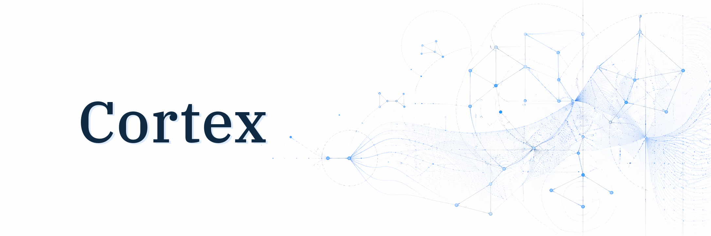

<p align="center">
  
</p>

<p align="center">
  <a href="https://github.com/Digimuoto/cortex/actions/workflows/ci.yml"></a>
  <a href="https://github.com/Digimuoto/cortex/actions/workflows/docs.yml"></a>
  <a href="LICENSE"></a>
  
</p>

# Cortex

Cortex is a standalone AI substrate: a typed topology layer, a source language
for composing that topology, and a durable runtime for executing it.

The core layers are:

| Layer | Role |
|---|---|
| **Graph** | Pure topology: vertices, overlay, connect, and graph laws. |
| **Circuit** | Validated executable topology with typed port compatibility. |
| **Wire** | Source language and rewrite notation for authoring circuits. |
| **Pulse** | Durable execution, checkpoints, events, memory, and rewrites. |

Downstream products bind Cortex to their own domain semantics, tools, product
policy, operators, transport, and persistence. Cortex owns the reusable
substrate.

## Minimal Wire

Wire composes registered authority. Executors, contracts, tools, and payload
meaning are registered outside the language; Wire describes how those typed
pieces connect.

```wire
contract Plan;
contract Evidence;
contract Report;

node plan   : -> Plan             = @llm.planner {};
node gather : <- Plan -> Evidence = @tool.search {};
node write  : <- Evidence -> Report = @llm.writer {};

plan => gather => write
```

## Documentation

- [Docs landing](docs/index.md) - architecture, reference, ADRs, roadmap, and
  consumer bindings.
- [Architecture overview](docs/Architecture/01-overview.md) - system frame and
  ownership boundary.
- [Wire language](docs/Architecture/05-wire-language.md) - authoring model and
  language architecture.
- [Wire grammar v1](docs/Reference/Wire/grammar-v1.md) - normative grammar.
- [Pulse runtime](docs/Architecture/06-pulse-runtime.md) - durable execution
  model.
- [Development workflow](docs/Reference/development.md) - build, test, docs,
  formatting, and local validation commands.

## Repository

```text
src/Cortex/               Graph, Circuit, Wire, Pulse, memory, capabilities
src-platform/Platform/    Runtime substrate helpers
app/cortex-pulse/         Pulse executor binary
editors/tree-sitter-wire/ Wire tree-sitter grammar
theory/                   Lean mechanization scaffold
docs/                     Published Cortex documentation
agents/                   Provider-neutral agent context and skills
```

## License

Apache-2.0. See [LICENSE](LICENSE) and [NOTICE](NOTICE).
