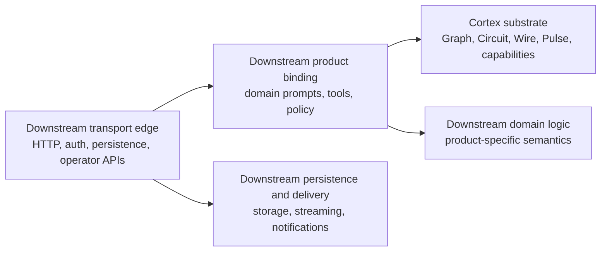

# Chapter 01 — Overview

Cortex is a standalone AI substrate. This chapter sets the core architectural
frame: Graph, Circuit, and Wire are separate layers; Cortex owns reusable
substrate concerns; downstream products own domain semantics and the operator
edge. Use this page to orient yourself. Use the later chapters for subsystem
detail and the ADRs for settled decisions.

## Three Layers

Cortex separates three concerns that typed-dataflow programs depend on:

| Layer | Responsibility | Primary artifact |
|---|---|---|
| **Graph** | Pure topology: vertices, edges, overlay, connect, DAG validation. | Graph topology |
| **Circuit** | Validated executable topology: nodes plus compatible wires, ready for execution. | Circuit |
| **Wire** | Source language and rewrite language that authors circuit topology. | `.wire` source |

The design rule: **Wire composes registered authority; implementations own what
that authority means.** Wire source references registered nodes, contract IDs,
prompts, and wiring. It does not invent executors, tools, payload types, or
domain authority; those are defined outside the source language and referenced
by name.

For Wire-specific detail:

- [Chapter 05 — Wire language](05-wire-language.md) for Wire architecture and
  substrate concerns
- [Wire Grammar v1](../Reference/Wire/grammar-v1.md) for the normative grammar
  and type-checking rules

## System Boundary

The core architectural split is:

- Cortex owns reusable substrate concerns: authoring and typing, topology and
  compilation, durable execution, capability abstractions, and provider
  adapters.
- A downstream product owns domain semantics, product policy, operator
  surfaces, transport, and persistence.

Chapter 02 turns this into concrete ownership rules. This overview keeps the
boundary at the architectural level.

## Layer Boundary

The dependency direction is conceptual rather than repo-specific:

`transport edge` → `product binding` → `Cortex substrate`

Runtime calls may cross back into host-provided actions, but ownership and
dependency direction still follow the boundary above.

Ownership rules:

- if a concern should be reusable across host applications as generic AI
  infrastructure, it belongs in Cortex
- if a concern encodes domain policy, artifact meaning, approval rules, or
  product-specific tools, it stays downstream
- if a concern owns transport, auth, delivery, storage, or API translation, it
  stays at the host edge

## What Cortex Owns

Cortex is not a thin provider wrapper. It owns the reusable substrate end to
end:

- **Authoring and typing** — Wire as the source language for authoring circuits;
  see [Chapter 05 — Wire language](05-wire-language.md) and
  [Wire Grammar v1](../Reference/Wire/grammar-v1.md).
- **Topology and compilation** — Graph and Circuit as the formal and executable
  layers below Wire; see [Chapter 04 — Graph and Circuit](04-graph-and-circuit.md).
- **Durable execution** — Pulse as the runtime that executes compiled circuits;
  see [Chapter 06 — Pulse runtime](06-pulse-runtime.md).
- **Runtime evolution** — admitted rewrites, materialization, and graph-native
  execution; see
  [Chapter 07 — Rewrites and materialization](07-rewrites-and-materialization.md).
- **Capability substrate** — provider-neutral capability surfaces, provider
  adapters, and reusable policy hooks.
- **Artifact and memory primitives** — reusable provenance, document, memory,
  and artifact-building surfaces that are not product-specific.

## What Stays Downstream

Downstream products configure Cortex for their own domain.

Downstream ownership includes:

- domain prompts, tool registries, and policy
- grounding and truth rules specific to a domain
- product-specific artifact assembly, report flows, and work-product schemas
- approval behavior and operator choices tied to a specific product UX
- transport, auth, delivery, persistence, and edge error translation

These are valid and important concerns. They are downstream concerns rather
than Cortex substrate concerns.

## Boundary In Brief

- Cortex may define substrate contracts and runtime mechanics, but it should not
  own product semantics.
- A downstream product binding may specialize Cortex, but it should not become
  the long-term home of reusable provider or runtime code.
- The transport edge should adapt requests, persistence, and delivery around
  the product binding, not absorb generic orchestration.

For the detailed ownership matrix, see
[Chapter 02 — Ownership and boundaries](02-ownership-and-boundaries.md).

## Relationship to Other Docs

Read in order:

1. **This page** — three-layer model and ownership boundary.
2. [Chapter 02 — Ownership and boundaries](02-ownership-and-boundaries.md) —
   the detailed ownership matrix and dependency direction.
3. [Chapter 03 — Algebraic foundations](03-formalism-stack.md) — the algebraic basis
   for the substrate layers.
4. [Chapter 04 — Graph and Circuit](04-graph-and-circuit.md) — the topology and
   executable layers below Wire.
5. [Chapter 05 — Wire language](05-wire-language.md) — source-language and
   rewrite architecture.
6. [Chapter 06 — Pulse runtime](06-pulse-runtime.md) — durable execution.
7. [Chapter 07 — Rewrites and materialization](07-rewrites-and-materialization.md) —
   admitted runtime graph evolution.
8. [Chapter 08 — Artifacts and provenance](08-artifacts-and-provenance.md) —
   reusable artifact and provenance surfaces.

## Related

- [../Reference/terminology.md](../Reference/terminology.md)
- [../ADRs/0002-cortex-downstream-ownership-boundary.md](../ADRs/0002-cortex-downstream-ownership-boundary.md)
- [../ADRs/0003-pulse-service-and-host-action-boundary.md](../ADRs/0003-pulse-service-and-host-action-boundary.md)
- [../ADRs/0004-graph-native-pulse-execution.md](../ADRs/0004-graph-native-pulse-execution.md)
- [../ADRs/0010-wire-closed-authority-and-three-layer-stack.md](../ADRs/0010-wire-closed-authority-and-three-layer-stack.md)
- [../Consumers/](../Consumers/)
- [../ADRs/0001-structured-report-ir.md](../ADRs/0001-structured-report-ir.md)

## Success Criteria

The Cortex architecture is structurally correct when:

- Cortex concepts stand on their own without downstream-product framing
- reusable authoring, topology, runtime, and capability concerns live in
  Cortex
- downstream products own domain policy, artifact meaning, and operator
  surfaces
- transport and persistence remain at the edge
- a second downstream product could adopt Cortex without semantic boundary
  cleanup first
