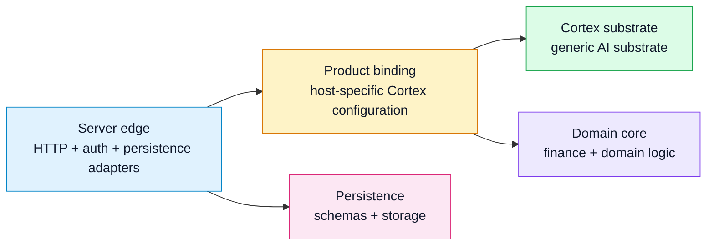

# Chapter 02 — Ownership and Boundaries

Cortex is a generic AI substrate. A host application embeds Cortex and supplies
domain semantics, transport, and persistence. Portman is the reference example
in this repository, but the boundary described here is meant to survive any
particular host.

This chapter states which subsystems own which responsibilities, which
direction dependencies run, and what may and may not cross each boundary.

## Core model

Three subsystems carry the bulk of the weight on either side of the boundary:

| Subsystem | Role |
|---|---|
| **Cortex substrate** | Reusable AI substrate: provider integrations, capability abstractions, the Graph / Circuit / Wire layers, and the Pulse runtime. |
| **Product binding** | Host-specific configuration of Cortex: prompts, grounding policy, tool registries, artifact assembly, and product policy. Portman calls this layer `Clerk`. |
| **Server edge** | Transport and persistence: HTTP, auth, streaming, request/response conversion, and persistence wiring. |

Two further subsystems are host-internal and do not interact with Cortex directly:

- **Domain core** — host domain types and finance logic.
- **Persistence** — schemas, queries, and storage.

Dependency direction is fixed:

`Server edge` → `Product binding` → `Cortex substrate`

Runtime flow may invert — Cortex calls back into host-provided handlers, and Pulse receives callbacks from host-registered executors — but module imports must follow the arrow above. A module in the Cortex substrate that imports anything host-specific is a boundary violation, regardless of what the runtime does.

The placement rule: if a module would be reusable outside the host as generic AI infrastructure, it belongs in the Cortex substrate, even when the product binding is currently the only caller. If it knows about finance semantics, host report artifacts, market-truth policy, or host tool authority, it stays downstream.

## Ownership breakdown

### Cortex substrate

Cortex is not a thin provider wrapper. It owns the generic substrate end to end, grouped into three layers:

- **Source language and graph layer.** Algebraic graph primitives (`Empty | Vertex | Overlay | Connect`), DAG validation, the validated executable Circuit, and the Wire source language that authors circuits. Normative Wire grammar lives at [`../Reference/Wire/grammar-v1.md`](../Reference/Wire/grammar-v1.md).
- **Runtime and agent layer.** The Pulse runtime — durable stage execution,
  checkpointing, rewrite hydration, and frontier scheduling — ships as its own
  service. Run lifecycle and stage events sit alongside it, with generic agent
  definitions and capability policies above.
- **Provider and capability layer.** Provider-specific HTTP clients and wire decoding, provider-neutral request/response types and tool-call records, generic JSON and text helpers.

### Product binding

The product binding is host-specific behavior. It configures Cortex for one product's use case and nothing more:

- prompts and model-catalog policy
- domain-specific grounding and truth policy (in Portman, finance market-truth)
- report assembly and report IR
- product-specific tool registries
- approval and policy behavior tied to product UX

### Server edge

The server edge is the transport and persistence boundary: HTTP routing, auth, SSE/poll, request/response conversion, persistence wiring, usage logging, edge error translation. Nothing else.

## Boundaries and invariants

Each boundary has a closed allow-list and an explicit forbid-list. Violations are caught in review today; mechanical enforcement is a direction-of-travel goal.

### Cortex substrate

Allowed: generic provider integrations; provider-neutral capability abstractions; Wire / Graph / Circuit / Pulse primitives; generic JSON, text, time, and runtime helpers; generic AI observability hooks.

Forbidden: any host-specific import; server transport types; host durable-task scheduling; database queries and schemas; finance-specific imports; host report or workspace artifact contracts.

The graph layer has a tighter rule than the rest of Cortex: it must contain no Pulse node identity, no rewrite lineage, no task scheduler coupling, no run-outcome semantics. It is pure graph algebra.

### Product binding

Allowed: the Cortex substrate, host domain core, host product code.

Forbidden as a long-term home: provider wire details, generic runtime helpers, or any utility that should be reusable by another host. If such code lands in the product binding during migration, it is a migration aid, not a durable boundary.

### Server edge

Allowed: the product binding, the host's transport API surface, auth, persistence, and route wiring.

Forbidden as a long-term home: provider clients, generic capability types, report or runtime orchestration that is not transport-specific, product-agnostic utility helpers. Edge handlers are thin adapters.

## Why this boundary matters

This split is not just cleanup discipline. It is what makes Cortex usable as a
real substrate:

- Cortex can evolve as a reusable system rather than as one product's internal
  helper layer.
- A second host can adopt Cortex by supplying its own bindings rather than by
  forking Cortex semantics.
- Product-specific meaning stays where product teams can change it without
  destabilizing the substrate.
- Transport and persistence concerns stay at the edge instead of leaking into
  the execution model.

## Extensibility

Downstream consumers extend Cortex by registering into closed alphabets, not by modifying Cortex modules:

- executors register under the `@qualified.name` namespace with declared vocabulary, structural constraints, and purity.
- contracts register with a payload kind and codec in the contract registry.
- tools register in the ambient tool namespace referenced from executor config records.

The boundary is preserved because Wire source only references names in these registries; it does not invent executor authority, contract semantics, or tool behavior. A second host stands up its own registrations and consumes Cortex unchanged.

## Related

- [./01-overview.md](./01-overview.md) — three-layer model and orientation.
- [../Reference/terminology.md](../Reference/terminology.md) — normative vocabulary.
- [./05-wire-language.md](./05-wire-language.md) — Wire substrate architecture.
- [./06-pulse-runtime.md](./06-pulse-runtime.md) — Pulse runtime details.
