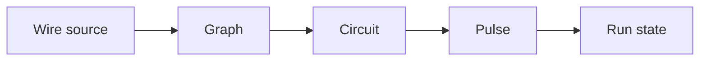

# Chapter 04 — Graph and Circuit

Chapter 03 establishes the algebraic basis. This chapter picks up one level later and defines the
two artifacts that matter operationally: Graph as pure topology, and Circuit as validated executable
topology. Graph keeps the formalism maximally reusable. Circuit is the point where a topology
becomes an artifact that Pulse can execute, persist, and re-validate after admitted rewrites.

## Core Model

The distinction is simple:

| Layer       | Role                                                                                                | Excludes                                             |
| ----------- | --------------------------------------------------------------------------------------------------- | ---------------------------------------------------- |
| **Graph**   | Pure topology: vertices, edges, overlay, connect, traversal, decomposition.                         | Ports, contracts, executors, payloads, runtime state |
| **Circuit** | Executable topology: stable nodes, compatible endpoints, boundary markers, runtime-facing metadata. | Scheduling, persistence policy, operator APIs        |

Wire authors topology using the Graph layer's composition laws. Pulse executes Circuits. The
boundary looks like this:

Each boundary narrows freedom:

- Wire chooses names, composition, and endpoint intent.
- Graph carries only denotational topology.
- Circuit checks that the topology is executable.
- Pulse schedules and persists the resulting executable object over time.
- Run state is the durable record of that execution, owned by Pulse and read by downstream artifact
  and provenance surfaces.

## Graph

Graph is the pure topology layer defined formally in
[Chapter 03 — Algebraic foundations](./03-formalism-stack.md). It is responsible for structure, not
meaning.

Graph owns:

- vertices and edges
- overlay and connect composition
- relation views, adjacency, traversal, and decomposition
- structural analysis such as reachability and topological inspection

Graph does not own:

- contracts or ports
- executor authority
- payload semantics
- runtime state or scheduling

A graph may be cyclic or acyclic. That distinction matters only when a topology is promoted into an
executable artifact. Keeping Graph permissive is what makes fragments, templates, and rewrite
proposals cheap to construct and analyze before execution is considered.

In practice, topology algorithms often run over a lowered relation or adjacency view rather than
over the authoring expression itself. That does not add new semantics; it is just the executable
denotation of the same topology.

## Circuit

Circuit is the executable topology artifact. It takes a graph-shaped structure and adds the facts
that execution needs but pure topology does not:

- stable node identity
- compatible endpoints between connected nodes
- explicit boundaries such as signal, artifact, and rewrite boundaries
- enough metadata for Pulse to lower and resume the topology safely
- a compatibility witness that downstream durable state can key against

Circuit is where executable invariants become mandatory. A topology that is perfectly valid as Graph
structure may still fail to become a Circuit if it is cyclic, references incompatible endpoints, or
does not preserve the required boundary information.

Circuit still does not own runtime behavior. It does not schedule work, store checkpoints, admit
rewrites, or decide operator policy. It defines the object those mechanisms operate on.

## The Compilation Boundary

Wire contributes three things to the Circuit boundary:

- a set of registered nodes and declared boundaries
- a composed topology over those nodes
- endpoint compatibility information already resolved at the authoring layer

Circuit compilation does not re-interpret domain semantics. Its job is narrower and more mechanical:
materialize the topology into an executable form, enforce the executable invariants, and emit an
artifact that Pulse can lower without re-parsing Wire.

Stated as seam contracts:

| Seam            | What comes in                                                        | What must come out                                                |
| --------------- | -------------------------------------------------------------------- | ----------------------------------------------------------------- |
| Wire → Circuit  | Registered nodes, composed topology, endpoint-compatible connections | Executable topology with stable identity and preserved boundaries |
| Circuit → Pulse | Executable topology plus compatibility witness                       | Runtime plan that preserves topology up to runtime naming         |

## Boundaries and Invariants

**Graph guarantees upward.** Structural algorithms operate over a coherent topology. Relation-style
views, adjacency, and decomposition must agree with the underlying edge set. Graph updates are
purely structural.

**Circuit guarantees upward.** A Circuit carries executable topology rather than merely possible
topology: acyclic structure, stable node identity, preserved boundaries, and a compatibility witness
suitable for durable consumers.

**Circuit guarantees downward.** Lowering preserves topology up to runtime renaming. Rewrite,
signal, and artifact boundaries remain explicit; Circuit does not collapse them into opaque generic
tasks.

**Delegated concerns.** The algebra and its laws live in Chapter 03. Wire owns source-language
composition and endpoint typing. Pulse owns scheduling, durability, and resume behavior. Chapter 08
owns value and artifact semantics. Graph and Circuit are the structural seam that lets those
concerns meet cleanly.

**Shared invariant: edges are opaque.** In both layers, an edge only means that one node feeds
another. Meaning lives at the endpoints, not on the edge itself. That is what keeps rewrites
tractable: topology changes can be checked mechanically without inventing edge-local semantics.

## Why the split matters

- It keeps the algebraic layer reusable and small.
- It puts executable checks exactly once, at the Circuit boundary.
- It lets rewrites propose structural edits without also re-defining runtime semantics.
- It gives downstream systems a clear extension point: register nodes, contracts, and host actions
  around the substrate instead of modifying the topology model itself.

The extension rule is correspondingly strict: host systems extend by supplying registered authority
around the substrate. They do not fork Graph semantics, and they should not use Circuit as a hiding
place for product policy.

## Related

- [./03-formalism-stack.md](./03-formalism-stack.md) — the algebra, Mokhov's laws, proofs.
- [./05-wire-language.md](./05-wire-language.md) — Wire as source language; contract registry.
- [./06-pulse-runtime.md](./06-pulse-runtime.md) — durable scheduling and execution over a compiled
  Circuit.
- [./07-rewrites-and-materialization.md](./07-rewrites-and-materialization.md) — dynamic rewrites
  admitted during execution.
- [./08-artifacts-and-provenance.md](./08-artifacts-and-provenance.md) — envelopes and payload kinds
  on edges.
- [./02-ownership-and-boundaries.md](./02-ownership-and-boundaries.md) — Cortex ↔ host boundary.
- [../Reference/terminology.md](../Reference/terminology.md) — normative vocabulary.
- [../Reference/Wire/grammar.md](../Reference/Wire/grammar.md) — Wire normative grammar.
