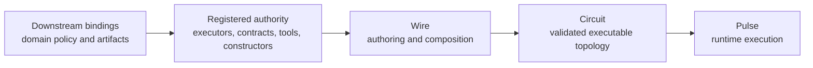

# Chapter 05 — Wire Language

Chapters 03 and 04 establish the algebraic and structural substrate. This chapter explains what Wire
adds on top: an author-facing language for composing registered authority into executable topology,
and a rewrite surface for proposing bounded structural change over the same model.

Wire is not where Cortex defines new runtime authority. It is where authors and agents compose
authority that has already been registered elsewhere.

## Relationship to the reference

This chapter is architectural. It explains what Wire is for and how it fits into Cortex.

The normative rules live in the reference:

- [Wire Grammar](../Reference/Wire/grammar.md) — grammar, precedence, type surface, composition
  semantics
- [Contracts, ports, and matching](../Reference/Wire/contracts-ports-and-matching.md) — contract
  namespace, port declarations, `=>` matching
- [Configured executors and execution boundary](../Reference/Wire/configured-executors-and-execution-boundary.md)
  — configured executor values, typed node boundaries, runnable-wire boundary
- [Conditionality](../Reference/Wire/conditionality.md) — `select(...)`, guarded-affine collapse,
  latent continuations, and selected-branch actualization
- [Rewrites](../Reference/rewrites.md) — bounded dynamic rewrite algebra, budget, admission,
  materialization, provenance
- [Modules, imports, and file returns](../Reference/Wire/modules-imports-and-file-returns.md) — file
  structure and import model

This chapter intentionally does not restate those rules in full.

## What Wire adds

Wire adds four things above the Graph and Circuit layers:

- an authoring surface for naming nodes, declarations, and reusable values
- endpoint-typed composition over registered contracts and ports
- configured executor reuse and configuration values
- a rewrite surface that lets topology changes be proposed in the same composition model used for
  initial authoring

Wire does not replace Graph or Circuit. It authors them. Graph remains the pure topology layer.
Circuit remains the validated executable artifact. Wire is the surface that turns registered
vocabulary into those artifacts.



## Design rules

Two rules carry most of the architecture:

```text
Wire composes registered authority.
The implementation owns what that authority means.
```

That yields three important consequences:

- Wire may reference executors, contracts, tools, and config constructors by name, but it does not
  define those authorities itself.
- Composition meaning lives at endpoints, not on edges. Edges stay structurally simple; contracts
  and ports determine whether a connection is valid.
- Domain semantics stay downstream. Cortex provides the language and substrate; host systems supply
  domain-specific vocabularies and policy.

## Registered authority

Wire is deliberately closed over authority. The language assumes an external registry surface for:

- executors
- contracts
- tool names and config constructors
- payload codecs, validation, and rendering rules

That closure is what keeps autonomous authoring and rewrites tractable. A Wire program can only
compose within a known vocabulary. It cannot invent a new executor, contract, or tool at compile
time.

This is also where the downstream boundary stays clean. A host system extends Cortex by registering
its own domain vocabulary around Wire rather than by changing Wire semantics.

## Nodes, Ports, And Edges

Wire's graph vocabulary has three different objects that should not be collapsed into each other:

- A **kind** is a reusable node-body shape. It is not live topology and does not have runtime
  identity by itself.
- A **node** is an addressable runtime and provenance object admitted into graph position.
- A **port** is a labeled input or output slot on the node boundary, typed by a contract.
- An **edge** connects one output port obligation to one compatible input port obligation.

```mermaid
flowchart LR
    subgraph A[Node analyze]
      AIn[evidence: EvidenceSet<br/>input port]
      ABody[@review.analyze<br/>local body]
      AOut[analysis: AnalysisRecord<br/>output port]
      AIn --> ABody --> AOut
    end

    subgraph B[Node summarize]
      BIn[analysis: AnalysisRecord<br/>input port]
      BBody[@review.summarize<br/>local body]
      BOut[summary: Summary<br/>output port]
      BIn --> BBody --> BOut
    end

    AOut ==>|contract + label match| BIn
```

In source, the same shape is explicit:

```wire
node analyze
  <- evidence: EvidenceSet;
  -> analysis: AnalysisRecord;
  = @review.analyze (evidence);

node summarize
  <- analysis: AnalysisRecord;
  -> summary: Summary;
  = @review.summarize (analysis);

analyze
  => summarize
```

The kind is the reusable shape. The node has identity and lifecycle. The ports carry the typed
boundary obligations. The edge is only the structural connection that says a producer output port
satisfies a consumer input port. It is not a place to hide computation, authority, projection,
aggregation, or retry policy.

This distinction matters for rewrites and recovery. A retained node can remain present for
provenance while its exposed boundary obligation has been transformed or consumed. Conversely, a
boundary obligation can be copied, moved, sealed, or discharged by node egress rules without
treating the node object itself as the linear resource.

## Boundary typing

Wire composes through endpoint compatibility rather than through semantic edge labels.

- ports declare what a node can accept or produce
- contracts name the semantic interface flowing through those ports
- `=>` connects compatible boundary ports
- payload validation and rendering happen in the contract registry and runtime surfaces, not in the
  graph operator itself

This is why Wire can stay structurally simple while still carrying meaningful types. The language
reasons about compatibility at the boundary. Rich payload meaning lives outside the composition
algebra.

One practical design rule follows from this split: edges carry typed values, not implicit context.
When a node aggregates several upstream values, author that shape explicitly as typed input ports
and pass a record or list to the executor body. Wire does not infer list aggregation from many
incoming arrows.

This typed port boundary is also the resource accounting surface for structural control. A node is
an addressable runtime and provenance object, but the locally consumed resource is the boundary
obligation it exposes. Rewrites, append continuations, and conditional actualization all have to
state which boundary they consume and which boundary they return. Retaining a node for provenance is
therefore not the same as keeping its original boundary obligation unspent.

This distinction is also what makes bounded generation possible without copying. `make(N, K)`
creates N fresh nodes from kind `K`; it does not clone one existing node or duplicate one output
port. Similarly, the `*` topology operator is an explicit record↔ports adapter node, not a hidden
fan-out rule on edges.

## Node boundary normal form

Wire nodes have a semantic normal form even when source syntax stays compact:

```text
input port environment
  -> ingress adapter
  -> local body
  -> egress adapter
  -> output port environment
```

The ingress adapter is authority-free boundary work over incoming ports: record packing, projection,
normalization, and deterministic precondition calculation. The local body is the authority-bearing
or transparent computation behind the whole node boundary. The egress adapter maps the body result
to declared output ports, validates or wraps those values, and accounts for copy, move, or seal
behavior at the boundary.

Edges never run these adapters. They only witness that a producer output port resource satisfies a
consumer input port obligation. If an authoring pattern appears to need "computation on an edge",
that computation belongs in producer egress, consumer ingress, or an explicit pure node.

See [ADR 0039](../ADRs/0039-wire-node-boundary-transform-normal-form.md) for the normal-form
decision.

## Conditionality and latent control

Wire conditionality is topology-level structural control, not value-level `if` hidden inside a
stage. The canonical surface is postfix `select(...)`: the graph on the left exposes an exclusive
output boundary, each arm provides a continuation for one variant, and exactly one continuation is
actualized.

The formal model is **guarded-affine collapse**. Before selection, every arm is checked as a sealed
latent continuation, and each branch-local boundary obligation is guarded by its arm key and affine:
it may be chosen at most once, but it is not live topology. Selection promotes the chosen arm into
the live linear context and discards the unselected arms for that run.

Pure computation may compute the selected arm key, but it does not gain graph rewrite authority. The
structural effect belongs to the compiled `select(...)` operator and to a restricted actualization
capability for that owner and arm. In the current runtime, that capability is realized through
retained-owner `AppendAfter` admission rather than a separate persisted `SelectActualize` token.
Branch actualization is not an arbitrary planner-authored rewrite.

## Configured executor values and reuse

Wire's reuse surface is the configured executor value: inert source data that names registered
executor authority and static config. It is not a graph vertex by itself. A configured executor
enters topology only when an explicit `node` declaration gives it a typed input/output boundary.

The canonical authored unit is:

```text
node = typed ports + executor body
```

Ports stay first-class because the graph type-checker reasons about them. Executor config carries
policy such as tools, memory authority, model choice, timeouts, budgets, and domain-specific fields.

```wire
let sectionWriter = @native.report_section_writer {
  memory = topological { preset = "analyst" };
  model = "gpt-5.4";
};

node valuation_writer
  <- brief: SectionBrief;
  -> fragment: ReportFragment;
  = sectionWriter (brief);
```

Per-node variation should appear as typed input data or as a separately named configured executor
value. Wire does not use configured executor values as hidden partial vertices whose port boundary
is discovered later.

Architecturally, this matters for two reasons:

- it keeps reusable executor policy visible in source review
- it keeps graph vertices tied to declared typed ports rather than to implicit context

The precise typing rules for configured executor values belong in the reference. The architectural
point is that reuse is compositional rather than template-like.

Workflow-level config may also provide defaults for executor config, for example default models or
per-executor model policy on a runtime wrapper. Those defaults only fill gaps; an explicit field
authored on a node remains authoritative.

## Pure computation and local binding

Wire has one deterministic expression layer, CorePure. It handles value transformations that should
stay inside the theorem-facing substrate: projection, filtering, scoring, record construction, and
text/config assembly. It does not name executor authority and it has no IO, tools, memory access,
time, randomness, or host callbacks.

Pure node bodies bind output labels directly:

```wire
node classify
  <- evidence: EvidenceSet;
  -> accepted: AcceptedSet = evidence.items |> filter (x: x.score >= 0.7);
  -> rejected: RejectedSet = evidence.items |> filter (x: x.score < 0.7);
```

If an expression is statically known, the compiler reduces it during elaboration. If it depends on
input ports, the same CorePure expression is delayed and lowered to the native pure evaluator.
General loops, host scripts, dynamic languages, IO, tools, and model calls belong behind explicit
`@` executors.

The binding story is deliberately split by surface:

- expression-local names use `let ... in` inside CorePure or Wire value expressions;
- module-level names use `let name = value ;` and are classified by the value they bind;
- node-local shared values use a trailing `where <record-expr> ;` clause whose fields are opened
  into the node body.

That split keeps `let ... in` expression-shaped. Node-local sharing is attached to the node as a
record of local names, not as a structural decoration between ports and body.

Module-level `let` is phase-neutral syntax. Graph-valued lets are elaborated at compile time, for
example `let pipeline = planner => analyst ;`. Configured executor values and ordinary scalar,
record, list, or string values are also compile-time module values. Delayed CorePure evaluation may
capture module lets only when their values are authority-free pure data, or when the binding is a
CorePure helper function such as `let pred = item: item.score >= 0.7 ;`. It may not capture graph
values or configured executor authority.

## Rewrites and runtime handoff

Wire is also the authoring surface for runtime topology evolution. A rewrite is not a different kind
of object from the initial graph; it is another composition over the same registered vocabulary and
compatibility rules.

The source-language view distinguishes three structural effects:

- **substitution**, where an anchor boundary is consumed and replaced by a graph exposing the same
  promised boundary;
- **append continuation**, where the anchor stays live and its output feeds a new downstream graph;
- **selected-branch actualization**, where a guarded continuation from a compiled branch family is
  promoted into live topology.

The current runtime may realize more than one conceptual effect with the same v1 constructor, but
the Wire language should keep their resource laws distinct.

The generic pattern is:

```text
Plan -> WorkItem* -> Fragment* -> Aggregate
```

The mutable part is the realized topology and the node configuration, not the core composition law.
That is why dynamic decomposition can stay bounded and checkable.

Wire does not admit rewrites by itself. The handoff is:

- Wire expresses the candidate structure
- Circuit validates that the structure is still executable
- Pulse decides admission, budgeting, materialization, and resume behavior

For latent branches, Pulse uses the current **selected-cost** policy: unselected arms do not consume
runtime rewrite budget, and the selected arm consumes ordinary rewrite budget when actualized. This
is not a reserved-capacity guarantee for every compiled arm.

That boundary keeps the language small. Wire describes candidate topology. Pulse owns runtime
policy.

## Downstream bindings

A consumer may register its own vocabulary around Wire, but it should not make Wire itself
product-specific.

Downstream bindings own:

- domain executor config, tools, and product policy
- product-specific artifact contracts and workflow templates
- registry entries that bind Cortex's generic composition model to one host

Cortex still owns the source language, composition rules, and substrate runtime.

## Related

- [Chapter 01 — Overview](01-overview.md) — system overview and high-level boundary
- [Chapter 04 — Graph and Circuit](04-graph-and-circuit.md) — the structural layers Wire authors
- [Chapter 06 — Pulse runtime](06-pulse-runtime.md) — runtime execution over Circuits
- [Chapter 07 — Rewrites and materialization](07-rewrites-and-materialization.md) — runtime
  admission and realized topology
- [Chapter 08 — Artifacts and provenance](08-artifacts-and-provenance.md) — payload, artifact, and
  provenance surfaces
- [ADR 0017 — Wire Executor and Port Catalog Boundary](../ADRs/0017-wire-executor-and-port-catalog-boundary.md)
  — contract, port, executor, and binding separation
- [ADR 0020 — Wire Pure Output Equations](../ADRs/0020-wire-pure-output-equations.md) —
  deterministic CorePure output equations
- [ADR 0050 — Wire CorePure Output Residue](../ADRs/0050-wire-corepure-output-residue.md) — direct
  output expressions and static/runtime residue split
- [ADR 0034 — Pure Selectors and Restricted Actualization Authority](../ADRs/0034-wire-pure-select-actualization-authority.md)
  — pure branch choice without general rewrite authority
- [Wire Grammar](../Reference/Wire/grammar.md) — normative grammar
- [Cortex Terminology](../Reference/terminology.md) — accepted vocabulary
- [Consumer examples](../Consumers/) — downstream binding examples
