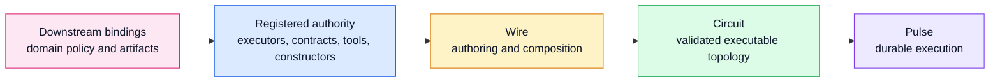

# Chapter 05 — Wire Language

Chapters 03 and 04 establish the algebraic and structural substrate. This
chapter explains what Wire adds on top: an author-facing language for composing
registered authority into executable topology, and a rewrite surface for
proposing bounded structural change over the same model.

Wire is not where Cortex defines new runtime authority. It is where authors and
agents compose authority that has already been registered elsewhere.

## Relationship to the reference

This chapter is architectural. It explains what Wire is for and how it fits
into Cortex.

The normative rules live in the reference:

- [Wire Grammar v1](../Reference/Wire/grammar-v1.md) — grammar, precedence,
  type surface, composition semantics
- [Contracts, ports, and matching](../Reference/Wire/contracts-ports-and-matching.md) —
  contract namespace, port declarations, `=>` matching
- [Partials and execution boundary](../Reference/Wire/partials-and-execution-boundary.md) —
  partial nodes, port-determined rule, runnable-wire boundary
- [Rewrites](../Reference/rewrites.md) — bounded dynamic rewrite algebra,
  budget, admission, materialization, provenance
- [Modules, imports, and file returns](../Reference/Wire/modules-imports-and-file-returns.md) —
  file structure and import model

This chapter intentionally does not restate those rules in full.

## What Wire adds

Wire adds four things above the Graph and Circuit layers:

- an authoring surface for naming nodes, declarations, and reusable values
- endpoint-typed composition over registered contracts and ports
- partial-node reuse and configuration layering
- a rewrite surface that lets topology changes be proposed in the same
  composition model used for initial authoring

Wire does not replace Graph or Circuit. It authors them. Graph remains the pure
topology layer. Circuit remains the validated executable artifact. Wire is the
surface that turns registered vocabulary into those artifacts.



## Design rules

Two rules carry most of the architecture:

```text
Wire composes registered authority.
The implementation owns what that authority means.
```

That yields three important consequences:

- Wire may reference executors, contracts, prompts, tools, and config
  constructors by name, but it does not define those authorities itself.
- Composition meaning lives at endpoints, not on edges. Edges stay structurally
  simple; contracts and ports determine whether a connection is valid.
- Domain semantics stay downstream. Cortex provides the language and substrate;
  host systems supply domain-specific vocabularies and policy.

## Registered authority

Wire is deliberately closed over authority. The language assumes an external
registry surface for:

- executors
- contracts
- tool names and config constructors
- payload codecs, validation, and rendering rules

That closure is what keeps autonomous authoring and rewrites tractable. A Wire
program can only compose within a known vocabulary. It cannot invent a new
executor, contract, or tool at compile time.

This is also where the downstream boundary stays clean. A host system extends
Cortex by registering its own domain vocabulary around Wire rather than by
changing Wire semantics.

## Boundary typing

Wire composes through endpoint compatibility rather than through semantic edge
labels.

- ports declare what a node can accept or produce
- contracts name the semantic interface flowing through those ports
- `=>` connects compatible boundary ports
- payload validation and rendering happen in the contract registry and runtime
  surfaces, not in the graph operator itself

This is why Wire can stay structurally simple while still carrying meaningful
types. The language reasons about compatibility at the boundary. Rich payload
meaning lives outside the composition algebra.

One practical design rule follows from this split: use ports for stable
structural roles, not for encoding graph-discovered collections. When a node
aggregates a variable number of homogeneous fragments, the structural shape
should usually be "many fragments of one contract" rather than "one separately
named port per expected fragment."

## Partial nodes and reuse

Wire's reuse surface is the partial node: a configured executor value whose
remaining structural choices are pinned later.

The canonical authored unit is:

```text
node = ports + executor(config)
```

Ports stay first-class because the graph type-checker reasons about them.
Everything behavioral belongs in executor config: prompt, tools, memory, model
choice, timeouts, budgets, and domain-specific fields.

```wire
let section_writer_base = @native.report_section_writer {
  memory = topological { preset = "analyst"; };
};

node valuation_writer :
  <- SectionBrief
  -> ReportFragment | ExecutorError
= section_writer_base // {
  prompt = "Write the valuation stress dimension.";
  sectionId = "valuation";
  title = "Valuation Stress";
};
```

Rewrite producers use the same explicit `node ... = @executor { ... };` form as
authored workflows. There is no separate template-use syntax in the Wire
surface.

Architecturally, this matters for two reasons:

- it keeps reuse inside the same value algebra as the rest of the language
- it lets rewrites instantiate new nodes by authoring bounded executor configs
  against already-registered authority

The precise typing rules for partial nodes belong in the reference. The
architectural point is that reuse is compositional rather than template-like.

Workflow-level config may also provide defaults for executor config, for
example default models or per-executor model policy on a runtime wrapper.
Those defaults only fill gaps; an explicit field authored on a node remains
authoritative.

## Rewrites and runtime handoff

Wire is also the authoring surface for runtime topology evolution. A rewrite is
not a different kind of object from the initial graph; it is another
composition over the same registered vocabulary and compatibility rules.

The generic pattern is:

```text
Plan -> WorkItem* -> Fragment* -> Aggregate
```

The mutable part is the realized topology and the node configuration, not the
core composition law. That is why dynamic decomposition can stay bounded and
checkable.

Wire does not admit rewrites by itself. The handoff is:

- Wire expresses the candidate structure
- Circuit validates that the structure is still executable
- Pulse decides admission, budgeting, materialization, and resume behavior

That boundary keeps the language small. Wire describes candidate topology.
Pulse owns runtime policy.

## Downstream bindings

Portman is the downstream example in this repository, not the definition of
Wire.

In Portman:

- domain prompts, finance tools, and report policy stay downstream
- Portman-specific artifact contracts such as report flows stay downstream
- Cortex still owns the source language, composition rules, and substrate
  runtime

The same pattern should hold for any other host system. A consumer may register
its own vocabulary around Wire, but it should not make Wire itself product
specific.

## Related

- [Chapter 01 — Overview](01-overview.md) — system overview and high-level
  boundary
- [Chapter 04 — Graph and Circuit](04-graph-and-circuit.md) — the structural
  layers Wire authors
- [Chapter 06 — Pulse runtime](06-pulse-runtime.md) — durable execution over
  Circuits
- [Chapter 07 — Rewrites and materialization](07-rewrites-and-materialization.md) —
  runtime admission and realized topology
- [Chapter 08 — Artifacts and provenance](08-artifacts-and-provenance.md) —
  payload, artifact, and provenance surfaces
- [Wire Grammar v1](../Reference/Wire/grammar-v1.md) — normative grammar
- [Cortex Terminology](../Reference/terminology.md) — accepted vocabulary
- [Portman deep-report v2](../Consumers/Portman/deep-report-v2.md) — downstream
  integration example
