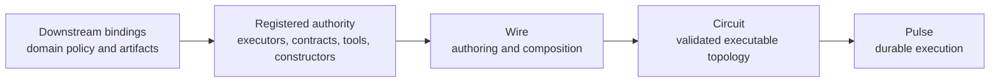

# Chapter 05 — Wire Language

Chapters 03 and 04 establish the algebraic and structural substrate. This chapter explains what Wire
adds on top: an author-facing language for composing registered authority into executable topology,
and a rewrite surface for proposing bounded structural change over the same model.

Wire is not where Cortex defines new runtime authority. It is where authors and agents compose
authority that has already been registered elsewhere.

## Relationship to the reference

This chapter is architectural. It explains what Wire is for and how it fits into Cortex.

The normative rules live in the reference:

- [Wire Grammar](../Reference/Wire/grammar.md) — grammar, precedence, type surface, composition
  semantics
- [Contracts, ports, and matching](../Reference/Wire/contracts-ports-and-matching.md) — contract
  namespace, port declarations, `=>` matching
- [Configured executors and execution boundary](../Reference/Wire/configured-executors-and-execution-boundary.md)
  — configured executor values, typed node boundaries, runnable-wire boundary
- [Rewrites](../Reference/rewrites.md) — bounded dynamic rewrite algebra, budget, admission,
  materialization, provenance
- [Modules, imports, and file returns](../Reference/Wire/modules-imports-and-file-returns.md) — file
  structure and import model

This chapter intentionally does not restate those rules in full.

## What Wire adds

Wire adds four things above the Graph and Circuit layers:

- an authoring surface for naming nodes, declarations, and reusable values
- endpoint-typed composition over registered contracts and ports
- configured executor reuse and configuration values
- a rewrite surface that lets topology changes be proposed in the same composition model used for
  initial authoring

Wire does not replace Graph or Circuit. It authors them. Graph remains the pure topology layer.
Circuit remains the validated executable artifact. Wire is the surface that turns registered
vocabulary into those artifacts.



## Design rules

Two rules carry most of the architecture:

```text
Wire composes registered authority.
The implementation owns what that authority means.
```

That yields three important consequences:

- Wire may reference executors, contracts, prompts, tools, and config constructors by name, but it
  does not define those authorities itself.
- Composition meaning lives at endpoints, not on edges. Edges stay structurally simple; contracts
  and ports determine whether a connection is valid.
- Domain semantics stay downstream. Cortex provides the language and substrate; host systems supply
  domain-specific vocabularies and policy.

## Registered authority

Wire is deliberately closed over authority. The language assumes an external registry surface for:

- executors
- contracts
- tool names and config constructors
- payload codecs, validation, and rendering rules

That closure is what keeps autonomous authoring and rewrites tractable. A Wire program can only
compose within a known vocabulary. It cannot invent a new executor, contract, or tool at compile
time.

This is also where the downstream boundary stays clean. A host system extends Cortex by registering
its own domain vocabulary around Wire rather than by changing Wire semantics.

## Boundary typing

Wire composes through endpoint compatibility rather than through semantic edge labels.

- ports declare what a node can accept or produce
- contracts name the semantic interface flowing through those ports
- `=>` connects compatible boundary ports
- payload validation and rendering happen in the contract registry and runtime surfaces, not in the
  graph operator itself

This is why Wire can stay structurally simple while still carrying meaningful types. The language
reasons about compatibility at the boundary. Rich payload meaning lives outside the composition
algebra.

One practical design rule follows from this split: edges carry typed values, not implicit context.
When a node aggregates several upstream values, author that shape explicitly as typed input ports
and pass a record or list to the executor body. Wire does not infer list aggregation from many
incoming arrows.

## Configured executor values and reuse

Wire's reuse surface is the configured executor value: inert source data that names registered
executor authority and static config. It is not a graph vertex by itself. A configured executor
enters topology only when an explicit `node` declaration gives it a typed input/output boundary.

The canonical authored unit is:

```text
node = typed ports + executor body
```

Ports stay first-class because the graph type-checker reasons about them. Executor config carries
policy such as tools, memory authority, model choice, timeouts, budgets, and domain-specific fields.

```wire
let sectionWriter = @native.report_section_writer {
  memory = topological { preset = "analyst" } ;
  model = "gpt-5.4" ;
} ;

node valuation_writer
  <- brief: SectionBrief ;
  -> fragment: ReportFragment ;
  = sectionWriter (brief) ;
```

Per-node variation should appear as typed input data or as a separately named configured executor
value. Wire does not use configured executor values as hidden partial vertices whose port boundary
is discovered later.

Architecturally, this matters for two reasons:

- it keeps reusable executor policy visible in source review
- it keeps graph vertices tied to declared typed ports rather than to implicit context

The precise typing rules for configured executor values belong in the reference. The architectural
point is that reuse is compositional rather than template-like.

Workflow-level config may also provide defaults for executor config, for example default models or
per-executor model policy on a runtime wrapper. Those defaults only fill gaps; an explicit field
authored on a node remains authoritative.

## Pure computation and local binding

Wire has one deterministic expression layer, CorePure. It handles value transformations that should
stay inside the theorem-facing substrate: projection, filtering, scoring, record construction, and
prompt-text assembly. It does not name executor authority and it has no IO, tools, memory access,
time, randomness, or host callbacks.

Pure node bodies bind output labels directly:

```wire
node classify
  <- evidence: EvidenceSet ;
  -> accepted: AcceptedSet = pure (accepted) ;
  -> rejected: RejectedSet = pure (rejected) ;
  where let
    items = evidence.items ;
    accepted = items |> filter (x: x.score >= 0.7) ;
    rejected = items |> filter (x: x.score < 0.7) ;
  in
  { accepted = accepted ; rejected = rejected ; } ;
```

The binding story is deliberately split by surface:

- expression-local names use `let ... in` inside CorePure or Wire value expressions;
- module-level names use `let name = value ;` and are classified by the value they bind;
- node-local shared values use a trailing `where <record-expr> ;` clause whose fields are opened
  into the node body.

That split keeps `let ... in` expression-shaped. Node-local sharing is attached to the node as a
record of local names, not as a structural decoration between ports and body.

Module-level `let` is phase-neutral syntax. Graph-valued lets are elaborated at compile time, for
example `let pipeline = planner => analyst ;`. Configured executor values and ordinary scalar,
record, list, or string values are also compile-time module values. Delayed CorePure evaluation may
capture module lets only when their values are authority-free pure data, or when the binding is a
CorePure helper function such as `let pred = item: item.score >= 0.7 ;`. It may not capture graph
values or configured executor authority.

## Rewrites and runtime handoff

Wire is also the authoring surface for runtime topology evolution. A rewrite is not a different kind
of object from the initial graph; it is another composition over the same registered vocabulary and
compatibility rules.

The generic pattern is:

```text
Plan -> WorkItem* -> Fragment* -> Aggregate
```

The mutable part is the realized topology and the node configuration, not the core composition law.
That is why dynamic decomposition can stay bounded and checkable.

Wire does not admit rewrites by itself. The handoff is:

- Wire expresses the candidate structure
- Circuit validates that the structure is still executable
- Pulse decides admission, budgeting, materialization, and resume behavior

That boundary keeps the language small. Wire describes candidate topology. Pulse owns runtime
policy.

## Downstream bindings

A consumer may register its own vocabulary around Wire, but it should not make Wire itself
product-specific.

Downstream bindings own:

- domain prompts, tools, and product policy
- product-specific artifact contracts and workflow templates
- registry entries that bind Cortex's generic composition model to one host

Cortex still owns the source language, composition rules, and substrate runtime.

## Related

- [Chapter 01 — Overview](01-overview.md) — system overview and high-level boundary
- [Chapter 04 — Graph and Circuit](04-graph-and-circuit.md) — the structural layers Wire authors
- [Chapter 06 — Pulse runtime](06-pulse-runtime.md) — durable execution over Circuits
- [Chapter 07 — Rewrites and materialization](07-rewrites-and-materialization.md) — runtime
  admission and realized topology
- [Chapter 08 — Artifacts and provenance](08-artifacts-and-provenance.md) — payload, artifact, and
  provenance surfaces
- [ADR 0017 — Wire Executor and Port Catalog Boundary](../ADRs/0017-wire-executor-and-port-catalog-boundary.md)
  — contract, port, executor, and binding separation
- [ADR 0020 — Wire Pure Output Equations](../ADRs/0020-wire-pure-output-equations.md) —
  deterministic CorePure output equations
- [Wire Grammar](../Reference/Wire/grammar.md) — normative grammar
- [Cortex Terminology](../Reference/terminology.md) — accepted vocabulary
- [Consumer examples](../Consumers/) — downstream binding examples
