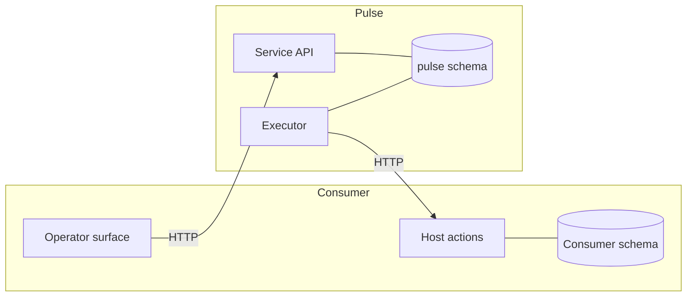

# Chapter 06 — Pulse Runtime

Pulse is the durable runtime that executes Circuits. It is the mechanical
realization of the Circuit semantics laid out in chapters 03 and 04: a
standalone service that owns scheduling, stage execution, checkpoint
persistence, cancellation, lease recovery, and rewrite materialization for
long-lived Cortex runs. This chapter covers the runtime model, Pulse-owned
state, stage execution, the memory surface, and the contract Pulse presents
to downstream consumers. Portman is cited as the reference consumer; the
contract does not depend on Portman-specific semantics.

If you are evaluating Cortex rather than implementing against Pulse directly,
the core model and service boundary are the key sections. The later sections
spell out the runtime mechanics in detail.

Wire source examples on this page use v1 syntax. The normative grammar is
[`../Reference/Wire/grammar-v1.md`](../Reference/Wire/grammar-v1.md); the
substrate story is [`./05-wire-language.md`](./05-wire-language.md).

## Core model

Pulse is a runtime, not an algebra. It interprets a compiled Circuit as a
sequence of stage transitions and records each transition durably. Every
stage boundary has a persisted checkpoint; every resume is a pure function
of persisted state. The service owns six concerns:

| Concern                         | Role                                                                       |
|---------------------------------|----------------------------------------------------------------------------|
| Scheduling                      | Own due-task discovery, CAS claim, cron advancement, lease recovery.       |
| Stage execution                 | Drive a Circuit's stage plan forward, one admitted transition at a time.   |
| Checkpoint persistence          | Write a versioned envelope at every stage boundary. Validate on resume.    |
| Cancellation                    | Propagate a cancel request to the executor and finalize at safe boundaries.|
| Rewrite materialization         | Atomically admit, apply, and record structural rewrites during a run.      |
| Observability                   | Emit lifecycle and per-stage events; expose run detail through a service API. |

Pulse does not define task semantics. Consumers register task types and
provide the stage actions; Pulse executes them. The generic contract is
captured in [`../Reference/Pulse/`](../Reference/Pulse/). Portman's
binding is in
[`../Consumers/Portman/pulse-host-actions.md`](../Consumers/Portman/pulse-host-actions.md).

## Service boundary

Pulse runs as its own service with its own DB schema. Consumers talk to
Pulse through HTTP. When Pulse needs domain work, it calls the consumer
back through a host-action API the consumer provides.



The boundary is strict:

- **Pulse owns** task definitions, runs, checkpoints, stage log, stage attempt log, scheduling, leases, cancellation flags, and run lifecycle.
- **The consumer owns** domain state and operator surfaces. It writes its own tables only through its own APIs.
- **Neither side reads the other's tables.** Pulse fetches domain context through host actions; consumers fetch run state through Pulse's API.

Co-locating both schemas in a single PostgreSQL cluster is an operational shortcut. The service-API-first contract means migrating to separate databases is cheap.

Endpoint shapes, authentication, and idempotency rules live in [`../Reference/Pulse/service-api.md`](../Reference/Pulse/service-api.md).

## Runtime model

### Process

Pulse runs as a standalone daemon under a process supervisor. It exposes a
health endpoint, recovers stale leases on startup, and restarts without
affecting the consumer's own processes.

### Scheduling

Pulse owns its scheduler. The poll loop discovers due tasks, claims them
with a CAS flag on the task row, creates a run, and advances the schedule
— all within Pulse-owned storage. No consumer table participates in
scheduling. The claim flag prevents double-claiming without overloading
`next_run_at` semantics; see
[`../Reference/Pulse/schema.md`](../Reference/Pulse/schema.md#2-task-definitions).

### Concurrent execution

Pulse runs up to N concurrent task runs per process, bounded by a shared
pool. Each cycle of the poll loop reaps finished runs, fills remaining
slots, and updates health counters. Per-task-type caps prevent any one
task type from starving others; unconfigured types share the remaining
global capacity.

Ordinary-node execution runs concurrently across the frontier. Rewrite
proposals may also arise from multiple frontier nodes in the same wave, but
rewrite admission is still deterministic rather than fully concurrent in the
strong semantic sense: proposals are admitted through a shared admission gate
and shared remaining-budget state, then materialized in deterministic order
after frontier classification. See
[chapter 07](./07-rewrites-and-materialization.md) for the admission contract.

### Lifecycle

- **Startup.** Connect to the database, verify schema, recover stale runs
  by resuming from their last completed checkpoint, start the scheduler
  and the health endpoint.
- **Shutdown.** On SIGTERM, stop claiming new work, drain in-flight runs
  at a tight poll interval, finalize each completed run, and exit.
- **Unclean exit.** On SIGKILL or crash, the next startup re-reads the
  last completed checkpoint and re-executes the incomplete stage.

### Run identity and operator verbs

A run is the unit of durable execution identity. Checkpoints belong to a
run. This principle determines the semantics of every operator action:

| Verb       | Meaning                                         | Implementation                                                                       |
|------------|-------------------------------------------------|--------------------------------------------------------------------------------------|
| **Resume** | Continue the same run after crash or lease loss.| Scheduler reclaim path — same `run_id`, same checkpoint lineage.                     |
| **Retry**  | Start a fresh execution.                        | New `run_id`, links to parent via `parent_run_id`, no checkpoint inheritance.        |
| **Cancel** | Request graceful termination.                   | Sets `cancel_requested_at`; executor checks at stage boundaries.                     |

Resume is not an operator action — it happens automatically when the
scheduler reclaims a run whose lease has expired. Any future
"restart from checkpoint" or "branch from run" capability would be modeled
as a distinct Tier 2 operation with explicit version compatibility checks
and side-effect fencing, not as a variant of retry.

## Stage execution

### Typed stage identity

Each stage in a Pulse run has a stable text identity. For linear plans,
the stage kind and the durable identity coincide. For rewrite-capable
runs, identity splits into four typed ids — `NodeId`, `stageId`,
`StageTemplateId`, `StageActionId` — so that rewritten nodes bind to the
intended runtime action on resume. The split is specified in
[`../Reference/Pulse/types.md`](../Reference/Pulse/types.md#3-stage-identity).

### Stage plans

The executor operates on a `StagePlan`: a typed container for a task's
executable dependency graph, its initial state, the replay policy, the
runtime version, and the initial rewrite budget. Each node carries a
`StageDefinition` that names the stage kind, its template, its action, its
replay safety, and optional per-stage timeout and retry policy. Shapes are
in [`../Reference/Pulse/types.md`](../Reference/Pulse/types.md#4-stage-plan).

`spCheckpointRuntimeVersion` is embedded in checkpoint envelopes and
validated on resume. Bumping it after a breaking stage-plan change causes
in-flight runs to fail cleanly instead of resuming against incompatible
code.

### Replay safety

Each stage declares its replay safety: `SafeToReplay` or `Irreversible`.
Irreversible stages (persistence writes, external trade execution) have
side effects that cannot be undone. The executor emits a warning event if
it detects a prior stage-log entry for an `Irreversible` stage during
resume, since the side effect may have partially completed.

### Retry

Per-stage retry policies name a serialized retryability predicate, a max
attempt count, a backoff schedule (fixed or exponential, capped), and an
exhaustion policy (fail the run, or skip the stage). Each attempt is
recorded in `pulse.stage_attempt_log`. Cancellation and shutdown checks
run between retries.

Per-stage `sdTimeoutSeconds` takes precedence over the task-level timeout
when set.

### Mandatory checkpoints

The executor rejects a stage transition that does not include a
checkpoint write. Every stage boundary has a persisted
`CheckpointEnvelope`, even when the task completes successfully without
needing resume. This enforces serialization discipline from day one.

### Resume

On resume, Pulse parses the raw checkpoint payload into a
`CheckpointEnvelope` and validates format, task type, task version, and
runtime version against the current code. A mismatch produces a
`checkpoint_incompatible` failure — the run fails non-retryably rather
than silently resuming against changed code. The executor then extracts
the last completed stage and its state, skips up to that stage, warns if
the next stage is `Irreversible` with a prior entry, and resumes from
the next stage. Host-action results needed for remaining stages come
from the checkpoint state, not by re-calling the host action.

### Current rewrite contract

Pulse owns where rewrite admission happens in the runtime loop, but it does not
own the rewrite contract in full. The current runtime admits bounded,
fail-fast rewrites during execution and persists enough anchor state to resume
correctly after admission. The full contract — rewrite forms, gas, admission
policy, materialization, and structural provenance — belongs to
[Chapter 07](./07-rewrites-and-materialization.md).

## Topological memory

Memory is a query, not a store. A stage's view of upstream context is a
deterministic graph query over the Pulse event substrate, scored by a
composite of graph influence, wall-clock distance, and a pluggable
semantic score. There is no parallel claim-assertion table; the substrate
is already indexed by node, by completion time, and by output schema, and
it is already append-only.

### Three graphs

A running Circuit at any moment contains three graphs:

- **Past** — settled nodes (`NodeCompleted`, `NodeSkipped`, `NodeRewritten`)
  with materialized outputs. This is memory. Stable, searchable, the only
  thing the memory API surfaces for domain queries.
- **Present** — the current frontier. Running and waiting nodes are
  deliberately excluded from memory: there is no observable artifact yet,
  and including them would leak sibling context into a stage that is
  supposed to run blind of its peers.
- **Future** — not-yet-materialized descendants and latent rewrites.
  Absent from memory by construction.

The `WalkScope` type reflects this split: `SettledOnly` for domain code;
`DebugAllStatuses` for operator inspection surfaces. Even when widened,
the scoring stage drops nodes without materialized payloads, so widening
never surfaces live-only statuses as memory matches.

### Stage-entry snapshot binding

The past/present split is enforced by binding one snapshot per stage
attempt. At stage entry the executor captures a `MemorySnapshot` over the
graph state, completion timestamps, and topology in one STM transaction,
and every `queryMemory` call on that stage's handle returns results
computed against that bound snapshot. Mid-attempt writes — a sibling
settling while this stage is still executing — are invisible to the bound
handle. The next stage's entry fires a new capture that does observe
them. Re-execution after a rejected rewrite is treated as a fresh stage
entry: a new handle is bound.

### Query pipeline

`queryMemory` uses a fixed, deterministic pipeline:

1. Enumerate reachable candidates by walk direction with BFS hop
   distance.
2. Compute DAG random-walk influence from the origin over the same
   direction relation. Bidirectional walks evaluate both directions and
   merge the influence maps with `max`.
3. Apply the hard graph-distance cutoff as a pre-filter only.
4. Drop candidates without materialized payloads.
5. Apply the query extractor and routing-key filter.
6. Score each survivor by graph influence, temporal distance, and the
   configured semantic scorer.
7. Sort by `(score DESC, graphDistance ASC, NodeId ASC)`.
8. Apply `limit` after sort.

Graph influence replaced the older `1 / (1 + hops)` graph axis because
hop count treats a node reached through many short paths the same as one
reached through a single chain. Influence rewards merges and shared
upstream structure without introducing an iterative fixed-point
procedure.

### Per-node declaration

Memory is a per-node property declared on the wire, not a global run
setting. The `MemoryStrategy` ADT is the surface:
`MemoryClassic` (the executor hands the stage exactly what its declared
upstream produced) or `MemoryTopological cfg` (the stage runs a
`queryMemory` walk at entry with the preset, routing-key filter, and
top-N limit from `cfg`). Wire grammar:

```wire
node reviewer :
  <- AnalystDraft
  -> ReviewerDraft | ExecutorError
= @llm.reviewer {
  memory = topological {
    preset = "reviewer";
    routingKey = "analyst";
    limit = 16;
  };
};
```

Short form `memory = classic;` is equivalent to omitting the field.
Changing strategy does not subsume classic — it remains a legitimate
choice, and its local-causality guarantee is the reason many stages
should keep it.

### Reviewer retrieval

The current reviewer contract is pull-based. Under `MemoryClassic`, the
reviewer sees only its direct inputs and runs as a normal single-shot
stage. Under `MemoryTopological`, the prompt is still prefilled only
with the direct-predecessor Markov boundary and the stage gets
`cortex_memory_query` as an on-demand retrieval tool. This keeps the
default prompt bounded while preserving access to sibling analysts and
distant ancestors when the model explicitly asks for them.

The full `MemoryStrategy` type, the scoring pipeline, and the
determinism contract are in
[`../Reference/Pulse/types.md`](../Reference/Pulse/types.md#6-memory-strategy).

## Cancellation

Cancellation is Pulse-owned state. The protocol:

1. The consumer's operator surface calls Pulse's cancel endpoint.
2. Pulse sets `cancel_requested_at` on the run row.
3. The executor checks the flag at every stage transition, between
   tool-loop steps within a stage, and before any irreversible host
   action.
4. On cancel, the current stage completes or is abandoned at the next
   safe boundary, a checkpoint is written at the last completed stage,
   the run is transitioned to `cancelled` with a reason, and the
   schedule advances normally.

Only Pulse transitions runs to terminal states. Consumers never write
Pulse run state directly.

## Observability

Pulse emits structured events on lifecycle transitions: run start, run
complete, run fail, lease loss, schedule advance, and per-stage
completion. Event fields include `run_id`, `task_id`, `task_type`,
`trigger_source`, `checkpoint_name`, per-stage `duration_ms`, and on
failure the `error_type` and `retryable` flag. Model-call and tool-call
cost is tracked in Pulse's own usage records. The generic error taxonomy
is in [`../Reference/Pulse/service-api.md`](../Reference/Pulse/service-api.md#6-error-taxonomy);
consumer-specific categories live with the consumer.

The admin run-detail response surfaces the persisted node-state summary,
remaining rewrite budget, applied rewrite watermark, rewrite history,
per-rewrite structural delta, and for supported graph tasks the
structured blocked and waiting sets.

## Boundaries and invariants

What this runtime enforces:

- **Durability at every stage boundary.** No stage transition is admitted
  without a checkpoint write. Resume is a pure function of persisted
  state.
- **Version compatibility.** Format, task, task-config, and runtime
  versions on the checkpoint envelope must all match on resume. Mismatch
  fails the run non-retryably.
- **Clean service boundary.** Neither side reads the other's tables.
  Pulse fetches domain context through the host-action contract;
  consumers fetch run state through Pulse's service API.
- **Single terminal-state writer.** Only Pulse transitions runs to
  terminal states. Cancel is a request, not a mutation.
- **Past/present isolation in memory.** Mid-stage frontier writes are
  invisible to a stage's bound memory handle.

What Pulse does not enforce: task semantics, domain validation, payload
kinds, and rewrite algebra — delegated to the Circuit layer, the
contract registry, and the consumer's host actions.

## Extensibility

New task kinds enter host-side: the host registers a handler and a
versioned config decoder under a new `TaskKind` tag. New stage-plan features enter by bumping
`spCheckpointRuntimeVersion` alongside a decoder migration. New memory
strategies attach as additional `MemoryStrategy` constructors with their
own wire syntax and executor dispatch. New error categories are added to
the taxonomy with an explicit retryability classification. None of these
require changes to the service boundary or the checkpoint envelope
format.

Child workflows (spawn sub-runs, await completion) and true concurrent
rewrite admission are the largest deferred extensions; the retained theory
thread is the rewrite materialization and recovery plan.

## Related

- [./01-overview.md](./01-overview.md), [./03-formalism-stack.md](./03-formalism-stack.md), [./04-graph-and-circuit.md](./04-graph-and-circuit.md), [./07-rewrites-and-materialization.md](./07-rewrites-and-materialization.md), [./08-artifacts-and-provenance.md](./08-artifacts-and-provenance.md)
- [../Reference/Pulse/](../Reference/Pulse/) — schema, types, service API.
- [../Reference/terminology.md](../Reference/terminology.md) — normative vocabulary.
- [../Consumers/Portman/pulse-host-actions.md](../Consumers/Portman/pulse-host-actions.md) — Portman's host-action contract and task types.
- [../Consumers/Portman/response-eval-run.md](../Consumers/Portman/response-eval-run.md) — ResponseEvalRun detailed design.
- [../Roadmap/Plans/rewrite-materialization-and-recovery.md](../Roadmap/Plans/rewrite-materialization-and-recovery.md) — rewrite and recovery research plan.
