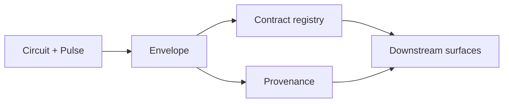

# Chapter 08 — Artifacts and Provenance

Chapter 07 covers structural provenance: how live topology changes over a run. This chapter covers
value and artifact provenance: what crosses an edge at runtime, how payload meaning is defined, and
how a downstream system can answer "where did this value come from?" without changing the
substrate's topology model.

The central idea is simple: runtime values travel as typed envelopes, while their semantic meaning
lives in the contract registry rather than in Wire syntax or edge-local labels.

## What this layer owns

This layer sits between executable topology and downstream artifact surfaces. It owns:

- the runtime envelope that carries values across edges
- the contract-owned interpretation of payloads
- payload-kind-driven validation and rendering behavior
- provenance that records where a value came from

It does not own:

- graph structure or rewrite provenance
- source-language typing rules
- downstream artifact presentation such as report-specific HTML, spans, or UI affordances



## Runtime envelopes

At runtime, Cortex moves envelopes rather than bare payloads. The envelope is a uniform carrier with
four responsibilities:

- identify what semantic contract the value claims to satisfy
- identify which node produced it
- carry the payload in a transportable form
- carry provenance metadata for later inspection

Illustrative shape:

```json
{
  "contract": "EvidenceBundle",
  "mediaType": "application/json",
  "producer": "gatherer",
  "value": {
    "items": []
  },
  "provenance": {
    "runId": "run_123",
    "nodeId": "gatherer",
    "derivedFrom": ["planner"]
  }
}
```

The important architectural point is not the field spelling. It is the split of responsibility:

- the runtime stamps envelope metadata
- the contract registry defines what the payload means
- downstream consumers decide how to present or store the resulting artifact

## Contract-owned meaning

The envelope carries a contract ID, but the ID alone is not the semantic type. Meaning lives in the
contract registry.

The registry is the authority for:

- payload kind
- validation rules
- codecs or equivalent decode/encode behavior
- examples and rendering hints
- content-level lint or normalization rules

This keeps the composition layer small. Wire and Circuit only need stable contract identity and
compatibility. Rich payload meaning stays in the registry surface that implementations and
downstream consumers can evolve deliberately.

That is also what keeps the downstream boundary clean: a host system can define its own domain
contracts without changing the substrate's composition or topology model.

## Payload kinds

Payload kinds are the substrate's coarse runtime categories for payload handling. They are not the
full semantic type. They select which validation and rendering pipeline applies.

Typical kinds include:

- `json` for structured payloads
- `markdown` for rendered document fragments
- `text` for plain text
- `table` for row/column data
- `artifact_ref` for references to durable blobs or externalized artifacts

The architecture relies on a two-level split:

```text
Envelope-level check:
  Is the contract known?
  Is this contract accepted at the destination boundary?

Contract-level check:
  Does the payload satisfy the validation and rendering rules for that contract?
```

That split is important because it lets Cortex keep routing and composition mechanical while still
supporting rich payload semantics.

## Value provenance

Value provenance answers where a specific runtime value came from. It is not the same as graph
provenance.

Value provenance tracks facts such as:

- which run produced the value
- which node emitted it
- which upstream producers informed it
- which tool or external actions shaped it when the execution model exposes that detail

Graph provenance, by contrast, tracks how the executable topology changed over time. That belongs to
Chapter 07.

The separation matters because the two questions are different:

- "Which rewrites were admitted?" is a graph question.
- "Where did this output number or document fragment come from?" is a value question.

Keeping the records separate lets Cortex answer both without overloading one structure with two
kinds of meaning.

## Artifact surfaces

An envelope is not yet a user-facing artifact. It is the substrate unit from which artifacts are
built.

Downstream systems build richer artifact surfaces by layering on top of:

- the envelope
- the contract registry
- the runtime provenance chain

That layered design is what allows the substrate to stay generic. Cortex does not need to know about
a particular consumer's report layout, annotation model, HTML rendering, or consumer presentation UX
in order to provide trustworthy provenance.

## Artifact references

One special case matters architecturally: some values are references to durable artifacts rather
than inline payloads.

`artifact_ref`-style contracts let the substrate move a stable reference through the graph while
leaving blob storage, large document rendering, or binary retrieval to the consumer boundary. This
prevents the graph runtime from having to copy large artifacts through every edge while still
keeping provenance and contract identity attached.

## Downstream bindings

Consumer-specific artifact surfaces are downstream bindings on top of the generic envelope and
provenance surfaces described here. Those bindings belong in consumer docs and ADRs, not in the
substrate chapter itself.

The pattern is:

- Cortex owns the generic runtime envelope and provenance model
- the consumer owns its presentation model, audit UX, and domain-specific artifact contracts

## Why this split matters

- It keeps runtime transport and composition generic.
- It lets provenance travel with values without hard-coding a particular UI or artifact format into
  Cortex.
- It gives downstream systems enough structure to build trustworthy audit and inspection surfaces.
- It prevents product-specific artifact meaning from leaking into the substrate layer.

## Related

- [Chapter 05 — Wire language](05-wire-language.md) — source-language view of contracts and
  registered authority
- [Chapter 06 — Pulse runtime](06-pulse-runtime.md) — runtime that emits and propagates envelopes
  during execution
- [Chapter 07 — Rewrites and materialization](07-rewrites-and-materialization.md) — structural
  provenance and realized topology
- [Cortex Terminology](../Reference/terminology.md) — normative definitions of envelope, payload
  kind, contract registry, and provenance
- [ADR 0013 — Artifact Provenance Contract](../ADRs/0013-report-provenance-artifact-contract.md) —
  artifact provenance contract decision
- [ADR 0040 — Logos-Owned Reasoning Surfaces](../ADRs/0040-logos-owned-reasoning-surfaces.md) —
  concrete report/document IR ownership
- [Consumer examples](../Consumers/) — downstream binding examples
