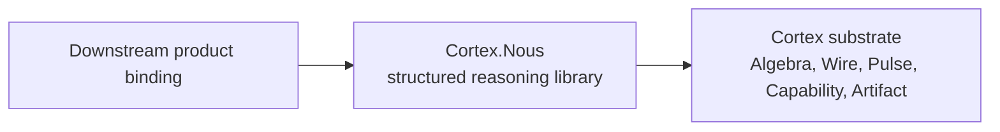

# Chapter 09 — Nous Reasoning Library

`Cortex.Nous` is the structured reasoning library above the Cortex substrate. It
names reusable epistemological modes under `Cortex.Nous.Archetypes`, one bounded
model-mediated node evaluation under `Cortex.Nous.Thought`, cognitive memory
under `Cortex.Nous.Memory`, and reusable reasoning programs under
`Cortex.Nous.Patterns`. It does not extend the runtime alphabet. Algebra, Wire,
Pulse, Capability, and Artifact mechanics remain the substrate. Nous composes
those mechanics into reusable reasoning programs.

> **Implementation staging.** Current Haskell modules still use staging paths such
> as `Cortex.Nous.Logos` and `Cortex.Nous.Logos.Capability`. Canonical paths such
> as `Cortex.Nous.Archetypes.Logos` and planned pattern modules such as
> `Cortex.Nous.Patterns.DeepReport` land through ADR 0017 migration slices.

## Core model

The split is vertical:

| Layer | Owns | Does not own |
|---|---|---|
| Cortex runtime substrate | Algebra, Wire language and compiled circuit form, Pulse execution, Capability authority, Artifact provenance. | Product persona, domain policy, concrete reasoning templates. |
| `Cortex.Nous` | Archetype taxonomy, thoughts, cognitive memory, reusable pattern catalogs, `.wire` templates, prompt families, memory presets, contract-entry conventions. | Runtime authority, new executor kinds, new contract registry, host tools. |
| Downstream product binding | Domain prompts, product policy, domain tools, approval behavior, product artifact semantics. | Generic substrate mechanics or generic Nous archetype definitions. |

The dependency direction is strict:



Substrate code must not import Nous. Nous may import runtime types and publish
catalog values or source templates that consumers opt into.

## Detailed structure

### Canonical tree

The canonical module and concept tree is:

```text
Cortex.Nous
|-- Archetypes
|   |-- Logos     -- discursive reason, argument, symbolic reasoning
|   |   `-- Activation
|   |-- Sophia    -- wisdom, judgment, synthesis
|   |   `-- Activation
|   |-- Techne    -- craft, engineering, implementation
|   |   `-- Activation
|   |-- Episteme  -- knowledge, evidence, research
|   |   `-- Activation
|   |-- Kritikos  -- criticism, adversarial review
|   |   `-- Activation
|   |-- Themis    -- audit, law, correctness, constraints
|   |   `-- Activation
|   `-- Poiesis   -- creative generation, composition
|       `-- Activation
|-- Thought       -- one bounded model-mediated node evaluation
|-- Memory        -- cognitive memory and context construction
`-- Patterns
    `-- DeepReport -- planned extraction target
```

### Archetype catalog

The first catalog contains seven archetypes:

| Archetype | Role | Typical responsibility | Literature-backed pattern |
|---|---|---|---|
| `Cortex.Nous.Archetypes.Logos` | Discursive reason, argument, symbolic reasoning | Make reasoning explicit as structured claims, premises, inference, and explanation. | Self-consistency, Tree of Thoughts |
| `Cortex.Nous.Archetypes.Sophia` | Wisdom, judgment, synthesis | Weigh competing goods, recognize context, identify salience, and synthesize under uncertainty. | LLM-as-a-judge, multi-agent debate |
| `Cortex.Nous.Archetypes.Techne` | Craft, engineering, implementation | Turn understanding into working artifacts, executable plans, interfaces, tests, and systems. | SWE-agent, CodeAct, tool-use frameworks |
| `Cortex.Nous.Archetypes.Episteme` | Knowledge, evidence, research | Ground cognition in what is known, observed, measured, cited, or otherwise supported. | ReAct, tool-use agents, information retrieval |
| `Cortex.Nous.Archetypes.Kritikos` | Criticism, adversarial review | Apply constructive severity to expose weak claims, hidden assumptions, contradictions, and failure modes. | Constitutional AI, red-teaming |
| `Cortex.Nous.Archetypes.Themis` | Audit, law, correctness, constraints | Ensure reasoning and action remain within defined bounds, contracts, policies, and invariants. | AI safety, Constitutional AI, alignment |
| `Cortex.Nous.Archetypes.Poiesis` | Creative generation, composition | Bring forth new forms, alternatives, narratives, designs, and generative possibilities. | Creative generation, story-telling agents |

The catalog describes reusable modes of cognition. It does not prescribe a
specific provider, model, prompt, tool list, or domain ontology. Those are later
library presets or downstream bindings.

### Activation bundles

An archetype becomes operational when it is implemented as an activation bundle:

```text
Cortex.Nous.Archetypes.<Archetype>.Activation
  = prompt discipline
  + retrieval corpus
  + embedding index
  + tool surface
  + evaluation criteria
  + memory policy
  + runtime contract
```

The archetype is the semantic definition. The activation is the concrete bundle
of assets and policies that implement that mode. A thought frame composes one or
more archetype activations into a single cognitive evaluation.

Current implementation status: this first PR lands the type shape and module
slots only. Current `Cortex.Nous.<Archetype>.Capability` modules are staging
stubs. The canonical target is
`Cortex.Nous.Archetypes.<Archetype>.Activation`, populated by later PRs with real
prompts, corpora, embedding indexes, tool surfaces, memory policies, evaluation
checks, and runtime contracts.

For example, `Cortex.Nous.Archetypes.Episteme.Activation` is the home for
evidence-grounded prompts, source-quality rules, retrieval strategies,
source-ranking heuristics, uncertainty policy, citation discipline, and
validation tests. A `Cortex.Nous.Archetypes.Kritikos.Activation` bundle is the
home for adversarial-review prompts, failure-mode corpora, contradiction checks,
falsification discipline, and red-team evaluation. A
`Cortex.Nous.Archetypes.Techne.Activation` bundle is the home for codebase-local
implementation memory, architecture conventions, build and test patterns, and
implementation checks.

This makes the vocabulary operational. A node is not just tagged with
`Episteme`; it runs with the Episteme activation active. The activation shapes what
context is retrieved, which tools are available, which prompt discipline is
applied, which memory policy is used, and how the result is evaluated.

The stub activations in this PR are not yet operational substrates. They are public
slots and expected component lists for follow-up implementation.

Retrieval is thought-frame-aware rather than a single global index per archetype. An
activation can combine canonical corpus, local project corpus, examples, failures,
contracts, and tool docs with task-specific weights. A `Techne` activation for
Cortex code and a `Techne` activation for another domain share the archetype but
activate different local corpora and tool surfaces.

### Catalog artifacts

Nous can expose the following catalog artifacts:

| Artifact | Shape | Runtime relationship |
|---|---|---|
| Archetype definitions | Haskell data values under `Cortex.Nous.Archetypes` | Metadata only. No runtime registration. |
| Activation bundle slots | Prompts, corpus selectors, embeddings, tools, memory policy, evaluation, runtime contract | Stubbed in this PR; later activated by thought frames and interpreted through existing substrate APIs. |
| Thought runtime | Frame, policy, host, tool loop, structured output, thought events | Uses model and tool capabilities without owning provider or tool authority. |
| Cognitive memory | Retrieval, ranking, packing, compaction, source selection, topological context | Builds model context over substrate state; Pulse remains durable execution state. |
| Pattern catalogs | `Cortex.Nous.Patterns.<Name>` modules | Library-owned reasoning programs interpreted by existing substrate APIs. |
| Template programs | `.wire` modules shipped by Nous patterns | Imported by consumers and compiled by the normal Wire compiler. |
| Memory presets | Haskell values naming query and walk strategy defaults | Passed through `Cortex.Nous.Memory` APIs over substrate state. |
| Contract conventions | Stable contract entries and documentation | Implemented through the existing contract registry. |
| Prompt families | Text builders or source artifacts | Bound to executors by consumers or library templates. |

The important rule is that each artifact is interpreted by an existing
substrate mechanism. Nous catalogs do not add a hidden resolver.

## Boundaries and invariants

Nous is correct when these invariants hold:

- Substrate modules do not import `Cortex.Nous` modules.
- Archetype names never grant tool access, model access, side effects, or host
  authority.
- Archetype activations can request tool surfaces and runtime contracts, but those
  requests are still admitted through existing executor, contract, and host
  authority boundaries.
- Patterns can ship contracts, ports, prompts, and templates, but executable
  authority still comes from consumer-selected executors and host bindings.
- A node's executable authority still comes from its registered executor and its
  configured tool scope.
- A node's payload obligations still come from its contracts and runtime
  validation.
- Archetypes classify epistemic function and reusable program shape; contracts
  define data obligations; activations bundle operational assets; executors
  define runnable authority.

What Nous intentionally does not enforce in this first slice:

- role-contract refinement typing
- per-run admission policy for reasoning templates
- full canonical `.wire` program set
- downstream domain semantics

Those are follow-up decisions and implementation work, not prerequisites for the
taxonomy to exist.

## Extensibility

New archetypes require an ADR because they change the public epistemological
vocabulary. Downstream products do not need an ADR to create product-specific
roles; they should map those roles to the nearest Nous archetype when using
generic templates.

Program templates extend the library by composing existing runtime authority:

- choose archetypes for structural role clarity
- bind concrete executors through the normal executor registry
- bind contracts through the normal contract registry
- attach memory presets through `Cortex.Nous.Memory`
- compile through Wire and run through Pulse unchanged

The planned target for reusable LLM-shaped workflow extraction is
`Cortex.Nous.Patterns.DeepReport`. Its first slices should extract generic
contract and port catalogs; downstream bindings keep product tools, artifact
semantics, DB loading, and authorization.

## Related

- [ADR 0015 — Structured Reasoning Above the Cortex Substrate](../ADRs/0015-cortex-logoi-reasoning-layer.md)
- [ADR 0016 — Canonical Cortex Nous Archetypes](../ADRs/0016-canonical-cortex-epistemological-archetypes.md)
- [ADR 0017 — Cortex Roots and Nous Pattern Extraction](../ADRs/0017-cortex-roots-and-nous-pattern-extraction.md)
- [Chapter 02 — Ownership and boundaries](02-ownership-and-boundaries.md)
- [Chapter 05 — Wire language](05-wire-language.md)
- [Chapter 08 — Artifacts and provenance](08-artifacts-and-provenance.md)
- GitHub #14, #31, and #32 for the first role-contract, debate, and critique
  workflows that need this vocabulary.
