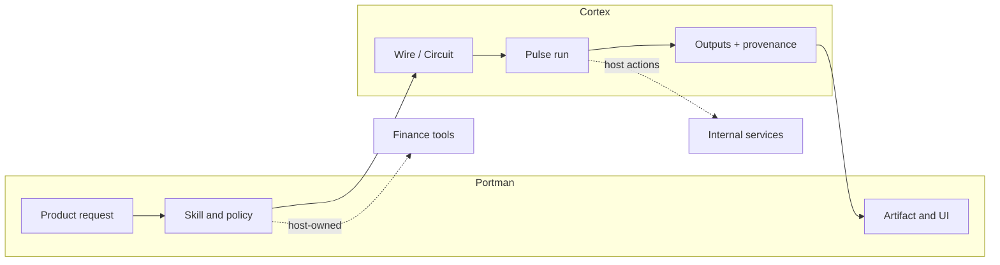

# Portman Consumer Example

Portman is a private downstream product that uses Cortex as an upstream substrate. This page is an
example of a consumer binding, not a specification for Cortex and not the full Portman system
design.

The useful pattern is the ownership boundary: Cortex owns reusable substrate mechanics, while the
consumer owns product semantics, policy, persistence, and operator experience.

## Boundary

| Cortex owns                                                                                 | Portman owns                                                                                    |
| ------------------------------------------------------------------------------------------- | ----------------------------------------------------------------------------------------------- |
| Wire authoring, graph composition, Circuit validation, and Pulse execution.                 | Product skills, finance policy, prompts, tool allowlists, report shape, and UI language.        |
| Generic run state, retries, cancellation, host-action boundaries, and provenance mechanics. | Product persistence, admin APIs, workspace surfaces, scorecards, and customer-facing artifacts. |
| Structured document and artifact contracts that can be reused by other consumers.           | Mapping those contracts into Portman report artifacts and private product workflows.            |

If another consumer could reuse the rule unchanged, it belongs in Cortex canon. If the rule depends
on Portman's product surface, storage model, or private domain policy, it belongs downstream.

## Binding Shape

Portman's current Cortex usage can be summarized as four binding points.

| Binding point         | Cortex role                                                                                        | Portman role                                                                                                     |
| --------------------- | -------------------------------------------------------------------------------------------------- | ---------------------------------------------------------------------------------------------------------------- |
| Deep research reports | Run a bounded research workflow and return structured research/document outputs.                   | Bind the workflow to the `/deep-report` product skill, finance prompts, section ordering, and report UX.         |
| Report provenance     | Provide reusable structured document and provenance mechanics.                                     | Resolve tool-call evidence into product-facing report inspection, freshness indicators, and workspace artifacts. |
| Pulse host actions    | Execute durable runs and call host-owned actions for domain side effects.                          | Implement authenticated, idempotent host actions and expose product-specific operator controls.                  |
| Evaluation runs       | Exercise the Pulse lifecycle with typed outcomes, checkpoints, cancellation, and partial progress. | Persist eval rows, scorecards, and admin read models in the private product database.                            |

The diagram is intentionally high level. Private endpoint names, table names, CLI commands, issue
IDs, and product rollout plans are Portman implementation details and should live in the Portman
repository.

## Why This Example Stays Here

Portman is useful in the Cortex docs because it shows how a real downstream consumer binds the
substrate:

- product skills sit above Wire and Pulse rather than inside them
- durable execution crosses into the host only through explicit host actions
- structured artifacts are reusable, but product rendering and storage are not
- provenance is substrate-supported, then presented through product policy

The example should stay compact. It should help a new consumer understand where to attach their own
semantics without making Portman the frame for Cortex.

## Related

- [../Architecture/02-ownership-and-boundaries.md](../Architecture/02-ownership-and-boundaries.md) -
  Cortex and downstream ownership rules.
- [../Architecture/05-wire-language.md](../Architecture/05-wire-language.md) - Wire authoring and
  registered authority.
- [../Architecture/06-pulse-runtime.md](../Architecture/06-pulse-runtime.md) - durable execution and
  host-action boundary.
- [../Architecture/08-artifacts-and-provenance.md](../Architecture/08-artifacts-and-provenance.md) -
  artifact and provenance substrate.
- [../ADRs/0002-cortex-downstream-ownership-boundary.md](../ADRs/0002-cortex-downstream-ownership-boundary.md) -
  decision record for keeping downstream examples out of the Cortex frame.
