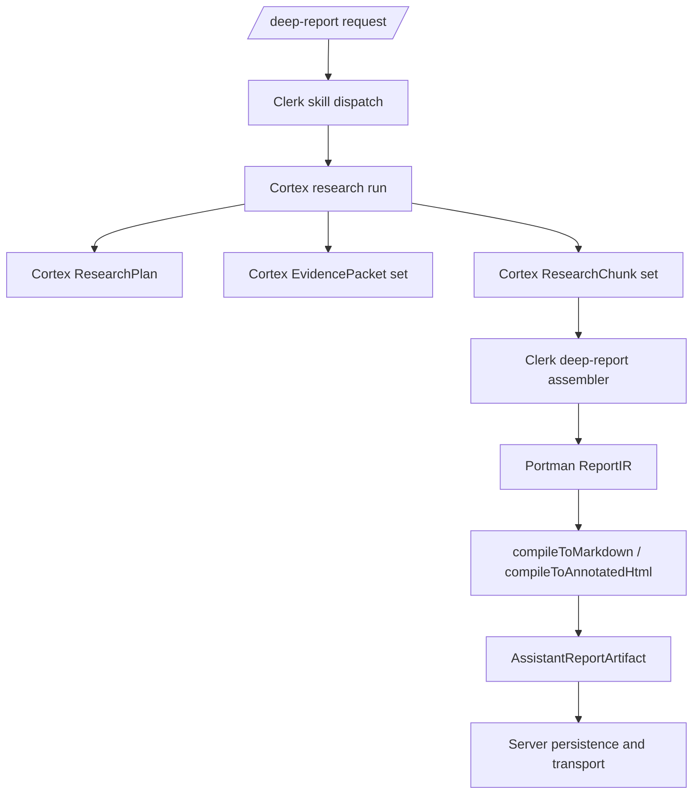

# Deep-Report v2 Architecture

Status: **Draft spec**

Last updated: **March 13, 2026** — DIG-304.

## Purpose

This page defines the Portman-specific architecture for the next generation of
`/deep-report`.

It is intentionally **not** the generic AI runtime spec. The generic provider,
runtime, research, memory, and long-lived task architecture is now owned by
[Cortex Architecture](/docs/Architecture/01-overview/).

This page only defines:

- how Portman's `/deep-report` skill binds onto Cortex
- how Portman finance prompts, tools, and policy shape that run
- how Cortex research outputs become Portman `ReportIR`
- how Portman report provenance and artifact rules are preserved

## Relationship to Other Docs

- [Cortex Architecture](/docs/Architecture/01-overview/) owns generic AI runtime and
  provider capability interfaces.
- Portman's Clerk skill docs define the product skill contract downstream.
- [Structured Document IR](/docs/ADRs/0001-structured-report-ir/) defines the
  reusable Cortex document artifact contract.
- [Clerk Report Provenance](/docs/Consumers/Portman/report-provenance/) defines the
  Portman provenance contract.

## Current Shipped Runtime

Today the shipped code path is:

```text
/deep-report
-> Planner
-> Gatherer
-> Analyst
-> Reviewer
-> Section Planner
-> Section Compilers emit bounded ResearchChunk outputs
-> local ReportIR assembly
-> local compileToMarkdown / compileToAnnotatedHtml
-> AssistantReportArtifact
```

The failure found in `DIG-296` was a boundary problem in the older runtime:

- the final compiler call had to emit the whole root `ReportIR`
- the provider hit `finish_reason=length`
- the `composeReport` JSON arguments were truncated
- the artifact could not be finalized

The fix is not "let Clerk own a different giant compiler." The fix is to move
generic research/runtime ownership into Cortex and keep only the Portman
binding downstream.

## Correct Ownership Model

Deep-report v2 is a **Clerk skill built on Cortex**.

### Cortex owns

- provider selection and capability paths
- the generic research workflow
- generic run-state, retries, cancellation, and telemetry
- generic research outputs such as `ResearchPlan`, `EvidencePacket`,
  `ResearchChunk`, `ExternalCitation`, and `RunLimitations`

### Clerk owns

- Portman deep-report prompts and skill binding
- Portman finance tools and tool policy
- Portman section semantics and report ordering
- conversion from Cortex research outputs into `ReportIR`
- Portman provenance rules
- Portman-specific degraded-report behavior and UX text

### Server owns

- HTTP start/poll/SSE surfaces
- persistence and workspace wiring
- artifact storage and retrieval

## Target Flow



Key rule:

- no model-facing path emits the full root `ReportIR`

Instead:

- Cortex produces bounded generic research chunks
- Clerk assembles the Portman report artifact from those chunks

## Core Decisions

### 1. `/deep-report` becomes a Clerk binding over a Cortex research workflow

The familiar user-facing phase labels may remain:

- Planner
- Gatherer
- Analyst
- Reviewer
- Compiler

But these are Portman-facing labels over a Cortex-owned generic research
runtime. Clerk does not own the underlying orchestration substrate anymore.

### 2. The model-facing output contract is Cortex `ResearchChunk`, not Portman `ReportIR`

Deep-report v2 should consume a Cortex-owned generic chunk contract such as:

```haskell
data ResearchChunk = ResearchChunk
  { chunkId :: Text
  , title :: Text
  , summary :: Maybe Text
  , body :: [ChunkParagraph]
  , structuredFindings :: [ChunkFinding]
  , tables :: [ChunkTable]
  , deterministicEvidenceRefs :: [EvidenceRef]
  , externalCitations :: [ExternalCitation]
  , openGaps :: [Text]
  }
```

The ownership rule is:

- Cortex owns the generic chunk contract and its validation limits
- Clerk owns how Portman maps those chunks into report sections and final
  `ReportIR`

### 3. `/deep-report` must stop exposing `composeReport`

Decision:

- `/deep-report` v2 no longer exposes `composeReport` as a model-facing tool

Instead:

- Cortex models emit bounded research chunks
- Clerk assembles the root `ReportIR`
- Clerk validates and compiles the final artifact locally

Current state:

- the legacy `composeReport` seam has now been removed
- there is one canonical report path: bounded section outputs, local `ReportIR`
  assembly, and local artifact compilation

### 4. Report assembly is Clerk-owned, not server-owned

Portman report assembly belongs downstream with the Portman report schema.

Clerk owns:

- section ordering for Portman reports
- chunk-to-`ReportIR` mapping
- report-local provenance ID assignment
- limitations blocks for omitted Portman sections

Server does not own report assembly logic in the target architecture.

### 5. Deterministic provenance remains Portman-owned

Portman keeps the deterministic-first provenance rule:

- deterministic tool-backed claims are first-class report provenance
- external web/document research remains attributed context unless a later
  provenance expansion is accepted

Implications:

- Cortex may return deterministic evidence references and external citations
- Clerk maps those into Portman provenance and attributed report content
- models do not invent Portman provenance IDs

### 6. Provider-native research is chosen through Cortex capability paths

OpenAI/OpenRouter features remain useful, but their selection is a Cortex
capability-path concern.

Clerk only defines policy such as:

- whether a Portman deep-report run may use external research
- whether a given phase must remain deterministic
- whether a provider-retained path is allowed for this skill

### 7. Degraded success is still a Portman product decision

If Cortex cannot produce every chunk successfully:

- Clerk may still assemble a partial Portman report if enough validated chunks
  remain
- Clerk must inject a Portman limitations block naming omitted sections and
  defect classes
- Server surfaces the resulting artifact or terminal error, but does not decide
  report semantics

## Migration Plan

### Phase 1: move generic AI ownership into Cortex

- move provider adapters into Cortex
- move generic research/runtime contracts into Cortex
- move generic memory/retrieval and long-lived task contracts into Cortex

This phase is about ownership, not deep-report behavior changes.

### Phase 2: bind `/deep-report` onto Cortex outputs

- keep `/deep-report` as a Clerk skill
- replace the monolithic compiler output with Cortex `ResearchChunk`s
- add a Clerk deep-report assembler that produces `ReportIR`

### Phase 3: retire the monolithic deep-report compiler boundary

- done: `composeReport` has been removed from the report runtime
- done: the temporary legacy compatibility path has been deleted as well

## Success Criteria

Deep-report v2 is structurally correct when:

- generic AI runtime and provider behavior are owned by Cortex
- `/deep-report` is clearly a Clerk configuration layer on top of Cortex
- no deep-report model call emits the root `ReportIR`
- Clerk assembles the Portman report artifact locally
- server handlers only transport and persist the result
