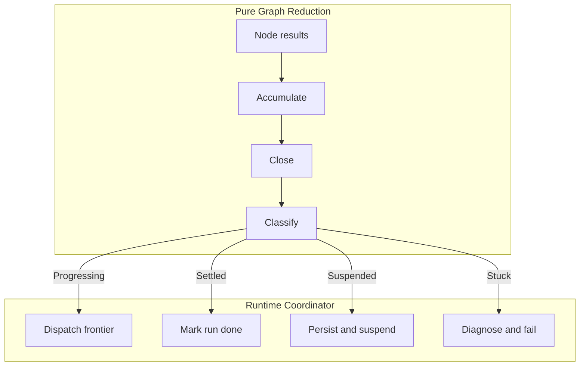

# Staged Reduction for Durable Workflow Execution

## Abstract

We present a durable workflow execution runtime organized as a staged pure reduction over fixed
algebraic graph topology. Workers produce node-local outcomes from an immutable predecessor-complete
snapshot. The coordinator applies results through three phases with distinct algebraic roles:
**accumulation** of commutative local facts, **closure** under an idempotent failure-propagation
operator, and **classification** of the resulting state into a lifecycle decision. The central claim
of the paper is intentionally narrow: incremental persistence is **structurally safe** at any point
during accumulation because recovery normalizes partially persisted state and re-closes it before
any authoritative lifecycle decision is taken. We define the recovered-state validity contract
explicitly and show how the three-phase decomposition explains both normal execution and crash
recovery. The paper reports the design as implemented in the Pulse runtime, contrasts it with the
failure modes of an earlier imperative runtime, and supports the implementation claims with
property-based validation plus a proof sketch of the core structural argument. We do not claim
end-to-end workflow correctness, outcome reproducibility for nondeterministic stages, or
topology-changing rewrite correctness in this paper.

## Artifact Status

The fixed-topology kernel is mechanized in Lean 4 under `theory/Cortex/Pulse/`; see
[lean-mechanization.md](lean-mechanization.md) for the artifact mapping. The boundary between the
Lean model and the live Haskell runtime is documented in
[lean-haskell-boundary.md](lean-haskell-boundary.md).

## 1. Introduction

Durable execution runtimes — systems that execute long-running workflows with crash recovery, signal
suspension, and audit trails — must answer a fundamental question: when do you persist state, and
what invariants does the persisted state satisfy?

Event-sourced runtimes (Temporal [\[1\]](#ref-1), Azure Durable Functions [\[2\]](#ref-2)) replay
workflow code from a command journal on crash. This achieves determinism but constrains workflow
code: no randomness, no direct I/O, no threading. Checkpoint-based systems (Flink [\[3\]](#ref-3),
derived from Chandy-Lamport [\[4\]](#ref-4)) snapshot operator state at barriers. DAG-based
orchestrators (Airflow [\[5\]](#ref-5), Dagster [\[6\]](#ref-6)) track task instance status but
typically treat the graph as scheduling metadata rather than as the semantic object that defines
state transitions.

We take a different approach. In our runtime, the algebraic graph topology is the source of the
state-transition semantics. The execution frontier — the set of nodes ready to execute — is an
antichain in the DAG's reachability order (Lemma 1). Workers execute from a common snapshot and
produce pure result values. The coordinator applies results through a staged reduction:

1. **Accumulate:** apply each worker's result as a commutative point update to graph state.
2. **Close:** propagate failure consequences through the topology via an idempotent closure
   operator.
3. **Classify:** determine whether the graph is progressing, settled, suspended, or stuck.

The architectural insight is that persistence boundaries align with algebraic phase boundaries.
Because the closure operator is idempotent, the coordinator can persist at any point during
accumulation — even mid-frontier — and recovery can normalize the partial state and re-close it
before resuming. This removes the need for frontier-atomic persistence and makes incremental
per-node persistence in the concurrent path safe by construction rather than by careful
synchronization.

### 1.1 Context

The model is implemented in the Pulse runtime for graph-shaped AI and host-action workflows. Pulse
manages workflows with 4-20 stages per plan, including stages that call external APIs, evaluate
model responses, and execute multi-step host actions. The staged-reduction model replaced an earlier
imperative design that used per-worker atomic state mutation and ad hoc recovery logic; that design
produced persist races, duplicated failure propagation, and exception-handling ambiguity that
motivated the redesign.

### 1.2 Assumptions and Scope

The algebra governs state transitions. It does not govern:

- worker I/O (the side effects of stage execution)
- persistence timing (when the coordinator writes to the database)
- signal delivery protocol (when external signals arrive)
- replay policy enforcement (whether irreversible stages may re-execute)
- topology-changing graph rewriting

These are coordinator responsibilities outside the pure reduction.

Model assumptions:

- finite DAG topology, validated at execution entry
- node execution is opaque I/O that produces a closed `NodeOutcome` value
- persistence occurs at coordinator-defined points
- signal suspension is a first-class node outcome inside the same reduction

Claim boundaries:

- **Claimed in this paper:** structural persistence safety for fixed-topology execution
- **Not claimed in this paper:** end-to-end workflow correctness, exact outcome reproducibility for
  nondeterministic stages, or rewrite-capable execution

When outcome reproducibility is discussed, it is conditional on a standard piecewise-determinism
assumption: re-executed nodes observe the same predecessor-complete inputs and produce compatible
results. Structural safety does not require that assumption; only outcome identity does.

## 2. Background

### 2.1 Algebraic Graphs

Mokhov [\[7\]](#ref-7) introduces an algebraic graph with four constructors:

```haskell
data Graph a
  = Empty
  | Vertex a
  | Overlay (Graph a) (Graph a)
  | Connect (Graph a) (Graph a)

instance Semigroup (Graph a) where (<>) = Overlay
instance Monoid (Graph a) where mempty = Empty
```

Derived combinators build execution topologies declaratively (`edge`, `path`, `star`, `clique`). We
lower graphs to a `Relation` with cached forward and reverse adjacency maps for efficient
predecessor and successor queries. DAG validation runs at plan construction and again at execution
entry.

### 2.2 Graph State

For the fixed-topology core considered in this paper:

```haskell
data NodeStatus
  = NodePending | NodeRunning | NodeCompleted
  | NodeFailed  | NodeSkipped | NodeWaiting !Text

data GraphState o = GraphState
  { gsNodeStatuses :: !(Map NodeId NodeStatus)
  , gsNodeOutputs  :: !(Map NodeId o)
  }
```

A graph is:

- **settled** when no node is Pending or Running
- **terminal** when settled and either some node is Failed or all nodes are Completed or Skipped
- **suspended** when at least one node is Waiting and no node is ready

The runtime also has rewrite-capable extensions, but they are intentionally out of scope for this
paper's theorem path.

## 3. The Staged Reduction



_Figure 1._ The pure graph reduction (top) processes worker results through commutative
accumulation, idempotent failure closure, and exhaustive lifecycle classification. The runtime
coordinator (bottom) dispatches frontier work, persists state, and finalizes lifecycle outcomes from
the classifier's verdict.

### 3.1 Frontier Computation

The execution frontier is the set of Pending nodes whose predecessors are all Completed, Skipped, or
Rewritten:

```haskell
readyNodes :: Relation NodeId -> GraphState o -> [NodeId]
readyNodes rel state =
  [ v | v <- Set.toList (relVertices rel)
      , Map.lookup v (gsNodeStatuses state) == Just NodePending
      , all (isCompletedOrSkipped state) (Set.toList (predecessors rel v))
  ]
```

**Lemma 1 (Frontier antichain).** The ready set forms an antichain under reachability.

_Proof._ Suppose frontier nodes $A$ and $B$ are comparable, so there is a directed path

$$
B = v_0 \to v_1 \to \cdots \to v_k = A.
$$

For $A$ to be ready, $v_{k-1}$ must be `Completed`, `Skipped`, or `Rewritten`. Inducting backward,
each $v_i$ for $1 \le i < k$ must be `Completed`, `Skipped`, or `Rewritten`; in particular, $B$ must
have one of those statuses. But frontier membership requires $B$ to be `Pending`. Contradiction.

**Consequence.** Frontier nodes update disjoint keys. Workers execute from the same
predecessor-complete snapshot without sibling ordering dependence.

### 3.2 Node Outcomes and the Forward/Reset Partition

Workers produce a closed outcome type:

```haskell
data NodeOutcome
  = OutcomeSucceeded Value
  | OutcomeSkipped
  | OutcomeSuspendedOn Text
  | OutcomeNodeFailed FailureDetail
  | OutcomeNodeTimedOut
  | OutcomeNodeCancelled
  | OutcomeNodeShutdown
  | OutcomeNodeRunCancelled
```

The outcome type partitions into two classes with different algebraic roles:

- **forward outcomes** advance the node's status monotonically on the status partial order
- **reset outcomes** revert the node to Pending and are explicitly non-monotone

Both classes commute for independent frontier nodes because they update disjoint keys. Only the
forward fragment admits the stronger lattice-style monotonicity reading.

### 3.3 Phase 1: Accumulate

```haskell
applyNodeFact :: NodeResult -> GraphState Value -> GraphState Value
applyNodeFact (NodeResult nid outcome) gs = case outcome of
  OutcomeSucceeded output ->
    gs { gsNodeStatuses = Map.insert nid NodeCompleted ...
       , gsNodeOutputs  = Map.insert nid output ... }
  OutcomeNodeFailed _ ->
    gs { gsNodeStatuses = Map.insert nid NodeFailed ... }
  OutcomeNodeCancelled ->
    gs { gsNodeStatuses = Map.insert nid NodePending ... }
  ...
```

`applyNodeFact` updates only the node's own status and output. It does not propagate consequences.

**Lemma 2 (Disjoint-key accumulation commutativity).** For frontier results $r_A$ and $r_B$ from
distinct frontier nodes $A$ and $B$,

$$
\texttt{applyNodeFact}\, r_A \circ \texttt{applyNodeFact}\, r_B
=
\texttt{applyNodeFact}\, r_B \circ \texttt{applyNodeFact}\, r_A.
$$

_Proof._ `applyNodeFact` writes to `gsNodeStatuses` and `gsNodeOutputs` at key `nrNodeId` only. For
distinct keys $k_1 \neq k_2$,

$$
\texttt{Map.insert}\,(k_1, v_1) \circ \texttt{Map.insert}\,(k_2, v_2)
=
\texttt{Map.insert}\,(k_2, v_2) \circ \texttt{Map.insert}\,(k_1, v_1).
$$

This lemma is deliberately weaker than the shared-state commutativity results studied in LVars or
CRDTs. Here we exploit disjoint-key point updates, not conflict resolution on a shared key.

### 3.4 Phase 2: Close

```haskell
propagateFailure :: Relation NodeId -> GraphState o -> GraphState o
```

`propagateFailure` marks all reachable Pending and Waiting descendants of Failed nodes as Failed. In
the implementation, it behaves as a closure operator:

- **monotone:** more failures in imply more failures out
- **extensive:** failures are only added, never removed
- **idempotent:** applying closure twice yields the same result as once

Extensiveness, monotonicity, and idempotence are mechanized in Lean 4 as
`propagateFailure_extensive`, `propagateFailure_monotone`, and `propagateFailure_idempotent` (see
[lean-mechanization.md](lean-mechanization.md)).

#### Definition 1 (Valid recovered graph state)

Let $G$ be a fixed DAG and $gs$ a graph state after recovery normalization and closure. We say
$\operatorname{wellFormedGraphState}(G, gs)$ holds iff:

1. $\operatorname{dom}(gsNodeStatuses) = V(G)$
2. $\operatorname{dom}(gsNodeOutputs) \subseteq V(G)$
3. a node has an output iff its status is `NodeCompleted` or `NodeRewritten`
4. no node is `NodeRunning` or `NodeInterrupted`
5. every `Pending` or `Waiting` descendant of a `Failed` node is itself `Failed`
6. $\texttt{readyNodes}(G, gs)$ is exactly the set of `Pending` nodes all of whose predecessors are
   `Completed`, `Skipped`, or `Rewritten`

Items 5 and 6 are properties of the closed, normalized state used for classification and resume.
Arbitrary mid-accumulation persisted snapshots need not satisfy them before normalization and
closure.

#### Proposition 1 (Structural persistence safety, conditional on closure laws)

Assuming the closure laws above, let $S$ be a frontier result set and let $S' \subseteq S$ be the
prefix whose facts were durably persisted before a crash. Define:

```haskell
gsPersisted  = foldl' (flip applyNodeFact) gs0 S'
gsRecovered  = propagateFailure G (resetRunningToPending gsPersisted)
```

Then `gsRecovered` is a valid recovered graph state. In particular, `readyNodes G gsRecovered` is a
correct resume frontier from which execution may continue without corrupting graph structure.

_Proof sketch._ The proof obligation breaks into named parts:

1. **Domain preservation.** `applyNodeFact` only updates keys already present in the
   topology-indexed status and output maps, so accumulation never introduces out-of-topology node
   ids.
2. **Normalization.** `resetRunningToPending` preserves domains and outputs while removing volatile
   `NodeRunning` and `NodeInterrupted` markers that may remain after a crash.
3. **Closure completeness.** `propagateFailure` preserves domains and saturates all propagatable
   descendants of failed nodes, establishing item 5 of Definition 1.
4. **Frontier correctness.** `readyNodes` is an extensional test of item 6: it selects exactly the
   Pending nodes whose predecessors are Completed or Skipped.
5. **Resume safety under additional facts.** When unpersisted nodes re-execute, re-closing cannot
   invalidate already propagated failures because closure is idempotent and monotone.

The proposition is therefore a structural statement: the recovered graph state is normalized,
closed, and schedulable. It does not prove that replayed worker I/O yields the same business result
as the pre-crash execution.

Proposition 1 is mechanized in Lean 4 as `persistence_safety` in `theory/Cortex/Pulse/Recovery.lean`
(see [lean-mechanization.md](lean-mechanization.md)). The Lean theorem is conditional on persisted
topology-domain, output-ownership, output-completeness, and causal-history preconditions, which the
runtime must establish at the persistence boundary.

### 3.5 Phase 3: Classify

```haskell
data StepResult
  = Progressing (GraphState Value) [NodeId]
  | Settled (GraphState Value) RunOutcome
  | Suspended (GraphState Value)
  | Stuck (GraphState Value) StuckDiagnostic

classifyGraphState :: Relation NodeId -> GraphState Value -> StepResult
classifyGraphState rel gs0 =
  let gs = propagateFailure rel gs0
      frontier = readyNodes rel gs
  in case frontier of
       (_:_) -> Progressing gs frontier
       []    -> if allSettled rel gs
                then Settled gs (if hasFailedNodes rel gs then OutcomeFailed else OutcomeCompleted)
                else if hasWaitingNodes gs then Suspended gs
                else Stuck gs (diagnoseStuck rel gs)
```

The four-way classification is exhaustive by construction:

- non-empty frontier implies `Progressing`
- otherwise, settled graphs are `Settled`
- otherwise, waiting-without-frontier graphs are `Suspended`
- everything else is `Stuck`

The coordinator is a thin I/O interpreter over this pure classification.

### 3.6 Composition: Sequential and Concurrent

The three phases compose differently in the two execution strategies:

- **Sequential:** for each node in the frontier, accumulate one fact, close, classify, persist,
  observe, maybe continue
- **Concurrent:** accumulate all facts, close once, classify once, observe once

Both converge to the same closed final state given the same `NodeResult` values. They differ only in
observation schedule: the sequential path may observe intermediate classifications and short-circuit
earlier, while the concurrent path defers observation to the batch boundary.

The formal composition is:

```haskell
applyFrontierResults :: Relation NodeId -> [NodeResult] -> GraphState Value -> StepResult
applyFrontierResults rel results gs =
  classifyGraphState rel (foldl' (flip applyNodeFact) gs results)
```

**Proposition 2 (Permutation invariance).** `applyFrontierResults` is invariant under permutation of
`results`.

_Proof._ By Lemma 2, the accumulation fold is permutation-invariant for distinct-key frontier
results. `propagateFailure` and `classifyGraphState` are deterministic functions of the accumulated
state. QED.

The Lean theorem `NodeResult.applyNodeFacts_perm_invariant` mechanizes the fold-level accumulation
claim for distinct node keys.

### 3.7 Crash Recovery

Recovery requires no event-log replay:

```haskell
gs0 <- readPersistedState
gs1 <- resolveDeliveredSignals gs0
let gs2 = resetRunningToPending gs1
let step = classifyGraphState topology gs2
```

The persisted state may reflect a partially completed frontier: some nodes may already be Completed,
some may still be Running, and some consequences of failure may not yet have been closed. Recovery
normalizes this partial state and then re-enters the same pure reduction used during ordinary
execution.

### 3.8 Signal Suspension

Suspension flows through the same staged reduction. `OutcomeSuspendedOn` maps to `NodeWaiting` via
`applyNodeFact`. When `classifyGraphState` finds waiting nodes and no frontier, the result is
`Suspended`. Signal delivery records the payload and conditionally wakes the run. On resume,
`resolveDeliveredSignals` transitions delivered waits into completed nodes with the signal payload
as output.

A run can have both waiting and progressing nodes simultaneously; suspension occurs only when no
further progress is possible without signal delivery.

### 3.9 Worked Examples

#### 3.9.1 Normal completion on a diamond

Consider the DAG

$$
\alpha \to \beta,\qquad
\alpha \to \gamma,\qquad
\beta \to \delta,\qquad
\gamma \to \delta.
$$

Initial state:

- $\alpha$ is `Pending`
- $\beta$ is `Pending`
- $\gamma$ is `Pending`
- $\delta$ is `Pending`

Step 1:

- the frontier is $\{\alpha\}$
- worker returns `OutcomeSucceeded a`
- accumulate writes $\alpha$ as `Completed`, with `output(alpha) = a`
- close is a no-op
- classify yields `Progressing [beta, gamma]`

Step 2:

- $\beta$ and $\gamma$ run from the same predecessor-complete snapshot
- workers return `OutcomeSucceeded b` and `OutcomeSucceeded c`
- accumulate writes two disjoint-key updates; order does not matter by Lemma 2
- close is a no-op
- classify yields `Progressing [delta]`

Step 3:

- worker returns `OutcomeSucceeded d`
- accumulate writes $\delta$ as `Completed`
- close is a no-op
- classify yields `Settled OutcomeCompleted`

The example shows the main path of the staged reduction: local facts first, global consequences
second, lifecycle decision last.

#### 3.9.2 Mid-frontier crash and recovery

Use the same diamond after $\alpha$ has already completed. The frontier is $\{\beta, \gamma\}$.

Suppose:

- $\gamma$ finishes and its fact is persisted
- $\beta$ is still `Running`
- the process crashes before the frontier is fully observed and closed

Persisted pre-crash state:

- $\alpha$ is `Completed`
- $\gamma$ is `Completed`
- $\beta$ is `Running`
- $\delta$ is `Pending`

Recovery performs:

1. `resetRunningToPending`, yielding $\beta$ as `Pending`
2. `propagateFailure`, which is a no-op because no failure has been persisted yet
3. `classifyGraphState`, which yields `Progressing [beta]`

Now $\beta$ re-executes and returns `OutcomeNodeFailed`. After accumulation and closure:

- $\beta$ is `Failed`
- $\delta$ is `Failed` by failure propagation
- classify yields `Settled OutcomeFailed`

If the crash had happened after $\beta$'s failure was persisted but before global observation,
recovery would simply close the already persisted failure and classify the same settled failed
state. The important point is not that the pre-crash and post-crash histories are textually
identical; it is that the recovered state remains structurally valid and resumes from a correct
frontier.

## 4. Implementation

The current prototype comprises approximately 1100 lines of pure graph-reduction code plus
approximately 1700 lines of runtime coordination code. The pure layer implements graph algebra,
frontier computation, failure closure, and classification. The coordinator handles persistence,
logging, cancellation, and worker scheduling.

The concurrent path dispatches workers with bounded parallelism. The theory permits persistence at
any coordinator-chosen prefix of accumulation; the current implementation still centralizes
close-and-classify at the frontier observation boundary.

Execution-entry DAG validation ensures cyclic topologies are rejected before any stage executes.

### 4.1 Property-Based Validation

The implementation-level claims are backed by QuickCheck property tests on randomly generated DAGs:

| Property                             | Paper ref  | Test evidence                                                                     |
| ------------------------------------ | ---------- | --------------------------------------------------------------------------------- |
| Frontier antichain (Lemma 1)         | §3.1       | No two `readyNodes` have a reachability relationship                              |
| Disjoint-key commutativity (Lemma 2) | §3.3       | `applyNodeFact` commutes for pairs of distinct frontier nodes                     |
| Permutation invariance               | §3.6       | `applyFrontierResults` gives the same result under `shuffle`                      |
| Closure idempotence                  | §3.4       | `propagateFailure` applied twice equals applied once                              |
| Closure extensiveness                | §3.4       | Failure count never decreases after propagation                                   |
| Closure monotonicity                 | §3.4       | More failures in yields more failures out                                         |
| Recovery normalization               | §3.4, §3.7 | Partial frontier + `resetRunningToPending` + classify yields a valid closed state |
| Sequential = batch                   | §3.6       | Fold of single-element `applyFrontierResults` matches batch application           |

Several of these properties are now mechanized in Lean 4 — frontier antichain, disjoint-key
commutativity and fold permutation, closure extensiveness, monotonicity, idempotence, recovery
normalization, and classification exhaustiveness — and the artifacts are listed in
[lean-mechanization.md](lean-mechanization.md). The QuickCheck tests remain runtime evidence on the
live Haskell implementation; they are not a substitute for the Lean proof surface.

## 5. Failure Modes Addressed by the Redesign

The table below is a design-level comparison between the earlier imperative runtime and the
staged-reduction model. It states which failure classes the redesign removes structurally; it is not
a quantitative operational evaluation.

| Failure mode                  | Prior design                                             | Staged reduction                                                 |
| ----------------------------- | -------------------------------------------------------- | ---------------------------------------------------------------- |
| **Persist race**              | Workers persist independently; stale snapshots overwrite | Coordinator-controlled partial persist; recovery re-closes state |
| **Interleaved mutation**      | Workers read and write shared coordinator state          | Workers get immutable snapshots and return values                |
| **Cancellation complexity**   | Monitor + terminal flags + exception discrimination      | Cancelled workers produce `NodeResult`; algebra handles reset    |
| **Failure propagation drift** | Duplicated in worker paths and collector logic           | Single `propagateFailure`, pure, tested independently            |
| **Recovery ambiguity**        | Event log reconstruction or frontier-atomic persist      | State normalization: `resetRunningToPending` + close + classify  |

## 6. Related Work

The accumulation lemma here is a disjoint-key commutativity result. It is related in spirit to
lattice-based determinism (LVars [\[8\]](#ref-8)) and CRDTs [\[10\]](#ref-10), but substantially
weaker: we do not solve shared-key merge semantics, only independent point updates. The analogy is
architectural rather than technical identity.

The CALM theorem [\[11\]](#ref-11) still provides a useful reading of the design. Accumulation is
coordination-free, while lifecycle classification is a threshold observation that requires a
barrier. The frontier boundary is therefore the coordination boundary.

Petri-net work on concurrent processes [\[9\]](#ref-9) is relevant because the frontier is an
antichain of concurrently enabled work, but again the correspondence is suggestive rather than
complete. Our runtime uses a much narrower operational fragment.

Henrio et al. [\[12\]](#ref-12) provide a recent mechanized account of layered confluence for actor
systems. That is a useful comparison point for the worker-coordinator topology, but we do not derive
our theorem from their framework here.

Temporal [\[1\]](#ref-1) constrains workflow code to be deterministic; we constrain only the
coordinator's reduction. Within Elnozahy et al.'s recovery taxonomy [\[13\]](#ref-13), our approach
is coordinated checkpointing at frontier barriers, justified by closure idempotence rather than by
replay from a command log.

Haxl [\[14\]](#ref-14) and the Par monad [\[15\]](#ref-15) exploit independence for deterministic
parallelism; our contribution extends that design pressure to long-running durable tasks with crash
recovery and signal suspension.

## 7. Discussion

### 7.1 Structural Safety Versus End-to-End Correctness

The main theorem is intentionally a structural theorem. It says the recovered graph state is
well-formed, closed, and schedulable. It does not say the application-level result is identical
across crashes, because that depends on stage I/O semantics that the algebra does not govern.

This is a deliberate design choice, not a hidden gap. The paper's contribution is to isolate the
part of the system that can be reasoned about compositionally and test it against a precise
contract.

### 7.2 Recovery Cost

Frontier-wave replay may re-execute completed work on crash, which asynchronous snapshotting systems
such as Flink can sometimes avoid. The trade-off is a much simpler coordinator model and a narrower
persistence theorem. Incremental per-node persistence reduces the replay cost in practice because
only work whose facts were not durably observed must re-run.

### 7.3 The Forward/Reset Boundary

The node-outcome type partitions into monotone forward outcomes and explicitly non-monotone reset
outcomes. The monotone core admits the cleaner algebraic story. Reset outcomes commute only because
they remain node-local. This boundary is the honest edge of the model and should remain explicit.

### 7.4 Boundary to Topology-Changing Execution

Dynamic graph rewriting is no longer treated as part of this paper's theorem path. Once topology
changes mid-run, the fixed-topology structural-safety theorem stated here is insufficient.
Rewrite-capable execution needs an additional materialization boundary, durable identity story, and
recovery theorem. That is now a separate paper track.

## 8. Conclusion

The central result is a staged pure reduction for fixed-topology durable workflow execution:

1. **Accumulate** commutative local facts from workers.
2. **Close** under an idempotent failure-propagation operator.
3. **Classify** the resulting state into a lifecycle decision.

The architectural insight is that persistence boundaries align with these algebraic phase
boundaries. Incremental persistence during accumulation is structurally safe because recovery
normalizes partial state and re-closes it before any authoritative lifecycle decision is taken.

The runtime is not claimed correct because every worker interleaving is directly controlled. It is
claimed structurally safe because worker results accumulate into a state that is normalized, closed,
and classified by a pure algebra with explicit assumptions and boundaries.

## References

1. <a id="ref-1"></a>Temporal Technologies. _Temporal_. <https://temporal.io>
2. <a id="ref-2"></a>Microsoft. _Azure Durable Functions_.
   <https://learn.microsoft.com/en-us/azure/azure-functions/durable/>
3. <a id="ref-3"></a>Carbone, P. et al. (2015). _Lightweight Asynchronous Snapshots for Distributed
   Dataflows_. arXiv:[1506.08603](https://arxiv.org/abs/1506.08603).
4. <a id="ref-4"></a>Chandy, K. M., Lamport, L. (1985). _Distributed Snapshots_. ACM TOCS
   3(1):63–75.
5. <a id="ref-5"></a>Apache Software Foundation. _Apache Airflow_. <https://airflow.apache.org>
6. <a id="ref-6"></a>Dagster Labs. _Dagster_. <https://dagster.io>
7. <a id="ref-7"></a>Mokhov, A. (2017). _Algebraic Graphs with Class_. Haskell 2017.
8. <a id="ref-8"></a>Kuper, L., Newton, R. (2013). _LVars: Lattice-based Data Structures for
   Deterministic Parallelism_. FHPC 2013.
9. <a id="ref-9"></a>Best, E., Devillers, R. (1987). _Sequential and Concurrent Behaviour in Petri
   Net Theory_. TCS 55:87–136.
10. <a id="ref-10"></a>Shapiro, M. et al. (2011). _Conflict-free Replicated Data Types_. SSS 2011.
11. <a id="ref-11"></a>Conway, N. et al. (2012). _Logic and Lattices for Distributed Programming_.
    SoCC 2012.
12. <a id="ref-12"></a>Henrio, L. et al. (2026). _Layers of Confluence for Actors_. CPP 2026.
13. <a id="ref-13"></a>Elnozahy, E. et al. (2002). _A Survey of Rollback-Recovery Protocols_. ACM
    Computing Surveys 34(3):375–408.
14. <a id="ref-14"></a>Marlow, S. et al. (2014). _There is No Fork_. ICFP 2014.
15. <a id="ref-15"></a>Marlow, S. et al. (2011). _A Monad for Deterministic Parallelism_.
    Haskell 2011.
