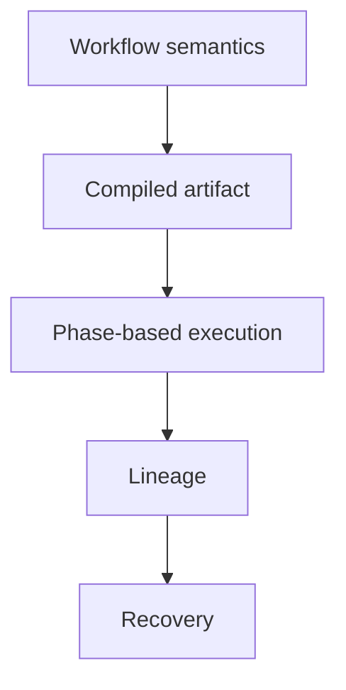
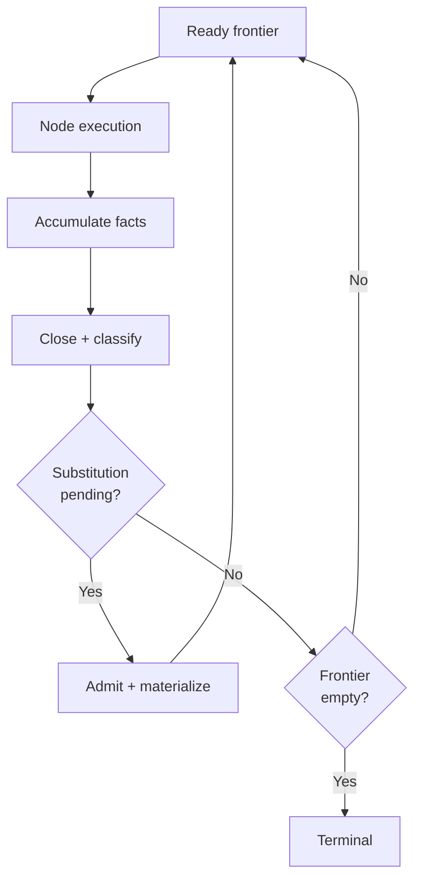
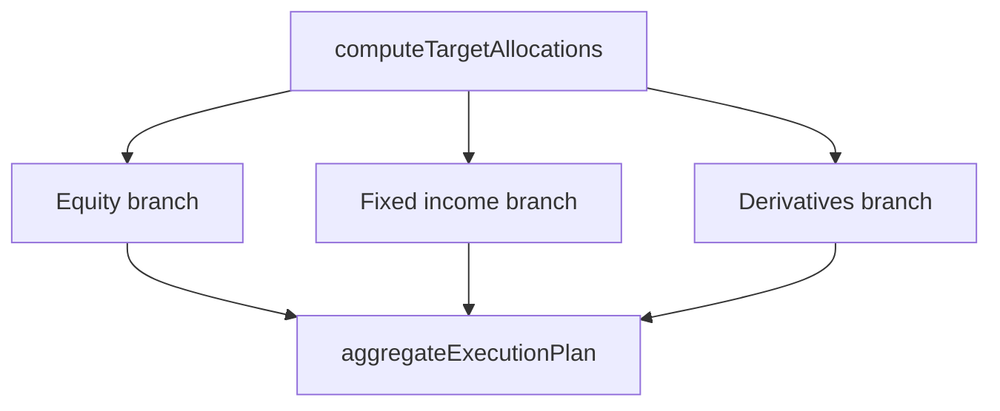
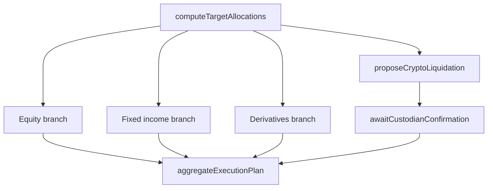

# Graph Substitution Semantics for Dynamic Durable Workflows

## Abstract

We present a semantics for dynamic durable workflows in which workflow meaning, durable execution,
and topology evolution are separated into explicit layers. A workflow program is first interpreted
into a typed workflow IR, then compiled into an executable graph artifact carrying topology, node
definitions, typed interfaces, and a compatibility witness. The compiled artifact denotes the space
of obligations that may arise during a run; the materialized run state records what has actually
been reached after applying an admitted lineage of substitutions. Execution proceeds in phases over
that materialized state. Dynamic change is modeled by **graph substitution**: an admitted operation
replaces or refines a durable step by splicing in a fragment through an explicit interface while
preserving causal structure and durable provenance.

The paper makes four claims. First, workflow semantics should not be identified with runtime
scheduling; lowering is a compilation boundary. Second, dynamic topology change is best modeled by
vertex-anchored substitution rather than ad hoc mutation. Third, durable execution requires a
lineage-plus-materialization semantics, not merely a replay story. Fourth, concurrency of node
execution and concurrency of substitutions are distinct questions and should be treated by different
laws.

The running examples use Cortex and downstream host applications as motivating contexts, but the
theory is stated independently of any particular implementation.

---

## 1. Introduction

Durable workflows must survive crashes, suspension, operator intervention, and long-running external
work. Fixed-topology models explain a large class of workflow engines, but they are insufficient
when execution may reveal that the remaining graph itself should change.

Typical examples include:

- a planning step that elaborates itself into a larger analysis subgraph
- a validation step that inserts remediation work before release
- a review step that appends a new branch for additional evidence
- an operator signal that unblocks or redirects part of the remaining workflow

The central semantic problem is therefore:

> How can a workflow evolve after partial execution while preserving durable replay, causal
> correctness, and a stable explanation of what was executed?

This paper presents the implementation-independent theory of that problem. A companion research
plan, **Rewrite Materialization and Recovery for Dynamic Durable Graphs**, grounds the same ideas in
the concrete Pulse runtime and uses implementation-specific invariants to sharpen the recovery
story.

This paper answers that question by separating three levels of meaning:

1. **workflow meaning**, expressed in a typed workflow language
2. **compiled executable structure**, expressed as a graph artifact
3. **durable operational semantics**, expressed as phase-based execution with graph substitution

The key terminological choice is deliberate:

- **graph substitution** is the primary term of this paper
- **graph rewriting** is used only as the umbrella term from the literature on algebraic graph
  transformation

The reason is precision. The runtime operation is not arbitrary graph surgery. It substitutes a
fragment into a durable graph through a bounded, typed, interface-preserving rule.

---

## 2. Glossary

- **workflow**: a semantic program describing obligations, dependencies, branching, waiting, and
  artifact boundaries
- **workflow IR**: a canonical typed intermediate form of workflow meaning
- **compiled workflow artifact**: the executable result of lowering a workflow IR into a graph
  package
- **materialized run state**: the currently executable graph and node/output state obtained by
  applying a lineage prefix to an original compiled artifact
- **node**: a durable execution locus with identity, status, and outputs
- **fragment**: a graph package intended to be substituted into another graph
- **substitution**: the operation of splicing a fragment into a graph through an explicit boundary
  contract
- **graph rewriting**: the broader literature umbrella; this paper studies a substitution calculus
  within that space
- **materialization**: durable installation of admitted substitutions into the graph state
- **lineage**: append-only history of admitted substitutions
- **compatibility witness**: a fingerprint or derivation witness tying a compiled artifact to the
  semantics that produced it

---

## 3. Layered Semantic Architecture

The theory is organized around a strict stack:



The stack matters because different correctness questions live at different layers:

- **workflow meaning** asks whether a program denotes the intended dependency structure
- **lowering** asks whether the compiled graph preserves workflow meaning
- **execution** asks whether the runtime reduces graph states soundly
- **substitution** asks whether topology evolution preserves admissibility
- **durability** asks whether crash, resume, and explanation remain coherent

Blurring these layers weakens the theory. A runtime graph is not the meaning of the source workflow;
it is the executable artifact produced by a lowering.

---

## 4. Workflow Language and Compilation Boundary

### 4.1 Workflow IR

We assume a typed workflow language with the following representative core constructors:

```text
W ::= step a
    | W ; W
    | parallel { W1, ..., Wn }
    | choose c { Wt, Wf }
    | await s
    | artifact k from W
```

Intuitively:

- `step a` introduces a durable step
- `;` introduces sequencing
- `parallel` introduces concurrent obligations
- `choose` introduces semantically controlled branching
- `await` introduces suspension on an external signal or fact
- `artifact` marks a durable product boundary

This IR is semantic, not directly executable. It does not say how node identities are serialized,
how retries are represented, or how persistence occurs.

The purpose of introducing the IR in this paper is narrow: it marks the compilation boundary between
workflow meaning and graph execution. The core formal development begins only after lowering.

### 4.2 Compiled Workflow Artifact

Lowering produces an original compiled artifact:

$$
\mathcal{C}_0 = (T, D, \Gamma, \kappa)
$$

where:

- $T = (V, E)$ is a finite directed acyclic graph
- $D : V \to \text{NodeDef}$ assigns executable node definitions
- $\Gamma$ is the interface environment describing input/output contracts, signal contracts, and
  artifact contracts
- $\kappa$ is a compatibility witness

For the purposes of this paper, the compatibility witness has the form:

$$
\kappa = (\nu, \lambda, h)
$$

where:

- $\nu$ identifies the lowering family
- $\lambda$ identifies the contract and interface regime used to interpret the lowered artifact
- $h$ is a digest of the normalized source artifact under $(\nu, \lambda)$

Two compiled artifacts need not have the same digest in order to interact, but they must agree on
the lowering family and contract interpretation regime. We write:

$$
\mathsf{Compat}_\kappa(\kappa, \kappa_F)
$$

for the predicate that the ambient compiled artifact and a fragment were produced under compatible
lowering and contract interpretation regimes. In the minimal version used by this paper:

$$
\mathsf{Compat}_\kappa((\nu, \lambda, h), (\nu_F, \lambda_F, h_F)) \iff \nu = \nu_F \land \lambda = \lambda_F
$$

The digests may differ because the ambient workflow and the fragment may denote different source
programs. Compatibility requires only that they inhabit the same lowering family and contract
regime.

This minimal definition is intentionally stricter than lowering-family equality alone. Two fragments
may be lowered by the same compiler family while still disagreeing about the contract language
attached to boundary nodes. Equality on $(\nu, \lambda)$ is therefore the smallest useful semantic
approximation.

The point of $\kappa$ is semantic rather than operational: a materialized graph should always be
interpreted relative to the compilation law that produced it.

### 4.3 Example

The following surface syntax is only illustrative:

```text
workflow QuarterlyPortfolioRebalance {
  parallel {
    fetchPositions,
    fetchMarketData,
    fetchRiskLimits
  };
  computeTargetAllocations;
  parallel {
    sequence {
      proposeEquityTrades;
      choose complianceOk {
        signOffEquities,
        sequence {
          remediateEquities;
          signOffEquities
        }
      }
    },
    sequence {
      proposeFixedIncomeTrades;
      signOffFixedIncome
    },
    sequence {
      proposeDerivativesOverlay;
      await riskDeskApproval;
      signOffDerivatives
    }
  };
  aggregateExecutionPlan;
  artifact rebalanceReport
}
```

Its lowering may produce a graph whose nodes are durable execution loci while preserving the
workflow meaning that three acquisition steps are initially independent, then join at
`computeTargetAllocations`, then fan out again into three asymmetric branches before joining at
`aggregateExecutionPlan`. That shape matters because the ready frontier widens and narrows over the
same DAG, and later substitutions may widen it again.

---

## 5. Executable Graphs and Interface Contracts

The compiled topology alone is not enough. Dynamic substitution requires typed fragment contracts.

### 5.1 Graph Package

A fragment is a graph package:

$$
\mathcal{F} = (T_F, D_F, \Gamma_F, \mathrm{In}_F, \mathrm{Out}_F, \kappa_F)
$$

where:

- $T_F = (V_F, E_F)$ is a finite DAG
- $D_F$ assigns node definitions
- $\Gamma_F$ assigns contracts to fragment boundaries and internal nodes
- $\varnothing \neq \mathrm{In}_F \subseteq V_F$ are entry nodes
- $\varnothing \neq \mathrm{Out}_F \subseteq V_F$ are exit nodes
- $\kappa_F$ is a compatibility witness for the fragment

The interface contract should be read semantically, not merely topologically. A fragment boundary
may constrain:

- value types or schemas
- artifact shapes
- signal names or capabilities
- side-effect classes
- retry or idempotence requirements

### 5.2 Minimal Contract Discipline

To keep the paper's formal core honest, we assume only a minimal contract discipline.

Let $(\mathcal{K}, \sqsubseteq)$ be a preorder of contracts, where:

$$
c_1 \sqsubseteq c_2
$$

means "a value or effect satisfying $c_1$ is acceptable wherever $c_2$ is required."

For each relevant boundary node $v$, the interface environment provides:

- $\Gamma^+(v) \in \mathcal{K}$, the contract offered by $v$
- $\Gamma^-(v) \in \mathcal{K}$, the contract required by $v$

Composition across a graph edge $(u, v)$ is then defined by:

$$
\Gamma^+(u) \sqsubseteq \Gamma^-(v)
$$

One concrete toy instantiation takes $\mathcal{K}$ to be finite record schemas ordered by width
subtyping:

$$
\{f_1:\tau_1, \ldots, f_n:\tau_n, \ldots\} \sqsubseteq \{f_1:\tau_1, \ldots, f_n:\tau_n\}
$$

meaning that a provider may offer additional fields beyond what the consumer requires.

Under that instantiation, semantic admissibility does real work. In the running rebalance example, a
predecessor might offer `{positions, marketData, riskLimits}` while a candidate fragment entry
requires `{positions, custodianBalances}`. Structural rewiring could still succeed, but semantic
admissibility fails because `custodianBalances` is absent even though the topology alone would
permit the splice.

This is intentionally minimal. A richer type-and-effect discipline could refine it, but this
preorder is enough to state semantic admissibility in a falsifiable way without pretending to solve
the entire typing problem.

The abstraction is deliberately weak. It does not yet model named ports, channel multiplicity,
linear or affine resources, or retention obligations for state that may no longer be present in the
current materialized graph. Those belong to richer interface calculi. The claim here is narrower:
even a simple contract preorder is enough to distinguish structurally valid substitutions from
semantically admissible ones.

### 5.3 Why Structural Interfaces Are Insufficient

Entry and exit node sets alone only say where reconnection occurs. They do not say whether the
substituted fragment can actually inhabit the obligation being refined. A durable dynamic workflow
semantics therefore needs both:

- **structural fit**, meaning the splice preserves graph well-formedness
- **semantic fit**, meaning contracts compose across the substitution boundary

This distinction is one of the central obligations of the theory.

---

## 6. Phase-Based Durable Execution

Execution proceeds relative to an original compiled artifact and a materialized run state:

$$
\Sigma_w = (\mathcal{C}_0, \mathcal{C}_w, \sigma, o, \ell, w, \chi)
$$

where:

- $\mathcal{C}_0$ is the original compiled workflow artifact
- $\mathcal{C}_w = \mathsf{Materialize}(\mathcal{C}_0, \ell_{\leq w})$ is the current materialized
  graph artifact for the admitted lineage prefix
- $\sigma : V_w \to \text{NodeStatus}$ is the total status map over $\mathcal{C}_w$
- $o : V_w \rightharpoonup \text{Value}$ is the partial output map over $\mathcal{C}_w$
- $\ell$ is the append-only substitution lineage
- $w$ is the materialization watermark
- $\chi$ is a materialized-state integrity witness

The abstract status space is:

$$
NodeStatus =
\text{Pending} \mid \text{Running} \mid \text{Completed} \mid \text{Failed}
\mid \text{Skipped} \mid \text{Waiting}(s) \mid \text{Rewritten}
$$

`Rewritten` is terminal and dependency-satisfying. It represents a durable step boundary that has
been refined by substitution while remaining part of the explanatory structure.

The execution discipline is phase-based:



This picture clarifies a subtle but important point:

- **concurrent node execution** is a question about reducing facts over a fixed materialized graph
- **concurrent substitution** is a question about changing the graph itself

They are not the same theorem.

The loop above is a runtime control loop, not a cycle in the workflow topology. Each materialized
artifact $\mathcal{C}_w$ remains a DAG. The back-edge means only that the next ready frontier is
computed again, possibly over a different materialized graph if a substitution was admitted at the
previous phase boundary.

### 6.1 Frontier Semantics

Let $pred_w(v)$ denote the immediate predecessors of node $v$ in the current materialized graph
$\mathcal{C}_w$.

The ready frontier is:

$$
\operatorname{Ready}(\Sigma_w) =
\{ v \in V_w \mid \sigma(v) = \mathrm{Pending}
\land \forall u \in pred_w(v).\ \sigma(u) \in \{\mathrm{Completed}, \mathrm{Skipped}, \mathrm{Rewritten}\} \}
$$

The frontier is an antichain in the dependency order. Nodes in the frontier may be executed
concurrently because readiness is defined relative to the same materialized topology.

### 6.2 Base Phase Discipline

The base calculus adopts a simple rule:

- many nodes may execute concurrently within one frontier phase
- substitution is admitted only at a phase boundary

This is not merely an implementation convenience. It is the semantic barrier that separates
reduction over facts from mutation of topology.

---

## 7. Graph Substitution

### 7.1 Core Primitive

The core primitive is:

$$
\mathsf{substitute}(a, \rho, \mathcal{F})
$$

where:

- $a \in V$ is an anchor node
- $\rho$ is a boundary policy
- $\mathcal{F}$ is a fragment

The boundary policy determines whether the anchor is replaced or retained as an envelope.

The literature uses **graph rewriting** broadly for systems that transform graphs by local rules.
This paper uses **graph substitution** for the concrete runtime calculus because the admissible
operation is more specific: it chooses a durable anchor node, a fragment with explicit boundary
interface, and a splice discipline that preserves the already discharged past.

### 7.2 Replace and Envelope

Let:

- $\operatorname{Pred}(a) = \{ u \mid (u, a) \in E \}$
- $\operatorname{Succ}(a) = \{ v \mid (a, v) \in E \}$

For a **replace** substitution, the anchor is removed and the fragment is spliced into its place:

$$
V' = (V \setminus \{a\}) \cup V_F
$$

$$
E' = (E \setminus I(a)) \cup (\operatorname{Pred}(a) \times \mathrm{In}_F) \cup E_F \cup (\mathrm{Out}_F \times \operatorname{Succ}(a))
$$

where $I(a)$ is the set of edges incident to $a$.

The base calculus intentionally uses full bipartite reconnection from every predecessor to every
fragment entry and from every fragment exit to every successor. Richer port-matching or
channel-discipline rules are refinements of the interface system, not part of this minimal core.
Accordingly, the base calculus proves compatibility for the induced reconnections it defines; it
does not claim that practical runtimes may ignore routing, arity, or multiplicity constraints.
Systems that require single-input consumers, named ports, or linear channels must refine $\Gamma$
with that additional structure.

For an **envelope** substitution, the anchor remains as the stable step boundary and the fragment is
inserted after the anchor's own completion:

$$
\sigma(a) \in \{\mathrm{Completed}, \mathrm{Rewritten}\}
$$

and, whenever downstream obligations depend on the anchor's output, $o(a)$ is defined.

$$
V' = V \cup V_F
$$

$$
E' = (E \setminus (\{a\} \times \operatorname{Succ}(a))) \cup (\{a\} \times \mathrm{In}_F) \cup E_F \cup (\mathrm{Out}_F \times \operatorname{Succ}(a))
$$

The envelope form is useful when the anchor's output, audit trail, or semantic identity should
remain explicit.

Replace substitution does not require $o(a)$ to remain defined because the anchor leaves the future
topology. Envelope substitution may require it because the anchor remains part of the explanatory
and dataflow structure.

### 7.3 Example

Suppose the rebalancing workflow's `computeTargetAllocations` step completes and discovers
unexpected crypto exposure requiring an additional execution branch before aggregation.

Materialized shape before substitution:



Envelope substitution at `computeTargetAllocations`:



This is not arbitrary mutation. The substitution widens the fan-out by one new branch, changes the
predecessor set of `aggregateExecutionPlan`, and still remains a local refinement of a durable step
boundary.

---

## 8. Admissibility

A substitution is admissible only if all of the following hold.

### 8.1 Structural Admissibility

1. the anchor exists
2. the fragment topology is finite and acyclic
3. the fragment's node definitions are total
4. entry and exit interfaces are well-defined and non-empty
5. the resulting topology is acyclic

### 8.2 Semantic Admissibility

1. for every predecessor $u$ rewired to an entry node $x \in \mathrm{In}_F$,
   $\Gamma^+(u) \sqsubseteq \Gamma_F^-(x)$
2. for every exit node $y \in \mathrm{Out}_F$ rewired to a successor $v$,
   $\Gamma_F^+(y) \sqsubseteq \Gamma^-(v)$
3. retained-anchor substitutions preserve any contract that downstream nodes rely on from the anchor
4. $\mathsf{Compat}_\kappa(\kappa, \kappa_F)$ holds

These clauses define only a minimal semantic admissibility notion. Richer contract systems remain
compatible with the paper's structure but are not required by the core results below. In particular,
they do not yet express port-level routing, arity bounds, linear consumption, or snapshot-retention
obligations. Those are extensions of the interface discipline, not hidden assumptions of the present
calculus.

### 8.3 Causal Admissibility

Substitution must preserve the already discharged past. The past may justify a substitution, but
substitution does not reinterpret already completed causal history. It refines the remaining
obligation.

This distinguishes substitution from process migration. Substitution is local future refinement, not
global re-interpretation of executed history.

### 8.4 Resource Admissibility

The runtime may also impose explicit budgets:

$$
B = (b_V, b_E, b_D, b_F, b_S)
$$

bounding:

- added vertices
- added edges
- added depth
- frontier expansion
- substitution count

Let:

$$
\mathsf{Cost}(a, \mathcal{F}, T) = (c_V, c_E, c_D, c_F, c_S)
$$

be the structural cost of substituting fragment $\mathcal{F}$ at anchor $a$ in topology $T$.
Resource admissibility requires:

$$
\mathsf{Cost}(a, \mathcal{F}, T) \leq B
$$

componentwise. Materialization consumes budget monotonically:

$$
B' = B - \mathsf{Cost}(a, \mathcal{F}, T)
$$

Budgets are not the whole safety story, but they make the calculus operational by bounding
expansion.

No core result below depends on this budget discipline. It is an operational guard layered on top of
the substitution calculus rather than a constitutive part of the paper's minimal proof core.

### 8.5 Concrete Rejection Example

The admissibility clauses are meant to reject substitutions that are topologically plausible but
semantically wrong.

Return to the rebalance example and let `computeTargetAllocations` be the anchor. Suppose a
predecessor $u$ offers

$$
\Gamma^+(u) = \{positions, marketData, riskLimits\}
$$

and a candidate fragment entry $x$ requires

$$
\Gamma_F^-(x) = \{positions, custodianBalances\}.
$$

Suppose also that an exit node $y$ of the fragment offers

$$
\Gamma_F^+(y) = \{cryptoLiquidationPlan\}
$$

while a downstream successor $v$ requires

$$
\Gamma^-(v) = \{executionPlan\}.
$$

The splice may still satisfy structural admissibility: the anchor exists, the fragment is finite and
acyclic, and the resulting graph remains a DAG. But semantic admissibility fails twice:

1. $\Gamma^+(u) \not\sqsubseteq \Gamma_F^-(x)$ because the predecessor does not provide
   `custodianBalances`
2. $\Gamma_F^+(y) \not\sqsubseteq \Gamma^-(v)$ because a `cryptoLiquidationPlan` is not an
   `executionPlan`

The candidate substitution is therefore rejected before materialization, even though bare graph
surgery would permit the splice.

Envelope substitution adds one more check. If the anchor $a$ is retained as a durable boundary but
the substitution would stop exposing an anchor contract that downstream obligations still rely on,
clause 8.2(3) rejects it. The point is that retained history remains semantically live, not merely
visually present.

---

## 9. Durability, Lineage, and Materialization

Substitution is durable only if admission and materialization are modeled explicitly.

### 9.1 Lineage and Watermark

Let:

- $\ell = [s_1, \ldots, s_n]$ be the totally ordered, append-only lineage of admitted substitutions
- $w \leq n$ be the watermark such that the materialized graph state reflects exactly the prefix
  $\ell_{\leq w}$

This yields a precise semantics:

$$
\mathcal{C}_w = \mathsf{Materialize}(\mathcal{C}_0, \ell_{\leq w})
$$

The original compiled artifact $\mathcal{C}_0$ defines the space of durable obligations. The
materialized artifact $\mathcal{C}_w$ defines the current execution surface after the admitted
lineage prefix has been installed.

### 9.2 Integrity Witness

The watermark alone states prefix application. It does not by itself certify that the materialized
graph package, node state, and provenance all agree.

For that reason the durable state should also carry an integrity witness $\chi$, such as:

- a topology hash
- a normalized graph-package hash
- a stronger derivation witness tying materialized state to the expected compiled artifact

The paper treats this as part of the semantics rather than optional operator metadata.

Each successful materialization step computes a fresh integrity witness:

$$
\chi' = \mathsf{Witness}(\mathcal{C}', \sigma', o', w')
$$

and subsequent execution or recovery is defined only from states satisfying:

$$
\mathsf{Verify}(\chi, \mathcal{C}, \sigma, o, w)
$$

The paper assumes only the following minimal axioms:

- **soundness:**
  $\mathsf{Verify}(\mathsf{Witness}(\mathcal{C}, \sigma, o, w), \mathcal{C}, \sigma, o, w)$
- **determinism:** if $(\mathcal{C}, \sigma, o, w) = (\mathcal{C}', \sigma', o', w')$ then
  $\mathsf{Witness}(\mathcal{C}, \sigma, o, w) = \mathsf{Witness}(\mathcal{C}', \sigma', o', w')$

Stronger collision-resistance or proof-carrying interpretations are valuable, but they are not
required by the paper's minimal recovery claim.

### 9.3 Recovery Law

Recovery should reconstruct execution from:

$$
(\mathcal{C}_0, \ell_{\leq w}, \sigma, o, \chi)
$$

subject to:

- compatibility checks for every admitted fragment in $\ell_{\leq w}$ derived from the compiled
  artifact witness $\kappa$
- integrity verification of $\chi$

The aim is not merely to restart execution, but to resume from a state whose interpretation is
stable.

A **canonical schedulable state** is the unique normalized state obtained by:

1. deterministically materializing
   $\mathcal{C}_w = \mathsf{Materialize}(\mathcal{C}_0, \ell_{\leq w})$
2. verifying $\chi$ against $(\mathcal{C}_w, \sigma, o, w)$
3. normalizing transient runtime state and recomputing the ready frontier over $\mathcal{C}_w$

Recovery is correct only if it produces that same $\mathcal{C}_w$ and the same normalized ready
frontier from the same persisted inputs.

---

## 10. Concurrency and Independence

The base calculus allows concurrent node execution but treats substitution as a phase-boundary act.
This should be understood as a semantic discipline. The base machine therefore separates two
semantic phases:

- a **reduction phase** that accumulates node-local facts over a fixed materialized topology
- a **substitution phase** that may change that topology before the next ready frontier is computed

This separation is not cosmetic. It isolates the order-insensitive fact fragment from the
topology-changing fragment whose admissibility depends on the ambient graph, the candidate fragment,
and the remaining budget.

### 10.1 Reduction Phase

Within a fixed materialized topology, the execution kernel from the previous paper applies
unchanged. Frontier nodes run concurrently from the same materialized graph, emit node-local facts,
and those facts are accumulated, closed, and classified without changing the topology to which
readiness is defined.

That is the coordination-friendly fragment of the machine. The important point is not that every
operational detail is monotone, but that within one fixed topology the reduction kernel only
accumulates information needed to move from pending work toward a more settled state. Later
execution in the same phase does not reinterpret the meaning of an earlier frontier fact by changing
the graph beneath it.

### 10.2 Coordinated Substitution Phase

Substitution is different because admissibility is proposal-set-sensitive. Whether a candidate
fragment may be installed can depend on:

- compatibility at the anchor boundary
- the resulting topology
- the remaining structural budget
- other proposals that may consume that same budget or overlap in effect

For that reason substitution is isolated at a phase boundary. The barrier is the natural
coordination boundary induced by the current semantics: the runtime finishes reduction on the
current materialized graph, then admits and materializes any accepted substitutions before defining
the next ready frontier.

### 10.3 Why This Restriction Is Natural

Ordinary node execution accumulates facts about an already materialized graph. Substitution changes
the graph to which readiness and downstream obligations are defined. Mixing these two levels without
a barrier complicates:

- replay
- provenance
- admissibility
- termination reasoning

This restriction is conservative and not free. In a wide frontier, a single admitted substitution
may delay further reduction until the next materialization boundary, sacrificing some throughput and
liveness for a simpler replay story, a single lineage order, and a cleaner proof boundary. The claim
is not that the barrier is always optimal, only that it is an explicit baseline whose relaxation
requires additional laws rather than informal scheduling intuition.

### 10.4 Independent Substitutions

A richer calculus may admit more than one substitution in a logical phase, but that requires an
explicit independence relation. At minimum, one would want conditions such as:

- disjoint anchor regions
- no interface overlap
- a formal commutation relation over interface effects
- a stable explanation of lineage order

Those conditions define a stronger machine. They should not be smuggled into the base semantics by
informal analogy.

---

## 11. Edge-Oriented Forms as Derived Notation

Edge-oriented refinement is still useful to describe insertion between two durable steps. For
example:

```text
insertBetween(gather, review, validateEvidence)
```

is often easier to read than a node-centered substitution formula. But the semantic core should
remain node-centered.

The reason is not only implicit joining. It is that a durable node carries the execution meaning:

- it owns status transitions
- it may carry outputs
- it may wait or fail
- it anchors provenance

An edge denotes a dependency relation. A node denotes a durable step boundary. Since dynamic durable
workflows evolve by refining obligations embodied by durable steps, vertex-anchored substitution is
the better core object.

Accordingly, edge-oriented forms are best treated as derived notation or a surface language
convenience that lowers into the node-centered calculus.

---

## 12. Core Results and Extension Program

### 12.1 Core Results

The paper's core formal obligations are the following.

#### Substitution Safety

Admissible substitution preserves graph well-formedness, causal structure, and interface
compatibility.

#### Phase Determinism

Within a fixed materialized topology, reducing a frontier phase is order-insensitive with respect to
the accumulation order of independent node facts, provided that frontier execution emits node-local
facts keyed by the executing node or else emits into a deterministic reducer. The intended proof
strategy is:

1. each node $v$ in the current frontier contributes facts affecting only the loci owned by $v$,
   such as $\sigma(v)$ and $o(v)$
2. for distinct frontier nodes $u \neq v$, those node-local updates commute
3. closure and classification are deterministic functions of the resulting normalized materialized
   state

This excludes the obvious counterexample in which concurrent frontier nodes perform uncontrolled
writes to the same shared artifact key. Such effects must either be represented as node-local
outputs or mediated by a deterministic reduction step before the theorem applies.

#### Recovery Correctness

Resume from materialized lineage prefix, compatibility witness, and integrity witness reconstructs
the canonical schedulable state defined in §9.3.

### 12.2 Extension Program

The following are intentionally outside the paper's core formal development but define its natural
continuation.

#### Lowering Soundness

One would like a theorem of the form:

$$
\llbracket W \rrbracket_{\mathrm{wf}} \equiv \llbracket \mathrm{compile}(W) \rrbracket_{\mathrm{graph}}
$$

for an appropriate denotational semantics of workflows, graphs, and their equivalence. This is a
research program for the workflow/lowering boundary, not part of the minimal substitution calculus
proved here.

#### Routed Interfaces and Resource-Aware Contracts

The minimal preorder on $\mathcal{K}$ intentionally leaves out named ports, arity constraints,
linear or affine resources, and retention obligations for values that later substitutions may still
depend on. A stronger interface calculus would enrich $\Gamma$ with those structures so that
executable routing policies and resource-sensitive admissibility can be stated directly.

#### Concurrent Substitution Commutation

For a richer extension, independent substitutions may admit a commutation law. That requires an
explicit independence relation and belongs to a stronger calculus than the base one defined here.

#### Budget-Bounded Growth

If substitution cost is tracked and budget decreases monotonically, one would like a bounded-growth
result limiting the number or size of admitted substitutions in a run. That is an operational
extension, not part of the minimal semantic core established here.

---

## 13. Related Work

Algebraic graph transformation studies local graph change through rule-based systems such as DPO and
SPO rewriting. This paper does not claim novelty over graph transformation as such. Its contribution
is to specialize that space to a durable workflow setting with named step boundaries, lineage,
materialization, and recovery.

Process calculi and workflow encodings provide rich accounts of concurrency, communication, and
mobility. Their center of gravity is usually process interaction rather than durable materialized
execution over named workflow steps. The contribution here is the layering between workflow meaning,
compiled graph artifact, substitution, and recovery.

Durable execution systems such as Temporal and Restate provide strong replay and suspension
semantics. The present contribution is orthogonal: it asks how durable execution should behave when
the future topology itself changes through admitted local substitution.

Accordingly, the claim is not that vertex-anchored substitution is the only possible graph evolution
formalism, but that it is the right semantic center for durable step refinement in this layered
setting.

---

## 14. Boundary of the Theory

This paper gives a theory of **dynamic durable execution by local substitution**. It does not claim
to solve all process evolution problems.

In particular, the theory should be distinguished from:

- global workflow migration
- reinterpretation of already executed history
- arbitrary graph surgery without boundary contracts
- semantic equivalence of unrelated lowered artifacts

Those are valid research directions, but they are not the same object as local durable graph
substitution.

---

## 15. Conclusion

The conceptual payoff of graph substitution is that it gives dynamic durable workflows a stable
semantic center.

- workflow meaning lives in a typed language and IR
- executable structure lives in a compiled graph artifact
- durable execution lives in a phase-based runtime
- topology evolution lives in a substitution calculus
- recovery and explanation live in lineage, materialization, and integrity

This layering makes the design space easier to reason about. It explains why vertex-anchored
substitution is the right core abstraction, why concurrency of execution and concurrency of
substitution are different problems, and why durability requires more than replay alone.

For motivating contexts such as Cortex and its downstream host applications, this theory offers a
principled route to dynamic workflow execution without collapsing workflow semantics, runtime
execution, and graph evolution into a single informal notion.

## References

1. Ehrig, H., Ehrig, K., Prange, U., Taentzer, G. (2006). _Fundamentals of Algebraic Graph
   Transformation_. Springer. <https://link.springer.com/book/10.1007/3-540-31188-2>
2. Milner, R. (1999). _Communicating and Mobile Systems: The Pi-Calculus_. Cambridge University
   Press.
3. van der Aalst, W. M. P. (1998). _The Application of Petri Nets to Workflow Management_. Journal
   of Circuits, Systems and Computers 8(1):21–66.
4. Temporal Technologies. _Temporal_. <https://temporal.io>
5. Restate. _Workflows_. <https://docs.restate.dev/tour/workflows>
