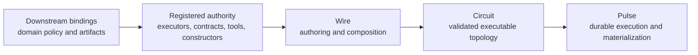

# Wire: Closed Alphabets, Open Composition for Typed Workflow Graphs

## Abstract

We present **Wire**, a source language for authoring typed workflow and reasoning graphs above a durable graph-execution substrate. The language is designed around one architectural rule: **authority stays closed; composition stays open**. Executors, contracts, tools, prompts, and policy are registered externally. Wire does not invent new runtime authority; it composes the authority that the host environment has already made available. This separation yields a compact graph language with four distinctive properties. First, topology remains honest: the core composition layer is a small graph algebra rather than a hidden API in a host language. Second, edges remain homogeneous and purely topological; compatibility lives on node endpoints through offered and accepted contracts. Third, reuse is expressed compositionally through partial nodes and configuration layering rather than through a second template language. Fourth, the same source language can describe both initial executable graphs and candidate structural proposals, while runtime admission, budgeting, and materialization remain outside the language.

The paper develops the design rationale for this split, gives a minimal semantic account of endpoint-typed composition, and reports the current implementation surface in Cortex: parsing, compilation to executable circuits, compatibility witnesses, vocabulary catalog generation, topological memory annotations, latent condition compilation, and append-style proposal fitting. We do not claim a full metatheory for Wire in this paper. The contribution is the language boundary itself: a safe authoring surface for graph programs that need typed structure, bounded extensibility, and downstream-owned semantics.

## 1. Introduction

Workflow systems and agent runtimes increasingly need an author-facing surface for graph structure. Two common approaches dominate. The first embeds graph authoring in a host language API. The second allows a planner or model to synthesize ad hoc structure through untyped text or imperative tool calls. Both approaches lose something important. Host-language embeddings blur graph meaning with general programming machinery. Open-ended text generation makes structure, authority, and runtime policy hard to separate.

Wire starts from a narrower goal: give authors and agents a small language for expressing graph structure over a vocabulary that has already been registered elsewhere. The language should be strong enough to define executable topology, endpoint contracts, reuse by partial instantiation, and candidate graph fragments for bounded structural change. It should not be strong enough to mint new runtime authority, redefine scheduler policy, or smuggle arbitrary host-language computation into the graph layer.

The resulting design can be summarized in one sentence:

> Wire composes registered authority; the implementation owns what that authority means.

This paper makes four claims.

1. Authoring should separate **authority registration** from **graph composition**.
2. Endpoint-typed composition over a small graph algebra is sufficient for a wide class of practical workflow and reasoning graphs.
3. Initial topology and candidate structural proposals should share one authoring surface, while admission and materialization remain runtime concerns.
4. The right extensibility rule for this language is **closed alphabets, open composition**: grow the registered vocabulary or add bounded composition forms, but do not casually enlarge the core operator set.

## 2. Position in the Cortex Stack

Wire is not the whole Cortex semantics stack. It sits above the topology and execution substrate.



*Figure 1.* Wire is an authoring layer above registered authority and below the compiled executable artifact.

This placement matters because it keeps three responsibilities distinct:

- Graph and Circuit own structural meaning.
- Pulse owns execution, admission, budgeting, persistence, and resume behavior.
- Wire owns author-facing composition.

That separation also prevents a recurring category error. A `.wire` file is not a scheduler script and not a general-purpose program. It is a graph program authored over a closed vocabulary.

## 3. Closed Alphabets, Open Composition

The central design rule of Wire is that the language is closed over **authority** and open over **composition**.

Closed authority means that executors, contracts, tools, prompts, memory presets, and configuration constructors are registered by the host environment or a library. A Wire program may reference them by name; it does not define their runtime behavior.

Open composition means that those authorities may be arranged into arbitrarily large graphs, partial-node families, and bounded proposal fragments using a small composition layer.

This split has three benefits.

- It keeps the language small and inspectable.
- It gives downstream systems control over what a Wire author is allowed to use.
- It makes LLM-facing authoring safer: a model may propose topology over a known vocabulary instead of inventing opaque capabilities.

The language therefore grows best by extending one of two surfaces:

- the registered vocabulary
- bounded composition forms over the existing graph algebra

What it should not do casually is grow a large new operator alphabet. That is why the current design keeps the core operator set deliberately small.

## 4. Endpoint-Typed Composition

Wire keeps edges homogeneous and purely topological. Compatibility does not live on the edge itself. It lives on the endpoints.

Let each node expose:

- offered output contracts $\Gamma^+(v)$
- accepted input contracts $\Gamma^-(v)$

Then composition across an edge $(u, v)$ is admissible when the offered contract is acceptable at the sink boundary:

$$
\Gamma^+(u) \sqsubseteq \Gamma^-(v)
$$

In the current regime, $\sqsubseteq$ is nominal contract-name equality extended with optional per-port labels: the match unit is the port key $(\text{direction}, \text{contract}, \text{label})$, and an absent label is a distinct key, not a wildcard. There is no structural refinement relation over contract fields, and no implicit subtyping graph; the check is resolved at compile time against the registered contract catalog. Richer regimes — parameterized contracts, refinement judgements, or field-level structural compatibility — are future work (see §8); the current language deliberately keeps the compile-time check simple and nominal.

This choice is deliberate. If edges themselves carried semantic selectors, routing operators, or transformation code, then every graph edit would become a small program synthesis problem. Endpoint-owned compatibility keeps the graph layer structurally honest.

This is also why default connection syntax can remain simple while explicit endpoint syntax exists as a disambiguation tool rather than as the primary model.

For example, a simple typed path can remain visually close to the graph it denotes:

```wire
node planner :
  -> ReportPlan
= @llm.planner {};

node analyst :
  <- ReportPlan
  -> AnalysisFragment
= @llm.analyst {};

node report :
  <- AnalysisFragment
  -> ReportArtifact
= @llm.report_writer {};

let deep_report = planner => analyst => report;
```

The graph is explicit. The contracts sit on the boundaries. The executors are named but not defined in the language.

When two ports on the same node would otherwise share $(\text{direction}, \text{contract})$, port labels are required to disambiguate; the label becomes part of the port key and participates in matching.

```wire
node splitter :
  <- Report
  -> primary: Claim
  -> fallback: Claim
= @llm.splitter {};

node consumer :
  <- primary: Claim
  -> Decision
= @llm.consumer {};

let decide = splitter => consumer;
```

Here `primary:` labels on both sides match and produce the single admissible edge; the `fallback:` output remains on the composed boundary because no labeled sink accepts it. Labeled routing is available but is not the default: unlabeled composition suffices for the common case.

## 5. Reuse Without a Second Language

Wire reuses graph structure through the same value layer it uses for ordinary nodes. The key mechanism is the **partial node**: a configured executor value whose remaining structural choices are pinned later.

```wire
let analyst_base = @llm.analyst {
  memory = topological { preset = "analyst"; };
};

node critic :
  <- AnalysisFragment
  -> ReviewFragment
= analyst_base // {
  prompt = "Critique the draft and call out weak claims.";
};
```

This matters because it avoids a common DSL failure mode: one language for graphs, another for templates, and a third for runtime configuration. In Wire, reuse stays inside the same algebra. The same mechanism also gives rewrite proposals a disciplined instantiation path: proposals can introduce new nodes by applying bounded configuration deltas to already-registered authority.

The current design intentionally stops short of full composition-level lambdas. That is a real future direction, but only if variable-arity or abstraction-emitting rewrites become load-bearing. For the current paper, the important point is simpler: Wire already gets meaningful reuse without abandoning graph transparency.

## 6. One Surface for Initial Graphs and Candidate Proposals

Wire does not admit topology changes by itself. That remains a runtime responsibility. But it does use the same authoring surface for two related tasks:

- authoring the initial executable graph
- describing a candidate fragment to be proposed later

This is a stronger result than it first appears. It means the authoring story for bounded structural change does not require a second graph language. The same vocabulary, endpoint compatibility discipline, and composition forms can be used to express a proposal fragment, while the runtime still owns:

- whether the fragment fits the anchor
- whether its exits fit the surrounding graph
- whether it fits the remaining structural budget
- whether and how it is materialized durably

This is the language-level counterpart to the substitution semantics developed in the previous paper. Paper 3 explains why admitted dynamic change should be modeled as substitution over compiled artifacts. This paper explains why the authoring layer can remain small even when programs are allowed to propose such change.

A minimal append-style proposal can therefore look like:

```wire
let c = @llm.fooToFizz { prompt = "Bridge foo to fizz."; };
let d = @llm.fizzToBar { prompt = "Bridge fizz to bar."; };

c => d
```

The authoring surface is ordinary Wire. What makes this fragment a proposal rather than an initial graph is not the syntax alone, but the surrounding runtime context: anchor hole, contract fit, remaining budget, and admission policy.

## 7. Implementation Surface

Wire is no longer a purely architectural sketch. The current implementation already supports:

- parsing and compilation of graph programs into executable circuits
- compatibility witnesses for compiled artifacts
- endpoint disambiguation when contract-only matching is ambiguous
- registry-backed vocabulary catalog generation for model-facing authoring
- typed runtime envelopes for stage outputs
- topological memory annotations on nodes
- closed-world conditional forms lowered into latent branch machinery
- append-style proposal compilation and hole-fit validation

The important point is not that every future semantic claim has been proved. It is that the language boundary is real enough to test. That matters for publication scope. Wire is not just a desired syntax. It is a working authoring surface with identifiable semantics and pressure points.

## 8. Boundaries and Open Questions

Three boundaries should remain explicit.

First, Wire is not a runtime policy language. Admission, budgeting, replay, persistence, and materialization remain outside it.

Second, closed-world branch selection should not be conflated with open structural proposals. A declared conditional with latent alternatives is a different semantic object from a planner-generated graph fragment, even if early implementations lower both through similar machinery. The structural distinction is timing: latent branches are compiled and statically validated with the initial circuit, and the runtime only selects an alternative whose full typing and budget footprint were known at compile time; open proposals are compiled, endpoint-checked, budget-checked, and materialized at runtime, against graph state the compile-time environment did not see.

Third, the current endpoint model is still compatibility-first rather than full multi-channel projection. Contracts label admissible flow between nodes. They do not yet imply arbitrary field-level routing across edges. That limitation is a feature for now: it keeps the language honest with respect to the runtime.

Open questions remain. Known-arity composition repetition may justify templates. Variable-arity composition or abstraction-emitting rewrites may eventually justify lambdas. Richer compatibility regimes may need to appear in compiled artifact witnesses. None of those are required to justify the current language boundary.

## 9. Related Work

Wire belongs at the intersection of several traditions.

From **algebraic graphs**, it takes the idea that overlay and connect can form a small honest graph algebra rather than a hidden implementation detail. From **selective and build-system semantics**, it inherits the idea that static structure and dynamic choice should be separated carefully. From **workflow DSLs and durable execution systems**, it inherits the need for authoring surfaces that survive compilation and runtime interaction without collapsing into a host-language embedding.

What distinguishes Wire in this context is the particular boundary it draws. The language is not trying to be a full workflow programming language, a host-language EDSL, or a scheduler policy surface. It is an authoring layer for typed topology over registered authority, with bounded structural proposals as a first-class downstream use case.

## 10. Conclusion

Wire is valuable not because it is a large language, but because it is a narrow one with the right boundary. By keeping authority closed and composition open, it gives Cortex an authoring surface that is compact, typed, graph-honest, and compatible with bounded structural evolution. That makes it suitable both for human authors and for model-assisted graph construction without turning the language into an unbounded authority generator.

The next steps are clear: sharpen the contract regime carried by compiled artifacts, keep closed-world selection distinct from open proposals, and evaluate when composition-level abstraction becomes necessary. None of those weaken the main claim of this paper. They follow from it.

## References

1. Andrey Mokhov. *Algebraic Graphs with Class*. 2017.
2. Andrey Mokhov, Neil Mitchell, Simon Peyton Jones. *Build Systems a la Carte: Theory and Practice*. 2020.
3. Andrey Mokhov, Georgy Lukyanov, Simon Marlow, Conor McBride. *Selective Applicative Functors*. 2019.
4. Alexandra Matache, Nicolas Wu, and Sam Staton. *Scoped Effects as Parameterized Algebraic Theories*. 2024.
5. Prior workflow and durable execution systems such as Temporal, Durable Functions, and related orchestration runtimes.

## Figures

- Figure 1 source lives in [Figures/wire-layering-overview.mmd](Figures/wire-layering-overview.mmd).
