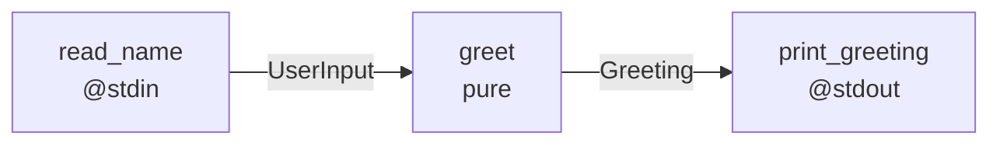
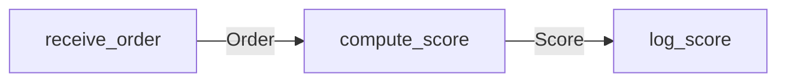
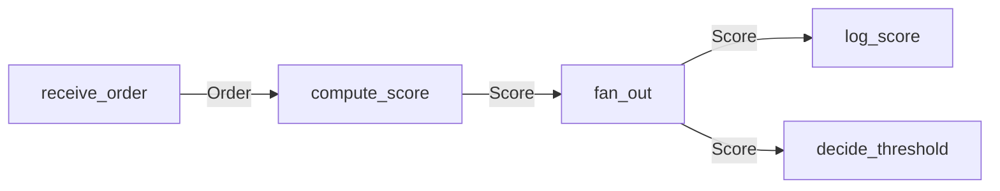
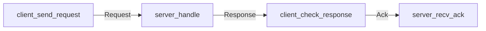
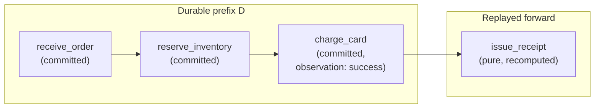
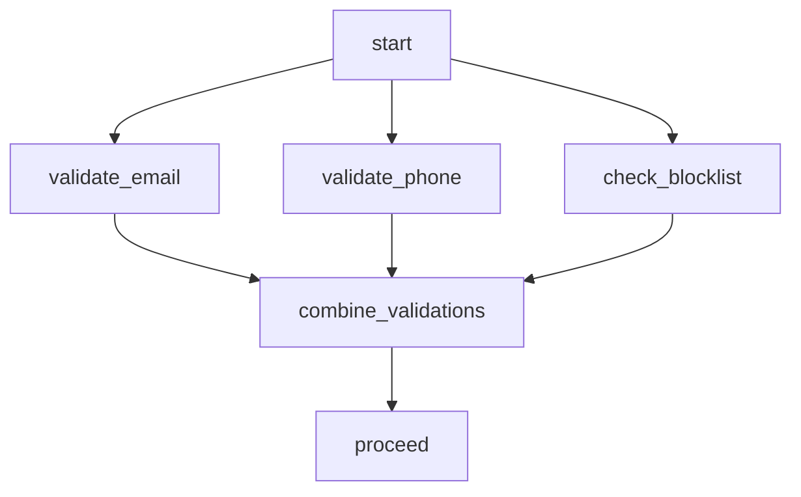
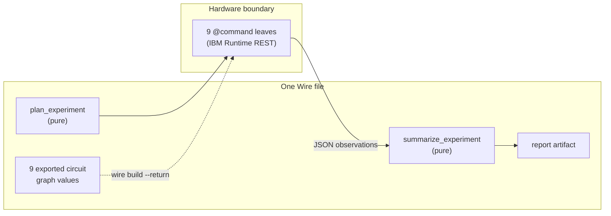
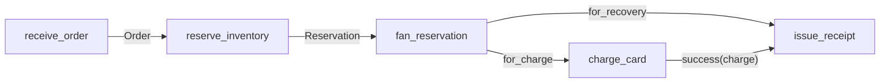
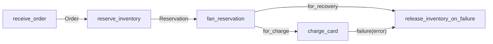

# Causal Programming: Temporal Honesty as a Foundation for Verified Distributed Systems

## Abstract

Mainstream programming languages inherit a single-stack model of computation in which execution is
presented as an implicit sequence of reads, writes, calls, and returns. The model is excellent for
local synchronous code; it is dishonest about the temporal structure of distributed, durable,
concurrent, and agentic systems. As correctness in those systems comes to depend on causal
relationships between events, hidden temporal assumptions reappear as engineering burdens: races,
replay bugs, tracing gaps, retry hazards, saga logic, and unverifiable recovery paths.

We articulate **causal programming**, a paradigm in which computation is modeled as typed, partially
ordered event flow. Values, effects, state transitions, and recovery steps are explicitly situated
in a causal structure rather than projected onto an implicit global sequence. We call the underlying
property **temporal honesty**: the program does not assert more temporal order than the computation
actually possesses, and it exposes the causal dependencies on which correctness relies.

The paper makes three nested claims. First, a _semantic diagnosis_: many of the notorious
engineering burdens of modern distributed systems are the cost of reconstructing temporal and causal
structure that the host language chose not to model directly. Second, a _paradigm proposal_: causal
programming, organized around eight structural commitments, is a foundational alternative whose
components are well-known but whose unification is novel and consequential. Third, an _existence
proof_: **Wire** and the **Pulse runtime**, a working causal language and a verified durable runtime
mechanized in Lean 4, show that the proposal is workable in practice and that several of its central
claims are tractable to prove.

We argue that mechanisms commonly treated as separate features—linear value flow, protocol-typed
channels, durable replay, observability, structural parallelism, and verifiable distributed
invariants—become native consequences of the paradigm to the extent that the relevant dependencies
are first-class in the model. We situate causal programming among predecessors including
event-structure semantics, process calculi, Petri nets, synchronous dataflow, functional reactive
programming, session types, durable execution runtimes, and modern observability standards.

## 1. Introduction: the time problem

### 1.1 A pointer that no longer names a value

Consider a small fragment of pseudo-C:

```c
int x = 0;
int *p = &x;

/* no intervening write in this thread */
int y = *p;
```

A reader will tell you that `y` equals `0`. Without further context, that answer is correct. The
expression `*p` is read as "the current contents of this address," where "current" is supplied
implicitly by the program counter. In single-threaded code, this is automatic. The program counter
establishes a total order on events, and there is exactly one "now" at which the read happens.

Replace the surrounding context with anything that admits multiple loci of control: a second thread,
a second process, a second machine, an asynchronous callback, a workflow that suspends and resumes
hours later. Now `*p` no longer denotes an unqualified value. In a real language with a real memory
model, the exact semantics may be undefined, memory-model-dependent, or consistency-model-dependent;
the point is that the meaning of the read depends on the causal and visibility relation between the
read event and the writes that may have happened before it. Operationally, the read is a
relationship among an _observer_ (the reading code), an _observed source_ (the address of `x`), a
_causal history_ (which writes have happened before this read), a _consistency model_ (which of
those writes are visible to this observer), and a _point in a partial order of events_.

The syntax does not change. The expression `*p` is identical. But its meaning depends on which
version of `x`, observed by whom, after which events, and before which other events. The pointer no
longer gives the program a stable value. It gives the program an address whose observed contents are
indexed by causal context.

### 1.2 The hidden coordinate

This is not a property of pointers in particular. Every variable read in an imperative language
carries an implicit temporal coordinate. The expression

```python
balance = account.balance
```

is shorthand for "the value of `account.balance` at the moment this read occurs in the program
counter's history, given whatever writes have causally preceded that moment." In a single-threaded
program with no concurrency or persistence, the implicit coordinate is determined by the program
counter, and the shorthand is faithful. Once the system has multiple program counters—threads,
processes, services, durable workflows, retries, replicated storage—the shorthand becomes a fiction.
There is no single "now." The read becomes meaningful only when its causal preconditions are made
explicit.

The classical observation that distributed computation is naturally organized by a `happens-before`
partial order, with concurrency defined by incomparability rather than absence from a total
schedule, gave a precise vocabulary to this fact decades ago. What we add is that the vocabulary
should be inherited by programming languages, not reconstructed at the runtime layer.

### 1.3 The three nested claims

This paper makes three nested claims, each of which can be considered separately.

The _semantic diagnosis_ is that programming language foundations widely in use today suppress
causal structure that has become load-bearing for correctness. The cost of the suppression is paid
in accidental complexity: the layers of tracing, retry frameworks, saga patterns, durable workflow
runtimes, and consistency tooling that exist primarily to reconstruct, at runtime, structure the
language has erased. The diagnosis would fail if current language foundations already exposed the
temporal and causal structure modern systems depend on.

The _paradigm proposal_ is that an alternative foundation, organized around eight structural
commitments centered on temporal honesty, is coherent and worth pursuing. The components of the
proposal are well-known: typed causal events, partial-order time, linear value flow, typed boundary
effects, replay over durable prefixes. The synthesis is what is novel. The proposal would fail if
the eight commitments turned out to be jointly inconsistent, or if the synthesis did not gain the
structural advantages we claim for it.

The _existence proof_ is that the paradigm is implementable and that its central theorems are
tractable to mechanize. Wire and the Pulse runtime demonstrate this concretely. The existence proof
would fail if there were a theorem that does not hold, an architectural contradiction, or a
foundational gap. The current state of the artifact is documented in a public proof-status
dashboard, and the dashboard is conservative about what is and is not yet established.

### 1.4 What this paper does not claim

We do not claim that causal programming repeals impossibility results. Consensus does not become
trivial; partial failure does not disappear; clock skew does not vanish. What changes is whether the
structure on which correct solutions to these problems depend is _expressible at the language level_
or must be reconstructed externally.

We do not claim that causal programming should replace imperative or functional programming for all
computation. Local numerical loops, in-process algorithms, and similar single-locus tasks are well
served by existing foundations. The paradigm earns its place where time is load-bearing: distributed
systems, durable workflows, concurrent services, agentic orchestration, regulated experimentation,
audit-bearing pipelines.

The individual mechanisms in causal programming have substantial prior history. The contribution is
synthesis under a foundational commitment, not invention of mechanism. We treat lineage in detail in
Section 6.

### 1.5 Terminology

We use _node_ for the source-level or actualized graph vertex that describes a computation step. We
use _event_ for an occurrence in the runtime history: a node being admitted, invoked, completed,
failed, recovered, or observed. For most of this paper, an actualized node instance is the event
that produces its output ports; runtime lifecycle transitions associated with that node are events
in the trace, but the causal graph abstracts them into the node's production event unless the
distinction matters. We use _port instance_ to mean a named port on a specific actualized node; the
same contract type may appear at many port instances.

We distinguish _static program_, _actualized graph_, and _runtime trace_. The static program is what
a Wire source file describes; it may include parametric forms, latent branch families, and bounded
structural rewrites. The actualized graph at any moment of execution is a concrete topology of node
instances and edges. The runtime trace is the sequence of events admitted by the Pulse runtime
runtime over an actualized graph, including recovery, frontier facts, pure-node successes, and
admitted rewrites.

## 2. The cost of the leak

### 2.1 The taxonomy of hidden structure

Many of the notorious engineering burdens of modern distributed systems are the cost of
reconstructing temporal and causal structure that the host language chose not to model directly. The
following table is partial but representative:

| Symptom                   | Hidden structure                                                  |
| ------------------------- | ----------------------------------------------------------------- |
| Race conditions           | Conflicting observations and writes without explicit causal order |
| Deadlocks                 | Implicit resource acquisition order                               |
| Distributed tracing gaps  | Erased causal path across process or service boundaries           |
| Retry bugs                | Missing durable effect identity and replay semantics              |
| Saga complexity           | Missing transactional causal boundary across services             |
| Event sourcing            | Recovery of history after mutation erased it                      |
| Futures and promises      | Stack-shaped syntax over deferred causal availability             |
| Distributed consensus     | Explicit agreement on an ordered durable prefix under failure     |
| Clock skew anomalies      | Mistaken substitution of physical time for causal order           |
| Partial failure           | Lifecycle events outside the language model                       |
| Exactly-once delivery     | Hidden idempotency, deduplication, and durable boundary structure |
| Eventual consistency bugs | Implicit time across replicated state                             |

In each case, an underlying distributed-systems problem is real and constrained by physics or
impossibility results. The fundamental constraints would remain even with a better language. What
changes with a temporally honest foundation is whether the structure that any correct solution must
name is at the language's surface or must be reconstructed by hand.

### 2.2 The accumulated tax

A wide range of widely deployed mechanisms exists primarily to repair temporal dishonesty:

**Async/await** is, in significant part, a syntactic illusion of stack-shaped code over
fundamentally non-stack-shaped reality. The `await` keyword visually pretends the call returns; what
actually happens is that a continuation is registered in a runtime, the current task is suspended,
and execution may resume on a different thread, in a different process, or after an arbitrary delay.
The syntax encourages the reader to think in stack-frame terms; the runtime knows better.

**Promises and futures** are values that pretend to be results-of-stack-frames. They name a deferred
causal availability, which is a useful concept, but they are typically introduced as a workaround
for the absence of explicit causal structure rather than as an explicit causal primitive.

**Distributed tracing** standards such as OpenTelemetry exist to reconstruct causal information that
the source program did not record directly. Spans carry parent context, timestamped events, and
links to causally related operations; baggage propagation carries metadata across process
boundaries. This is already a causal-metadata substrate, just not one the language sees
semantically. Modern observability tooling is, in significant part, a standardized rescue apparatus
for causal information that an honest language would have provided directly.

**Saga patterns** are inverted-control compensations for the absence of cross-service transactions.
The forward and compensating actions of a saga are causally related, but they are typically
expressed as scattered handlers and ad hoc retry logic rather than as named causal subgraphs.

**Durable execution runtimes** are perhaps the strongest practical evidence that mainstream stacks
are already being forced toward temporally explicit semantics. Azure Durable Functions documents an
event-sourcing replay model in which orchestrators are checkpointed at await points and replay
reconstructs local state by rerunning from the start; deterministic-code restrictions are required
for that model to be sound. Restate describes durable execution as a journaled replay discipline in
which non-deterministic operations must be wrapped and recorded. Temporal documents crash-proof
execution and resumption after failures as primary product features. These systems do not merely
schedule work; they impose temporal semantics on application code that the host language did not
provide.

**Event sourcing** is a workaround for the fact that mutation deletes history. By recording state
changes as immutable events, the system reconstructs the temporal structure that ordinary
state-mutation programming had erased.

**CRDTs and consistency protocols** exist to reason about partially ordered observations of
replicated state across systems whose application code is written as if state were globally
consistent.

Each of these is a real engineering achievement, and each is in some sense a feature. But each is
also a symptom: it exists because the foundational model of the host language did not represent the
structure the system actually depends on. The pattern is convergent across communities. They are
reaching for the same shape from different angles.

### 2.3 The convergent pull

Several research and engineering traditions have arrived at increasingly causal models from
different directions. Synchronous dataflow languages (Lustre, Esterel, Signal) committed to explicit
temporal models for real-time systems. Functional reactive programming made time-varying values
typed objects of computation. Session types formalized linear protocol structure across
communicating processes. Build systems (Make, Bazel, Nix) developed the discipline of
content-addressed dependency graphs; Bazel's documentation is explicit that successful builds rely
on declared dependencies forming a directed acyclic graph, and Nix's derivation model treats build
steps as immutable nodes over a content-addressed store. Workflow engines made durable replay a
first-class runtime feature. Structured concurrency restored scoped causal lifetimes to concurrent
code. Distributed tracing standardized causal observation across heterogeneous systems.

Most consequentially for our framing: **event-structure semantics**, developed by Nielsen, Plotkin,
and Winskel, established a precise mathematical vocabulary for computation as typed events related
by causality, concurrency, and conflict. Petri nets and event structures together form the most
direct theoretical antecedent to what we call causal programming. We do not claim novelty over this
lineage; we propose that programming language design should now inherit it.

Each of these traditions discovered a local necessity. Each remains, in mainstream practice, a
partial fix added to a host language whose foundational model does not include time. The convergence
across these traditions is not coincidental. They are reaching for the same shape. Causal
programming is not the discovery of this shape; it is the proposal that the shape should be
foundational rather than retrofitted.

## 3. Causal programming: the alternative model

### 3.1 Defining temporal honesty

We use the term **temporal honesty** as a property of a programming model. Informally, a model is
temporally honest when the program's semantic structure does not claim more temporal ordering than
the computation actually has, and when every observation, effect, and state transition has an
explicit causal precondition in the semantics.

Several existing models can be classified by their degree of temporal honesty.

_Imperative shared-memory code_ is often temporally dishonest. It gives the surface appearance of
immediate stable state, even though the real system has interleavings, memory-ordering constraints,
cache effects, scheduler nondeterminism, and races. The implicit total order of the program counter
does not match the actual partial order of events.

_Pure functional code_ is temporally honest about values but not necessarily about interaction. The
pure core treats values as timeless, which is faithful to mathematical functions and unfaithful to
anything that interacts with the world. Time-bearing interaction is sequestered into an effect
category—the IO monad, algebraic effects, stream processors—which acknowledges the temporal
structure but does not make it foundational.

_Durable execution runtimes_ are more temporally honest than ordinary application code. They
explicitly record event histories and replay causal steps. Their honesty is partial because it is
layered onto host languages whose underlying model is imperative; the deterministic-code
restrictions that frameworks like Azure Durable Functions impose on application code are evidence of
the impedance mismatch.

_Distributed tracing infrastructure_ is a post hoc attempt to recover temporal honesty after the
program has already erased the relevant structure. OpenTelemetry's span model, with its parent
context and links, is a standardized rescue operation.

The classification matters because the axis is not "imperative versus functional." It is whether the
semantic model exposes the causal structure that correctness depends on. A temporally honest causal
model is the natural foundation we propose.

### 3.2 Causality is not clock time

A frequent source of confusion deserves explicit handling. The "time" in temporal honesty is
_causal_ time, not _clock_ time. We are not proposing that programs be annotated with timestamps
everywhere, nor that wall-clock latency be made primary, nor that synchronous clocks govern
execution. Causal programming is not programming with clocks. It is programming with explicit causal
dependence.

We distinguish four concepts that are sometimes conflated:

1. **Physical time.** Wall-clock time, latency, deadlines, clock skew. A property of the world, not
   of the program directly.
2. **Operational sequence.** The order in which a particular executor happens to run steps. An
   implementation detail.
3. **Causal order.** The partial order of dependency, observation, and production among events. The
   primary semantic object of causal programming.
4. **Logical or durable history.** The persisted prefix of causal events on which recovery may
   legitimately rely.

Causal programming makes (3) and (4) primary. Physical time can appear as an observed effect (a
`clock_read` event, a `timeout`) and operational sequence as a runtime choice constrained by (3).
Synchronous-dataflow languages choose to commit to a particular total operational sequence (a global
clock); causal programming generalizes by admitting partial-order causality and treating physical
time as a typed observation.

### 3.3 The eight commitments

We articulate causal programming through eight structural commitments. They are intended to be
jointly definitional: a language is causal in our sense when it makes these commitments, and the
consequences of making them are the substance of the paradigm.

**1. Event traces are primary.** Execution denotes a typed, partially ordered structure of events.
The static program may describe potentially unbounded families of such traces. The dynamic execution
is, at any moment, an acyclic event history. Static recursion, fragment reuse, and cyclic
descriptions are admissible at the source level; they unfold into acyclic causal traces at runtime.

**2. Causality is explicit.** Every observation, consumption, effect, and transition declares the
events it depends on. There is no ambient state that can be read without naming the production
event. Causal preconditions are part of the semantics, not properties to be reconstructed by
external instrumentation.

**3. Time is partial order, not hidden sequence.** Two events with no causal path between them are
concurrent. There is no global clock and no implicit total order. The language's composition
operators distinguish causal sequence (which establishes a `happens-before` relation) from
concurrent independence (which leaves events incomparable in the partial order).

**4. Values flow through typed causal edges, with linearity at actualized port instances and
affinity at latent branches.** A value produced at one actualized event and consumed at another
flows along a typed edge. The unit of linearity is the _actualized output port instance_: each named
output port on a specific actualized node has its produced value consumed exactly once by the
consumer connected to its outgoing edge, or explicitly discharged at a declared sink or egress
boundary. Contract types may appear at many ports; linearity is at the port boundary, not at the
type. Reuse, sharing, copying, persistence, and broadcast are explicit causal acts that introduce
fresh port instances, each consumed linearly. Latent alternatives are different: branching
constructs describe a family of possible continuations that is _affine_, not linear. Non-selected
branches are not actualized graphs containing dropped values; they are unrealized possibilities.
Once a branch is selected and materialized, its internal port structure is linear like any other
actualized graph.

**5. State is versioned propagation.** "Updating" a value produces a new event-and-value pair; it
does not retroactively alter the causal past. State is a sequence of typed events related by
production and observation, not a mutable memory cell.

**6. Effects are typed boundary events.** External interaction is represented as durable,
contract-bearing causal events. Each effect has a contract describing what it observes or produces,
and the runtime distinguishes the phases of an effect: declared _intent_, runtime _invocation_,
observed _result_, and durable _commit_. Effects are not a special category bolted onto the model;
they are nodes in the causal graph with declared external semantics.

**7. Recovery is replay over durable prefixes.** Crash recovery resumes from the recorded causal
history. Pure nodes are recomputed from durable predecessors; previously committed effect
observations are reused; uncommitted effect intents are dispatched according to the effect's
contract. Nondeterminism is treated as observed effects so that replay is deterministic relative to
the durable prefix.

**8. Correctness is invariant over causal structure.** Safety, replay, protocol, and resource
properties are stated as graph invariants and preservation theorems. The language's structural
commitments make these invariants directly expressible, which in turn makes them tractable targets
for mechanized verification.

### 3.4 Edge kinds live in port roles

A common objection is that "graph" and "edge" are too vague to support the paradigm's claims.
Different communities use graph edges to mean very different things. We address this directly, with
the definition the substrate itself fixes
([../../ADRs/0087-wire-edge-as-saturation-event.md](../../ADRs/0087-wire-edge-as-saturation-event.md)):
in causal programming, an edge is a **saturated directed port pair**. At the typed layer, the edge
is not an independent object; it is the event of composition matching one output endpoint against
one input endpoint under linear side-conditions, and every typed property of the edge lives in the
two endpoints — their contracts, labels, and roles. At the algebra layer, where edges are
first-class ordered pairs, lowering has already forgotten port identity, polarity, labels, and
contracts — the pair keeps only its source→target order; the graph laws this paper relies on hold
only past that forgetting, so kinds cannot be stored on the relation-layer edge without destroying
the algebra. An "edge kind" is therefore a **classification of the match, carried by the port
roles** — a refinement of the compatibility relation between two endpoints, parametrized by
multiplicity, relation family, and protocol state — never decoration on the graph edge and never
computation on the wire.

Under that definition, the kind vocabulary sorts into two groups. Three kinds are genuine
refinements of the match:

- _Value-flow_ carries a typed value from a producing event to a consuming event. This is the
  degenerate relation family in use today: every Wire match is a value-flow at linear multiplicity.
- _Resource_ represents ownership transfer (a database transaction, a lock, a quota allocation) — a
  multiplicity-mode plus relation-family refinement of the same match.
- _Effect-order_ imposes causal sequencing between effects whose composition is non-commutative —
  the protocol axis, partially given today by linearity plus state-threading through nominal
  contracts.

Three are **not edge kinds** but first-class causal-graph citizens of a different shape — each
transforms, persists, or authorizes, so each is a node or witness, and its "edges" are the ordinary
value-flow and order edges incident to it:

- _Durability_ (a downstream event's recovery validity depends on an upstream durable record) is a
  commit event plus its witness.
- _Observation_ (a downstream event observed an upstream effect's result) is an observer node — it
  transforms a value into an observation of it.
- _Policy_ (an event's permission depends on a prior approval) is an approval/validation node
  carried by capability and contract boundaries.

Projections survive this sorting, and become precise: the runtime records per-edge endpoint use in
the admission witness, so projecting the graph "along a kind" is a derived view computed from that
witness — filter the saturation events by their roles — not a stored color on the runtime graph.
Parallelism requires absence of paths in the value-flow, effect-order, and resource projections;
replay semantics read durability and observation nodes and their witnesses; auditability draws on
policy nodes and provenance. Treating "edges" as a single undifferentiated dependency relation
collapses these distinctions and weakens the model; treating kinds as typed classifications of the
match strengthens it without breaking the algebra underneath. The vocabulary is also open in the
right place: relation families and contracts are downstream-registered names fed into a closed
matching rule — a family tag both sides must share can only reject a match, never manufacture one —
while a kind's dynamic semantics (what a durable commit or an approval _does_) belongs to host
bindings, executors, and witnesses.

We are explicit about implementation status. Wire today implements exactly the degenerate instance:
endpoint contracts, boundary-resource witnesses, and runtime provenance carry value-flow,
observation, effect-boundary, and durability _structure_, but there is no `EdgeKind`/`valueFlow`
type or relation in `src/` or `theory/`. Every non-degenerate instance is design-only, canonized as
a definition by ADR 0087 and bounded by ADR 0085's refinement rule: a kind may only partition or
grade an already-typed match between ports carrying the same contract, never relate two contract
names
([../../ADRs/0085-wire-contract-schema-as-type-enforcement.md](../../ADRs/0085-wire-contract-schema-as-type-enforcement.md)).
Rewrite-anchor resource use is already mechanized: each admitted structural rewrite carries a typed
boundary-resource witness whose law is fixed by the rewrite kind (contract-preserving substitution
for `expandNode`, append-continuation for `appendAfter`), and the proof side certifies that the
runtime witness and the planner's budgeted cost agree. Richer projections of resource and policy
structure are part of the broader causal-programming design space, and are work the program plans to
do as the runtime matures. The paradigm-level claim is that the kind vocabulary is the right
organizing principle; the implementation-level claim is more modest and bounded by what the artifact
does today.

### 3.5 Comparing the foundations

The paradigm's relationship to imperative and pure-functional foundations can be summarized as
follows:

| Foundation         | Primary abstraction                 | Time model                     | Effects                               | Recovery           | Observability         |
| ------------------ | ----------------------------------- | ------------------------------ | ------------------------------------- | ------------------ | --------------------- |
| Imperative         | Mutable state plus control sequence | Implicit total order           | Ambient operations                    | External mechanism | Logs and traces added |
| Pure functional    | Timeless value transformation       | Erased from pure core          | Separated effect layer                | External mechanism | External              |
| Actor / message    | Isolated processes plus messages    | Local order plus message order | Actor behavior                        | Framework-specific | Mailbox-dependent     |
| Durable execution  | Event-sourced application code      | Replay sequence                | Activity boundaries with restrictions | Native             | History trace         |
| Causal programming | Typed partial-order event structure | Explicit causality             | Typed boundary events                 | Native replay      | Semantic trace        |

Causal programming is not pretending no other model addresses time. Durable execution runtimes do,
partially. Actor systems do, partially. Synchronous dataflow languages do, in a constrained way. The
proposal is for a more general foundation in which the temporal commitments of these existing
systems are unified rather than fragmented across separate runtime layers.

### 3.6 Surface and substrate

The paradigm is a claim about _semantics_, not about _syntax_. A causal program need not look like a
graph on the page. The surface language can be functional, declarative, or visual; what matters is
that its elaboration and execution preserve the typed causal structure described by the eight
commitments. In our existence proof, the surface is a small functional language; the same paradigm
could be expressed through different surface choices.

This distinction matters for adoption. Graph-shaped surfaces have historically struggled with
complex programs because raw graph manipulation is unwieldy. Causal programming inherits the option,
well known from functional programming, of providing high-level abstractions—forms, fragments,
parametric instantiation, composition operators—that elaborate into the foundational semantic
object. The graph is the substrate; the surface can be designed for human comprehension.

A simple Wire program that we will return to throughout the paper:

```wire
use std.io.{@stdin, @stdout};

contract UserInput;
contract Greeting;

node read_name
  -> name: UserInput = @stdin { cfg = { prompt = "Name: "; }; };

node greet
  <- name: UserInput
  -> greeting: Greeting = "Hello, ${name}.";

node print_greeting
  <- greeting: Greeting = @stdout { payload = greeting; cfg = { newline = true; }; };

read_name
  => greet
  => print_greeting
```

The same program, viewed as a typed causal graph:



Three events; three contract types; an effect leaf for input; a pure transformation; an effect leaf
for output. The connector `=>` advances causal time; absence of a connector denotes independence.
Every commitment of Section 3.3 is visible: events are typed, edges are typed, effects are bounded
leaves, and the program denotes a partial order rather than a sequence of statements.

### 3.7 A compact semantic core

The propositions in Section 4 require a small shared vocabulary. We give it here as a one-page
semantic skeleton, not as a complete calculus.

A causal program _execution state_ `G` consists of:

- `E`: the set of actualized node instances (events).
- `Pout(e)`, `Pin(e)`: the named output and input port instances of `e ∈ E`.
- `τ`: a port typing function assigning each port instance a contract type.
- `→v`: value-flow edges from output port instances to input port instances, respecting `τ`.
- `→k`: typed causal edges of kind `k` for the match-refinement kinds of §3.4 (effect-order,
  resource) — refinements of the same port-pair match as `→v`, never a separate edge carrier.
- `⇝w`: derived dependency relations (durability, observation, policy) — not edge kinds, but
  relations over `E` induced by paths of `→v`/`→k` through the corresponding witness-bearing events
  (a durable commit, an observer node, an approval node; §3.4).
- `≤`: the causal partial order over `E` induced by the union of `→v` and `→k`; each `⇝w` is a
  subrelation of `≤` obtained by restricting paths through its witness events.
- `D ⊆ E`: the _durable prefix_, the subset of events whose results have been durably committed.
- `Λ`: the latent branch families: typed descriptions of possible continuations that are not yet
  actualized.
- `σ`: the selected-branch records: the audit trail of which latent branch from which family has
  been actualized, with provenance.

A state is _well-formed_ (`WF(G)`) when:

1. `≤` is acyclic over `E`.
2. Every `→v` edge respects port types under `τ`.
3. Every actualized input port has exactly one producer via `→v`.
4. Every actualized output port has exactly one consumer: either one `→v` edge to an input port, or
   one explicit terminal sink/egress discharge.
5. Each latent branch family in `Λ` is internally well-formed as a possible continuation.
6. Selection actualizes at most one branch per family in `Λ`, recorded in `σ`.
7. `D` is downward-closed under `≤`: if `e ∈ D` and `e' ≤ e`, then `e' ∈ D`.
8. Effect events appear only as typed boundary events with declared contracts.

Clauses 3 and 4 state port-instance linearity. Clauses 5 and 6 state latent-branch affinity. Clause
7 is the durable prefix invariant on which replay rests. Clause 8 is the effect-boundary discipline
that bounds the trusted leaves.

The propositions in Section 4 are properties of `WF(G)` and its preservation under closed admitted
transitions. Linearity is clauses 3–4 over actualized port obligations: internal values are consumed
through `→v`, while terminal outputs are consumed by declared sink or egress boundaries. Parallelism
is absence of paths under the selected projections of `→v` and `→k`, together with the derived
relations `⇝w` they induce through witness events. Replay determinism is preservation of `WF(G)` and
recomputability of pure events under fixed `D`. Verification is the preservation of `WF(G)` under
the closed admitted alphabet defined in Section 5.2.

## 4. What becomes native

The case for causal programming as a paradigm rather than a feature collection rests on a specific
empirical claim: that a substantial set of properties usually treated as separate engineering
concerns become native consequences of the foundational commitments, _to the extent that the
relevant dependencies are first-class in the model_. We argue this for six properties, with explicit
Wire examples and proposition-shaped statements where appropriate.

### 4.1 Linearity is structural

**The paradigm claim.** Once edges carry typed values from producing events to consuming events,
linearity becomes a structural property of _actualized_ value flow. The precision matters: linearity
is not a property of contract types. A contract type such as `Score`, `Reservation`, or `Qubit` may
appear at many ports throughout a program. The linear unit is the value produced at a particular
_output port instance_: a named output port on a specific actualized node.

In a well-formed actualized graph, every output port instance is consumed exactly once: by a
value-flow edge to a downstream input, or by an explicit sink or egress boundary. The value cannot
silently disappear, and it cannot be consumed by two downstream inputs. If multiple consumers need
values derived from the same source, the program represents that fact explicitly through a
duplication, sharing, persistence, or broadcast node. Such a node consumes the original port
instance once and produces fresh output port instances, each of which is then consumed linearly.

Branching introduces affinity, but only at the level of unrealized possibilities. A `select` over a
latent branch family describes a set of possible continuations, at most one of which is actualized
in any run. Non-selected branches are not actualized graphs containing dropped values; they are
unrealized possible futures. Once a branch is selected and materialized through the runtime's
admission discipline, its internal port structure is linear like any other actualized graph.

The slogan: _linearity governs actuality; affinity governs unrealized alternatives_. An unused
actualized output is invalid; an unselected latent output was never actualized.

**Proposition (linear actualized port consumption).** _In a well-formed actualized causal graph,
every output port instance is consumed exactly once by a value-flow edge or an explicit terminal
discharge. Multi-consumer use is represented by an explicit fan-out, sharing, persistence, or
broadcast node that consumes the source port instance once and produces fresh output port instances,
each terminating at one consumer or discharge. Latent branch families are affine: at most one branch
is actualized per family, and non-selected branches impose no consumption obligations on the
actualized execution._

**The Wire example.** Linearity is concrete, not abstract, in Wire. Consider a node that computes a
score and a downstream consumer:

```wire
contract Order;
contract Score;
contract LogEntry;

node receive_order
  -> order: Order = ...;

node compute_score
  <- order: Order  -> score: Score = pure (calculate_score(order));

node log_score
  <- score: Score  -> entry: LogEntry = @audit.log score;

receive_order
  => compute_score
  => log_score
```

The graph:



The value at the port `compute_score.score` flows along one typed edge to one consumer. The port
instance produces its value once, and the value is consumed once. The contract type `Score` is
incidental to this property; what matters is the port boundary.

If two consumers need the score, the duplication is explicit. Note in the example below that the
contract type `Score` appears at four ports — the output of `compute_score`, the input of `fan_out`,
and the two outputs of `fan_out` — and yet each _port instance_ is consumed exactly once:

```wire
contract Decision;

node receive_order
  -> order: Order = ...;

node compute_score
  <- order: Order  -> score: Score = pure (calculate_score(order));

node fan_out
  <- score: Score  -> for_audit: Score = score;
  -> for_decision: Score = score;

node log_score
  <- for_audit: Score  -> entry: LogEntry = @audit.log for_audit;

node decide_threshold
  <- for_decision: Score  -> ok: Decision = pure (for_decision > 0.5);

receive_order
  => compute_score
  => fan_out
  => (log_score <> decide_threshold)
```

The graph:



`compute_score.score` is consumed by `fan_out`; `fan_out.for_audit` is consumed by `log_score`;
`fan_out.for_decision` is consumed by `decide_threshold`. Three port instances, three consumers, no
aliasing. The contract type appears four times in the source; the linearity property is preserved at
every port boundary. The `fan_out` node makes the duplication a named causal act, with the
duplication structure visible in the source, the graph, and the execution trace.

This is the substrate-level demonstration of the paradigm claim. The eight commitments give us
actualized-port linearity as a semantic discipline. Wire is being aligned to make that discipline
the default source-level and admission-level rule: the intended admission rule rejects direct
edge-level fan-out, and multi-consumer use is expressed by an explicit node that creates fresh
output port instances. In the current Pulse runtime mechanization, closed admitted-step preservation
keeps whatever graph well-formedness predicate is supplied to the run. The Lean port-use witness
theorem now covers the proof-side input-producer and output-consumer exact-once claims;
compiler-side witness production, direct fan-out rejection, and direct fan-in rejection remain
implementation-correspondence work.

### 4.2 Session-typed structure is native

**The paradigm claim.** Session types formalize what it means for communication between parties to
follow a protocol. Classical session types rest on linearity (each channel is used at most once at
each step) and typed messages (each communication step has a declared type). In causal programming,
both of these are foundational: edges are typed, and consumption is linear by default.

We claim that causal programming makes session-typed structure _native_: many session-type
properties become graph well-formedness properties rather than a separate overlay. We are careful
here, because the session-types literature is rich and we do not want to claim that it collapses
into a single graph invariant.

The defensible claim is this: **causal programming puts you on session-typed ground by construction
more readily than mainstream host languages do**. Binary session protocols correspond to constrained
causal subgraphs whose typing follows directly from the language's edge type discipline. Branching
protocols correspond to selection over conditional subgraphs. Recursion at the protocol level
corresponds to runtime extension of the graph through bounded structural rewrites. Multiparty
global-to-local projection, deadlock-freedom under failure, and cancellation semantics in realistic
networks all require additional structure, and that structure must still be designed; what causal
programming provides is the substrate on which session-type theorems are usually built.

**The Wire example.** Consider a request-response-acknowledgment protocol between two parties:

```wire
contract Request;
contract Response;
contract Ack;

node client_send_request
  -> req: Request = pure (build_request(...));

node server_handle
  <- req: Request  -> resp: Response = @service.handle req;

node client_check_response
  <- resp: Response  -> ack: Ack = pure (validate(resp));

node server_recv_ack
  <- ack: Ack  = @service.complete ack;

client_send_request
  => server_handle
  => client_check_response
  => server_recv_ack
```

The protocol structure is the graph structure:



The protocol fidelity is enforced by the type system. `server_handle` cannot fire until it has
received a `Request`; `client_check_response` cannot fire until it has received a `Response`;
`server_recv_ack` cannot fire until the `Ack` is produced. This is not a complete session calculus.
It shows the substrate on which session typing normally rests: linear typed communication steps with
explicit causal order. Full session typing would add endpoint duality, branch labels, recursion
patterns with progress guarantees, cancellation semantics under failure, and multiparty role
projection. What causal programming provides is the linear-typed-channel-in-causal-graph foundation;
the additional discipline that turns that foundation into a session calculus must still be designed.

For branching protocols, the Pulse runtime provides selected-branch admission through latent branch
families. A protocol that admits "either Login or Register" is a graph in which a selector node
actualizes one of two latent branches; the actualized branch becomes part of the materialized
topology and is consumed by the downstream protocol. The Lean module `Cortex.Wire.Select` proves
that this lowering is sound: a certified selected branch lowers to the ordinary `appendAfter`
rewrite, inherits the constructed-step admission discipline, and consumes the selected-fragment cost
from the rewrite budget. Unselected branches remain outside the constructed delta, so a branching
protocol's unselected alternatives are not materialized for that run.

In event-structure terms, causal programming inherits not only causality and concurrency but also
conflict: the structure by which alternative possible events cannot all occur in the same run.
Wire's selected-branch mechanism is the practical version of this idea. The source describes a
family of possible continuations; the actualized execution contains one. This is why the
latent-branch affinity of Section 4.1 and the session-typed substrate here are not separate
features: they are the same structural commitment seen from different angles.

The defensible summary: causal programming reduces the distance between ordinary program structure
and session-typed protocol structure. It does not collapse the session-types literature into a
single graph invariant.

### 4.3 Durability is the natural shape of recovery

**The paradigm claim.** Crash recovery is, at the level of operational semantics, a question about
which events are durably recorded and what computation may legitimately depend on them. In
stack-based languages, this question requires reconstructing temporal structure that the language
has erased. In causal programming, the question is local: the causal graph already names the events
and their dependencies; the durable prefix is a subset of those events; recovery is forward
execution from the durable prefix along causal edges.

The replay contract has a precise shape. A pure node whose inputs are all durably recorded can be
recomputed deterministically. A node whose value is a previously committed effect observation can be
reused without re-invocation. A node whose effect intent has not been committed can be
re-dispatched, with its idempotency or compensation semantics determined by the effect's contract.
Nondeterminism—clock reads, randomness, model outputs, external API responses—is treated as observed
effects, so replay is deterministic relative to the durable prefix.

**Proposition (replay determinism over fixed durable observations).** _Let `D` be a downward-closed
durable prefix of an actualized causal graph, and let the pure-node evaluator, executor identities,
code versions, and recorded external observations be fixed. Replay from `D` yields the same
lifecycle classification, and the same outputs for deterministic pure nodes, independent of frontier
scheduling order. Previously committed effect observations are reused rather than re-invoked._

In the Pulse runtime, the mechanized theorem `pulseReplayDeterminism_modulo_fixedOutcomes`
establishes the scheduling-insensitive classification part of this proposition: distinct-node fact
lists classify identically under permutation, so replay over a fixed durable prefix produces the
same lifecycle classification regardless of frontier scheduling order. The value-level replay claim
for deterministic pure nodes is discharged by the corresponding executor and witness assumptions.
Nondeterministic value equality across runs is not implied; nondeterminism is captured as observed
effects whose results live in `D`.



This is not a new insight in the durable workflow community; engines like Temporal, Restate, and
Azure Durable Functions embody substantially this contract through event-sourced replay. What
changes in causal programming is that this contract becomes _the language's semantics_, not a
runtime convention layered on top of an unaware language. Durable execution runtimes today need to
impose deterministic-code restrictions on application code precisely because the host language does
not enforce the discipline that replay requires. In causal programming, the discipline is the
language. Durable execution is what causal programming does, by virtue of being causal programming.

### 4.4 Observability is the trace

**The paradigm claim.** Modern observability infrastructure is, in significant part, the manual
reconstruction of causal information that the source program failed to record. Spans, trace IDs,
correlation tokens, baggage propagation, and structured logging are encodings of a causal graph that
an honest program would have provided directly. OpenTelemetry's specification of span context,
parent links, timestamped events, and cross-process propagation is a standardization of this rescue
operation.

Causal programming inverts this: the execution of a program _is_ the trace, annotated with timing,
outcomes, and external observations. There is no instrumentation layer. Filtering by node, by
contract type, by causal subgraph, by execution attempt, by failure path—these are graph queries
against an object the runtime maintains by construction, not searches over unstructured logs.

Operational telemetry remains useful: wall-clock durations, resource consumption, queue depths,
machine placement, version metadata, security context. The causal graph is the _skeleton_ of
observability; telemetry annotates the skeleton rather than reconstructing it. Audit becomes a
causal subgraph query: why was this payment made, which approval caused it, which model output
influenced it, which version of the policy was used, which human reviewed it, which external
response was observed, what was replayed after recovery. These are not separate questions in a
causal model. They are traversals of the same object.

In Wire, a node's execution emits structured events keyed by node identity. The Pulse runtime
maintains the execution graph as the durable record. The observability surface of a Wire program is
therefore the graph, queryable by structural identity rather than reconstructed from log lines. The
Portman production system, built on Pulse runtime, exposes this observability through a live
operator view in which each node's events are addressable as structured graph queries.

### 4.5 Parallelism is the default

**The paradigm claim.** If two events have no causal path between them—no value-flow, effect-order,
or resource edge, and no derived durability dependency (a path through a durable-commit event)—they
are independent. The runtime can execute them concurrently without programmer annotation, without
lock acquisition, without barrier synchronization, and without risk of race conditions, because the
very thing that would be a race (a hidden ordering dependency) has been promoted to explicit graph
structure.

The slogan is **sequence is explicit; parallelism is the default**. A reader of an imperative
program must scan for hidden state to determine whether two operations may be reordered. A reader of
a causal program reads the absence of edges along the relevant projections.

The qualification is essential. Absence of a causal path gives semantic independence only when _all
relevant effects and resources are represented in the graph_. If two nodes share an external
resource that is not represented as an edge—a database table, a rate-limited API, a non-commutative
service—the runtime may incorrectly parallelize. This is a feature, not a weakness: it forces the
dependencies that matter for correctness into the structural surface where they can be reasoned
about. In Wire, effect contracts and capability boundaries provide the place where such dependencies
are declared; the discipline of representing relevant dependencies is enforced through the typed
contract surface at effect leaves.



In this small validation graph, the three validators have no causal path between them. The runtime
is free to execute them concurrently. The combiner sees all three. Independence is structural, not
annotated.

### 4.6 Verification is tractable

**The paradigm claim.** Imperative programs can be verified. The literature on separation logic,
rely-guarantee, Iris, TLA+, and Coq's verified programs establishes that. The question is not
whether verification is possible, but whether it is _tractable_ for the specific properties that
distributed systems care about: crash recovery, replay determinism, exactly-once semantics, parallel
safety.

The argument is that causal programming makes those properties _direct structural invariants_ rather
than properties reconstructed across a large semantic gap. Stating "every reachable state preserves
well-formedness" is a graph property in a causal language. Stating it in a heap-and-thread
imperative language requires modeling the heap, the threads, the scheduler, the memory model, the
IO, the recovery code paths, and the relationships among them, before the property can even be
expressed.

**Proposition (safety preservation and non-stuckness).** _A well-formed causal graph state
classifies as completed, failed, executable, or waiting; never as stuck. Recovery from a state
satisfying the persisted preconditions yields a well-formed state. Every transition in the closed
runtime alphabet preserves well-formedness._

In the Pulse runtime mechanization, this proposition is composed of several proved theorems:
`pulseRecoveryStep_preserves_safeRunState` for recovery preservation, the classification
non-stuckness theorem in `Cortex.Pulse.Classify`, the per-constructor preservation theorems in
`Cortex.Wire.PulseSafety`, and the trace-level theorem
`AdmittedWirePulseTrace.final_not_stuck_from_runStart` for end-to-end composition.

This is not a claim that imperative verification is impossible. It is a claim that for the temporal
properties at the heart of distributed-systems correctness, causal programming reduces the proof
obligation to direct graph reasoning. The Pulse runtime mechanization, occupying approximately
thirty thousand lines of Lean across three layers, is evidence that the work is bounded but not
zero.

## 5. Existence proof: Wire and the Pulse runtime

The paradigm's commitments must be implementable. We present **Wire** and the **Pulse runtime**, an
existence proof that the eight commitments are jointly satisfiable in a working system, and that the
resulting system admits substantial mechanized verification. We treat the existence proof as
evidence for the paradigm rather than as the paradigm's centerpiece. Detailed technical results are
companion work, referenced where appropriate.

### 5.1 Architecture

**Cortex** is described in its public materials as a durable runtime substrate for typed graph
programs. Its architecture is structured as four layered components:

- **Algebra** provides the graph laws on which the rest of the system is built. The mechanization
  formalizes Mokhov's algebra of graphs in Lean 4, with denotational equality of graph expressions
  through a finite-relation model and a quotient carrier on which Mokhov's laws hold as ordinary
  equality.
- **Pulse** is the runtime kernel that executes graphs over a fixed topology. It defines the
  lifecycle status lattice for nodes, the well-formedness predicate for graph states, the recovery
  normalization operator, the failure-closure operator, and the classification function. The Pulse
  kernel is verified: recovery preserves well-formedness, well-formed states classify as completed,
  failed, or executable, never as stuck.
- **Wire** is the source language: a small functional surface for writing typed dataflow graphs. A
  Wire program elaborates to a Pulse-executable graph through a closed admission discipline. Wire
  admits parametric forms, fragment binding, and bounded structural rewrites.
- **Capability and Artifact boundaries** specify the registered authority under which executors are
  admitted to the runtime, and the durable contract under which artifacts are produced and consumed.

The greeting program from Section 3.6 is the simplest faithful Wire program. More elaborate examples
in production use parametric forms (`kind`, `form`), let-bound graph fragments, explicit fan-out
nodes, and composition operators (`<>` for parallel composition, `=>` for causal sequencing).

Implementation-status note: the current artifact includes the `std.io` standard executor pack,
registry `use` imports, selected file returns through `wire build --return`, and `kind`/`form`
elaboration. Their decision records are still marked proposed while the language surface is being
stabilized, so this paper treats them as implemented artifact evidence rather than as a claim that
the public Wire surface is finalized.

### 5.2 The closed admitted middle

A central design choice in the Pulse runtime is that the set of transitions the runtime may
legitimately make is _closed_. The Lean module `Cortex.Wire.RunTrace` defines the closed alphabet
`AdmittedWirePulseStep` with six constructors:

- `recovery`, applying crash-recovery normalization;
- `frontierFacts`, accumulating admissible execution outcomes from frontier nodes;
- `corePureSuccess`, applying the result of a successful pure-node evaluation;
- `constructedRewrite`, admitting a planner-constructed structural rewrite under the rewrite-budget
  discipline;
- `selectActualize`, admitting the actualization of a selected latent branch as the special case of
  an `appendAfter` rewrite;
- `selectedBranchRecovery`, replaying a previously admitted selected-branch rewrite from durable
  provenance.

Every admissible runtime move falls in this alphabet, or it does not exist as far as the proof is
concerned. New constructors require an explicit ADR and a runtime version bump. This closure is not
aesthetic; it is what makes the verification finite. Each constructor has a local preservation
theorem; the trace-level theorem composes them by induction on traces.

The closure interacts with the open world through trusted boundary witnesses. Parsers, compilers,
executor bodies, materialization layers, and durable lineage decoders are inputs to the proof, not
outputs of it. The runtime is verified conditional on these witnesses delivering data of the shape
the proofs require. This is the same epistemic posture as verified compilers (CompCert) and verified
microkernels (seL4): the core is closed and proved; the boundary witnesses are explicit and
minimized.

### 5.3 Bounded rewrites and the gas algebra

Programs that are dynamically generated, including agentic workflows, require runtime structural
change. Cortex admits this through bounded graph rewriting. A rewrite is a typed structural
edit—replace this node with a fragment, or append this fragment after that node—and is admitted only
when it passes the runtime's checks: vocabulary bounds, endpoint compatibility, topology validity
(acyclicity), resource bounds, and runtime policy.

The resource bound is metered by a five-dimensional natural-vector budget over structural-change
axes:

- nodes added,
- edges added,
- depth added below any anchor,
- peak frontier breadth delta,
- admitted rewrite operations.

Each admitted rewrite has a static cost computed from its specification and consumes the budget
pointwise. A proposal whose cost exceeds any dimension is rejected with no partial consumption. The
budget shape is co-designed with the mechanized proof: runtime `RewriteBudget` and `RewriteCost`
types use the same natural-vector shape as the proof-side model, and runtime validation rejects
proposals whose serialized form cannot denote the proof-side sets and natural numbers.

### 5.4 The verification surface

The Cortex proof-status dashboard is conservative by design. It tracks human-level claims, not raw
theorem counts. As of 2026-06-10, the dashboard contains 28 such claims. All 28 are mechanized in
Lean 4, with no axioms and no incomplete proofs in the theory tree. Of the 28, 19 are connected to
executable Haskell correspondence through checks, witnesses, regression tests, or hooks; 2 are
graph-vocabulary proof-only facts with no direct runtime analog; the remaining 7 have a Lean proof
in place with executable correspondence work in progress. Since this draft was first written, the
correspondence layer has also gained an enforced compiler invariant: every compiled circuit is gated
on a binding check that the admission artifact it carries describes exactly that circuit, so
artifact-circuit drift is a compile failure rather than a silent possibility.

The dashboard explicitly distinguishes Lean-side proof from runtime correspondence. A Lean proof is
not the same thing as proof that the Haskell runtime conforms; the boundary witness must still be
supplied by the implementation. The dashboard makes this distinction visible per claim. It also
explicitly states that most remaining open work is in the executable correspondence layer, not on
the Lean side.

The high-level `kind` and `form` surface is part of this boundary story. Those constructs elaborate
before graph admission; after expansion, the ordinary Wire graph checks and runtime proof surface
apply. The preservation claim for the elaboration pass is currently supported by implementation
tests and deterministic scoped identities, not by a separate Lean mechanization. Richer
source-origin metadata for expanded nodes is an artifact-hardening item rather than a semantic
prerequisite for the claims made here.

Among the proven claims, those most load-bearing for the paradigm argument are the recovery envelope
(recovery preserves the structural safe-run predicate), classification non-stuckness (well-formed
states are not stuck), replay determinism modulo fixed outcomes, the rewrite admission bridge, the
closed-alphabet trace safety theorem, and selected-branch recovery determinism. The full claim set,
with links to the specific Lean declarations that discharge each row, is published online as part of
the project's documentation.

### 5.5 Demonstrations

We give one demonstration the depth it deserves and treat the others as pointers to companion work.

#### 5.5.1 Flagship: a quantum eraser on real hardware

The flagship demonstration is a delayed-choice-style quantum eraser circuit executed against IBM
Quantum hardware. A single Wire file defines nine exported circuit graph values: open, which-path,
and eraser configurations at three relative phase settings (0, quarter-turn, half-turn). A Wire
orchestration graph selects each circuit by name with `wire build --return`, submits it through
`std.io.command` leaves to the IBM Quantum Runtime REST path, parses the returned JSON observations
with `fromJson` in pure Wire nodes, and renders the analyzer report in another pure Wire node. No
simulator path is used. The same Wire file specifies the experiment, the orchestration, the
observation boundary, and the post-analysis.

The orchestration shape:



The experiment's central structural claim is encoded directly as fragment composition. A
parameterized form takes another graph as a parameter:

```wire
form marked_circuit(phase_angle: Value, marker_readout: Graph) = { ...; };
```

The two specializations differ in exactly what subgraph they pass for `marker_readout`. The
which-path circuit passes a direct measurement; the eraser circuit passes a basis rotation followed
by the same measurement:

```wire
form which_path_circuit(phase_angle: Value) = {
  node z_measure_marker = qubit_measure(target, marker);
  let marker_readout = z_measure_marker;
  let circuit = marked_circuit(phase_angle, marker_readout);
  circuit;
};

form eraser_circuit(phase_angle: Value) = {
  node z_measure_marker = qubit_measure(target, marker);
  let marker_eraser_basis = quarter_turn(target);
  let marker_eraser_readout =
    marker_eraser_basis
      => z_measure_marker;
  let circuit = marked_circuit(phase_angle, marker_eraser_readout);
  circuit;
};
```

The physical hypothesis of the experiment—whether adding a basis-rotating analyzer before
measurement erases the which-path information—is a one-line difference in graph composition. The
circuit is a graph; the readout is a graph; the readout is passed as a parameter; the experimental
question becomes a question about which subgraph is composed at the marker boundary.

The observed results match the expected qualitative quantum-eraser pattern. At 100 shots per
circuit:

| Mode             | Phase 0 | Quarter-turn | Half-turn | Meaning                         |
| ---------------- | ------: | -----------: | --------: | ------------------------------- |
| open             |  98/100 |       48/100 |     3/100 | reference fringe                |
| which-path       |  48/100 |       51/100 |    39/100 | marker destroys marginal fringe |
| eraser, unsorted |  47/100 |       51/100 |    55/100 | no-signalling preserved         |
| eraser, marker=0 |   44/50 |        26/51 |      4/49 | one fringe                      |
| eraser, marker=1 |    3/50 |        25/49 |     51/51 | complementary fringe            |

The open configuration shows the reference fringe across the three phases. The which-path
configuration destroys the marginal fringe by tagging the alternatives as distinguishable. The
eraser configuration preserves the no-signalling property—the unsorted screen distribution remains
balanced regardless of phase—and recovers complementary fringes only when the data is conditioned on
the marker observation. At 100 shots per circuit, this run is qualitative rather than a precision
physics claim, but the expected pattern is clearly visible. The reproducibility artifacts include
the Wire source (`examples/wire/quantum-eraser-experiment.wire` in the Cortex repository), the
report file, and the IBM Runtime job identifiers; the run reported here used the `ibm_fez` backend
with job identifier `d7rnnhst738s73cfpljg`. At submission freeze, pin the Wire source and report to
the repository commit used for the run so the artifact reference is exact rather than
branch-relative.

The demonstration is rhetorically apt for the paradigm. The whole point of the eraser experiment is
that looking only at the screen marginal hides the joint causal structure: the unsorted distribution
remains balanced; only the conditioned distribution shows the fringe. A naive reading that treats
the screen alone as "the result" misses the structure that determines what happened. Causal
programming makes the analogous demand of distributed software: do not infer a stable temporal story
from an incomplete projection of the causal structure. The experiment and the paradigm reject the
same epistemic mistake. We do not press the analogy further than this; what we claim is that the
eraser is a vivid example of what causal programming makes natural to express.

The full Wire source for the experiment is approximately 540 lines and is included as Appendix C in
selected form.

#### 5.5.2 Other demonstrations

_Agentic workflows._ A JEPA-style agent tick sketched in Wire encodes the canonical
perceive-plan-act loop as a typed graph with bounded structural rewrites for runtime plan
refinement. Durable execution gives the agent crash safety: a process kill mid-tick resumes from the
last admitted node boundary.

_Pipeline computation._ A Criterion benchmark suite compares the Wire pure evaluator against
hand-written Haskell on representative data pipelines (weighted scoring, eligibility summarization,
risk adjustment, label rollup), in both fused-single-task and multi-node Wire shapes. At workloads
of practical size the graph-runtime overhead lands within a small constant factor of native Haskell,
and on at least one workload (label rollup) the Wire evaluator outperforms the hand-written
baseline. The fused fast-path specializations for filter-then-summarize and numeric-map expressions,
recently landed in the pure evaluator, are the largest contributors. Precise ratios move with each
round of perf work and are reproduced from the bench suite rather than pinned in this paper.

_Production durable agentic systems._ The Pulse runtime is the runtime for Portman, a portfolio
analysis system that orchestrates LLM-driven evidence gathering, market-context retrieval,
decomposition verification, and dynamic planning as a Wire graph. Workflows execute over multiple
minutes with multiple model calls and tool invocations, with the entire execution structure visible
as a live causal graph in the operator interface.

These are pointers to companion work. Detailed treatments of each demonstration are reserved for
separate publication.

### 5.6 What is not done

We are explicit about the boundaries of the existence proof.

The Wire compiler is engineered, not yet mechanized. The Lean proofs reason about a
planner-construction model that the Haskell compiler is required to match; the runtime conforms to
that model through tested correspondence rather than through extracted code. Compiler verification
is on the project roadmap; given the language's deliberately tractable surface (substitution-based
metaprogramming, no recursive bindings, deterministic elaboration), it is not expected to be the
dominant work in the program.

Executor bodies are trusted leaves. When a Wire node calls an LLM, a database, or an external API,
the runtime treats the executor as a black box that produces values matching declared contracts. The
verification covers the runtime's _handling_ of the executor's output under any well-typed result;
it does not cover the executor's internals.

Persistence and serialization, while engineered carefully, are not mechanized. The
recovery-precondition predicate is stated formally; whether the database backend satisfies it is an
engineering claim.

The visual editor described in our broader research notes—bidirectional graph-and-text editing,
let-bindings as togglable bounding boxes, live trace replay with status coloring—is sketched but not
yet shipped. The screenshots and operational descriptions in this paper are from the production
runtime; the editor is a planned interface to the same system.

These gaps are honest. They do not undermine the paradigm claim. They establish where the existence
proof currently stops and where the next phases of work lie. The technical companion papers (on
staged reduction, on algebraic foundations, on graph substitution semantics, on the Wire language)
state their own scope claims with similar precision.

## 6. What is and is not novel

### 6.1 Components: not novel

Almost every component of causal programming has prior history. **Event-structure semantics**,
developed by Nielsen, Plotkin, and Winskel, established a precise mathematical vocabulary for
computation as typed events related by causality, concurrency, and conflict; this is the most direct
theoretical antecedent to what we propose. **Petri nets** provided an even earlier formalism for
tokens flowing along arcs through transitions. **Process calculi** (CSP, π-calculus) made
communication and parallel composition primary structuring mechanisms. **Linear types** and
**session types** formalized the typing disciplines that emerge when one-shot use and protocol
structure matter. **Synchronous dataflow languages** (Lustre, Esterel, Signal) committed to explicit
temporal models for real-time systems. **Functional reactive programming** made time-varying values
typed objects. **Build systems** (Make, Bazel, Nix) developed content-addressed dependency graphs.
**Durable execution runtimes** (Temporal, Azure Durable Functions, Restate, Inngest) brought durable
replay into mainstream production. **Structured concurrency** restored scoped causal lifetimes to
concurrent code. **Verified runtimes** (seL4, CompCert) demonstrated that substantial systems can be
mechanically verified.

The mechanization of Mokhov's algebra of graphs is new in the present work but builds directly on
Mokhov's 2017 functional pearl. The bounded gas algebra for graph rewrites is engineered
specifically here, but resource-aware rewriting and reduction are well-studied territory. Backus's
1978 critique of the von Neumann style attacked the centrality of statement-sequence execution long
before distributed systems made the time problem acute.

### 6.2 Synthesis: novel

The contribution is the recognition that the components are not independent design choices but
consequences of a single semantic commitment, and the articulation of that commitment in a form that
admits both formal mechanization and practical implementation. The paradigm name, _causal
programming_, and the design principle, _temporal honesty_, give the synthesis a handle by which it
can be referenced, taught, criticized, and extended.

The claim is not that causality in computation is new. The claim is that the convergence of event
structures, dataflow, linear protocols, durable replay, and causal observability should be
recognized as a programming paradigm and treated as a foundation, not as a collection of compatible
features.

The test of a paradigm name is whether it predicts design choices. We claim that "causal
programming" does. It tells the language designer to expose partial order, name effects as boundary
events, treat sharing as explicit causal acts, model recovery as replay over durable prefixes,
represent failure as event structure, and structure verification around graph invariants. A reader
of this paper, asked to design a new system in the paradigm, has clear guidance.

### 6.3 Distinguishing from neighbors

We anticipate several "isn't this just X?" responses and address them briefly.

_Not just dataflow._ Dataflow captures dependency and parallelism. Causal programming additionally
treats durability, effects, recovery, and verification as semantic commitments rather than runtime
concerns.

_Not just event sourcing._ Event sourcing records state changes as immutable events. Causal
programming types the causal structure that produces and observes those events, not just the events
themselves.

_Not just durable execution runtimes._ Workflow engines provide replay over event histories layered
onto host-language semantics, often with deterministic-code restrictions imposed on application
code. Causal programming makes replay one consequence of a broader typed causal semantics that the
language enforces, removing the impedance mismatch that durable execution runtimes currently must
paper over.

_Not just FRP._ Functional reactive programming models time-varying values. Causal programming
focuses on discrete causal events, effect boundaries, durability, and partial-order execution; the
two paradigms address overlapping but distinct slices of the time problem.

_Not just session types._ Session types capture communication protocols between parties. Causal
programming embeds protocol structure into a larger model that includes effects, state, recovery,
and observability.

_Not just effect systems._ Effect systems classify operations by what they may do. Causal
programming additionally records each effect's causal position, durability, and replay behavior.

_Not just tracing._ Distributed tracing records what happened, after the fact. Causal programs are
structured so that the trace is part of the semantics, not a logging artifact.

_Not just event structures._ Event-structure semantics provides the mathematical vocabulary; causal
programming proposes that programming language design should now inherit it as a foundational
commitment with practical implementation, rather than as a model used only in theoretical analysis.

In each case, the existing technology is real and successful within its scope. The paradigm proposes
that they instantiate a common foundation that, made explicit, also produces the integration these
technologies historically lack.

### 6.4 Distinguishing from causal inference

A terminological note. We use "causal" in the operational and distributed-systems sense of event
dependence, not in the statistical sense of causal inference. The connection is conceptual—both
reject mere sequence as explanation—but the technical object here is a typed partial order of
computational events, not a model of counterfactual intervention over random variables. Pearl's
causal calculus and our causal programming address different questions and use the word in different
but related senses.

## 7. Implications and limits

### 7.1 For distributed systems engineering

If causal programming is the right model for distributed systems, then a substantial class of bugs
becomes structurally unrepresentable, _to the extent that the relevant dependencies are first-class
in the model_. Races, recovery inconsistencies, exactly-once edge cases, parallel-safety violations,
and similar errors that depend on hidden causal structure cannot be expressed when the structure is
not hidden. The complexity tax currently paid for distributed-systems infrastructure—bespoke tracing
pipelines, ad hoc retry frameworks, hand-rolled saga implementations—is partially refundable.
Auditability and compliance become side effects of the model rather than separate engineering
programs. The boundary between "application code" and "infrastructure code" shifts: more correctness
lives in the language and runtime, less in the application.

We do not claim this eliminates distributed-systems difficulty. The fundamental constraints of
asynchronous systems with partial failure remain. Consensus is still subject to FLP; CAP is still a
tradeoff; clock synchronization remains a physical problem. Causal programming changes which of
these difficulties are _expressible at the language level_ and which require external coordination.
It does not repeal them.

### 7.2 For verified systems

Causal programming makes verification of distributed-systems concerns more tractable than for
general-purpose languages. The relevant temporal properties are at the language's surface, which
means theorems about them can be stated directly. This opens domains—financial settlement, medical
devices, robotic safety, regulated experimentation—where verified software has been desirable but
cost-prohibitive.

We are explicit that this is a _tractability_ claim, not an _automation_ claim. Causal programming
does not make verification automatic; it makes the relevant proof obligations syntactically and
semantically available. The proofs themselves remain real work. The Pulse runtime mechanization,
roughly thirty thousand lines of Lean accumulated over the project's development, is evidence that
the work is bounded but not zero.

### 7.3 For agentic systems

LLM-driven agents are causal-programming-shaped phenomena currently being implemented in
causal-programming-hostile substrates. An agent step is a causal event: a model call, conditioned on
a prompt assembled from prior context, producing a structured output, possibly invoking tools,
observing their results, updating memory, and continuing. The relationships between these steps are
causal: which prompt was assembled from which prior outputs; which document influenced which
decision; which tool call produced which observation; which approval preceded which action.

Current agent frameworks reconstruct this structure post hoc, in transcripts and trace logs. Causal
programming makes it the program's semantics. Crash recovery and replay become tractable: pure parts
of the agent step recompute deterministically; nondeterministic parts (model outputs, tool results)
are recorded as observed effects and reused. Audit becomes a graph query: which retrieved documents
caused this output, which policy check preceded this action, which model output influenced which
decision. The brittleness of current agentic systems is, in significant part, the brittleness of
running causal-shaped processes on causal-blind substrates.

### 7.4 For programming language research

Causal programming offers a design point that previous taxonomies do not cleanly cover. The lineage
runs:

- _Imperative programming:_ computation as ordered mutation.
- _Functional programming:_ computation as value transformation.
- _Causal programming:_ computation as typed causal event flow.

The first treated state and sequence as primary. The second made state non-foundational. The third
makes sequence non-foundational, retaining causality.

We do not claim causal programming should replace functional programming. Pure value transformation
is the right model for mathematical computation, deterministic transformation, and many algorithmic
kernels. Causal programming is the right model for systems whose correctness depends on interaction
over time. Inside a causal program, individual nodes may be implemented as pure functions; the
paradigm operates at the orchestration level, not at the inner-loop level.

### 7.5 For software engineering culture

The cultural moment is relevant. As LLM-assisted code generation increases the rate at which code is
produced, the foundations on which that code rests come to matter more, not less. Generation
amplifies whatever the substrate provides. Generated code that runs on a temporally dishonest
foundation inherits that foundation's accidental complexity, and the model has no way to fix what
the substrate does not represent. Generated code that runs on a temporally honest foundation
inherits that foundation's structural commitments, and the model can produce code that respects them
because the type system and runtime enforce them.

We argue that depth of design matters more in the LLM era, not less. The languages and runtimes that
compound well under generation are the ones whose foundations are honest about what computation is.
Causal programming, with its commitment to temporal honesty, is one such foundation. The rise of
generated code makes the case for causal programming more urgent rather than less.

### 7.6 Non-goals

To prevent misreadings, we are explicit about what causal programming is not.

It is not a claim that all computation should be represented as static graphs. Inner numerical
loops, deterministic transformations, and many algorithmic kernels are well served by existing
models.

It is not a claim that distributed-systems impossibility results disappear. Consensus, FLP, CAP, and
the physics of partial failure remain.

It is not a replacement for formal protocol verification, transactional database design, or
specification languages. It composes with them; it does not subsume them.

It is not a claim that effect bodies are automatically verified. The runtime's relationship to
declared external observations is verifiable; the external world's behavior is not, and the runtime
must specify the contract under which external observations are trusted.

It is not a claim that physical clocks are irrelevant. Wall-clock time appears in the model as
observed effects (clock reads, deadlines, timeouts). What is rejected is the _substitution_ of
physical time for causal order.

It is not a claim that earlier paradigms were wrong. They were optimized for worlds in which the
hidden temporal coordinate was not the dominant source of complexity. Modern computation makes the
coordinate visible; the paradigm responds.

### 7.7 Limits of liveness

Safety properties—well-formedness preservation, replay determinism, gas-bounded admission,
classification non-stuckness—are natural in causal programming and tractable to prove. Liveness is
harder. Whether a program "eventually completes" depends on fairness assumptions, scheduler
behavior, external system availability, resource bounds, and physical time. Causal programming makes
many _bounded_ progress properties tractable: that each admitted transition makes progress along the
graph; that finite traces preserve safety; that gas-bounded rewrites terminate. _Unbounded_
liveness, in the sense of "every desired outcome eventually occurs," still requires explicit
environmental assumptions that the language alone cannot supply.

This is honest. The paradigm provides a framework in which liveness assumptions can be stated and
discharged. It does not pretend liveness is automatic.

## 8. Conclusion

The thesis of this paper is small but consequential. Programming languages have inherited from their
early designs an abstraction in which time is implicit: a single program counter, a single stack, a
single "now." This abstraction is excellent for the programs it was designed for. It is dishonest
about the programs we increasingly write—distributed, durable, concurrent, agentic—where many
partially ordered nows must coexist. The cost of the dishonesty is paid in the accidental complexity
of modern systems engineering: the layers of tracing, retry logic, saga patterns, durable execution
runtimes, and consistency frameworks that exist primarily to reconstruct, at runtime, structure that
the language has erased.

Causal programming proposes a different foundation. Computation is a typed, partially ordered event
structure. Time is causal partial order. Effects are boundary events. Recovery is replay over
durable prefixes. Verification reasons about graph invariants. Linearity, session-typed structure,
observability, structural parallelism, and tractable verification are not features added to the
language but consequences of its foundational commitment to temporal honesty, _to the extent that
the relevant dependencies are first-class in the model_.

Wire and the Pulse runtime are an existence proof that the paradigm is implementable and that its
theorems are mechanizable. The runtime is not a research prototype; it executes production
workflows, coordinates real quantum experiments, and supports durable agentic systems. The
verification is not aspirational; it occupies approximately thirty thousand lines of Lean across
three layers, with no `sorry` and no axioms, and it is documented in a public dashboard that
distinguishes Lean-mechanized claims from executable correspondence.

We are early in the work. The compiler is not yet mechanized; the visual editor is sketched but not
shipped; the catalogue of demonstration domains will broaden as further work is completed. None of
these gaps undermines the paradigm claim. They mark where the existence proof currently stops and
where the program continues. Companion technical papers address staged reduction, algebraic
foundations, graph substitution semantics, and the Wire language with the precision their topics
require.

A closing observation about the cultural moment. As code generation by language models increases,
the foundations on which generated code rests come to matter more, not less. Foundations honest
about computation compound under generation; foundations dishonest about computation amplify the
dishonesty under generation. Causal programming, with its commitment to temporal honesty, is one
such honest foundation. The case for it is structural, not aesthetic.

The paradigm has a name. The commitments are stated. The existence proof is built. The work of
building on the foundation is the next decade's work, and we invite it.

## References

1. Lamport, L. (1978). Time, Clocks, and the Ordering of Events in a Distributed System.
   _Communications of the ACM_ 21(7).
2. Petri, C. A. (1962). _Kommunikation mit Automaten_. PhD thesis.
3. Nielsen, M., Plotkin, G., and Winskel, G. (1981). Petri Nets, Event Structures and Domains.
   _Theoretical Computer Science_.
4. Winskel, G. (1986). Event Structures. _Petri Nets: Applications and Relationships to Other Models
   of Concurrency_.
5. Hoare, C. A. R. (1985). _Communicating Sequential Processes_. Prentice-Hall.
6. Milner, R. (1999). _Communicating and Mobile Systems: The π-calculus_. Cambridge University
   Press.
7. Fischer, M. J., Lynch, N. A., and Paterson, M. S. (1985). Impossibility of Distributed Consensus
   with One Faulty Process. _Journal of the ACM_ 32(2).
8. Brewer, E. (2000). Towards Robust Distributed Systems. _PODC_ keynote.
9. Wadler, P. (1990). Linear Types Can Change the World! _IFIP TC 2 Working Conference_.
10. Honda, K., Vasconcelos, V. T., and Kubo, M. (1998). Language Primitives and Type Discipline for
    Structured Communication-Based Programming. _ESOP_.
11. Honda, K., Yoshida, N., and Carbone, M. (2008). Multiparty Asynchronous Session Types. _POPL_.
12. Halbwachs, N., Caspi, P., Raymond, P., and Pilaud, D. (1991). The Synchronous Data-Flow
    Programming Language LUSTRE. _Proceedings of the IEEE_ 79(9).
13. Berry, G. and Gonthier, G. (1992). The ESTEREL Synchronous Programming Language. _Science of
    Computer Programming_.
14. Elliott, C. and Hudak, P. (1997). Functional Reactive Animation. _ICFP_.
15. Backus, J. (1978). Can Programming Be Liberated from the von Neumann Style? _Communications of
    the ACM_ 21(8).
16. Hughes, J. (1989). Why Functional Programming Matters. _The Computer Journal_ 32(2).
17. Wadler, P. (1989). Theorems for Free! _FPCA_.
18. Mokhov, A. (2017). Algebraic Graphs with Class (Functional Pearl). _Haskell Symposium_.
19. Mokhov, A., Mitchell, N., and Peyton Jones, S. (2018). Build Systems à la Carte. _ICFP_.
20. Leroy, X., et al. (2009). Formal Verification of a Realistic Compiler. _Communications of the
    ACM_ 52(7).
21. Klein, G., et al. (2009). seL4: Formal Verification of an OS Kernel. _SOSP_.
22. Microsoft. _Azure Durable Functions_.
    <https://learn.microsoft.com/azure/azure-functions/durable>.
23. Restate. _Restate documentation_. <https://docs.restate.dev>.
24. Temporal Technologies. _Temporal documentation_. <https://docs.temporal.io>.
25. OpenTelemetry. _OpenTelemetry specification_. <https://opentelemetry.io>.
26. Pearl, J. (2009). _Causality_ (2nd ed.). Cambridge University Press.
27. Digimuoto. _Cortex documentation_. <https://digimuoto.github.io/cortex>.
28. Digimuoto. _Cortex source_. <https://github.com/Digimuoto/cortex>.
29. Companion technical papers (forthcoming): Staged Reduction for Durable Workflow Execution;
    Algebraic Foundations; Graph Substitution Semantics; and Wire: Closed Alphabets, Open
    Composition for Typed Workflow Graphs.

_Citation list anticipated for submission; entries will be expanded with full bibliographic detail
before formal submission._

## Appendix A: the closed admitted middle, in Lean

For readers who want to see the mechanized core. The full module is in the public repository under
`theory/Cortex/Wire/RunTrace.lean`. The key inductive definition:

```lean
inductive AdmittedWirePulseStep
    (registry : ExecutorRegistry executor config contract authority)
    (initialBudget : RewriteBudget) :
    (payload : Type) →
      WirePulseSnapshot executor config authority payload →
        WirePulseSnapshot executor config authority payload →
          Prop where
  | recovery               (snapshot) : ...
  | frontierFacts          (snapshot) (results) (hResults) : ...
  | corePureSuccess        (snapshot) (hNode) (hEval) (hContracts) (hAdmissible) : ...
  | constructedRewrite     (snapshot) (step) (hDelta) (hMaterialized) : ...
  | selectActualize        (snapshot) (step) (hDelta) (hMaterialized) : ...
  | selectedBranchRecovery (snapshot) (persisted) (record) (hProvenance) (hDelta) (hMaterialized) : ...
```

The theorem `AdmittedWirePulseStep.preserves_safeRunState` is proved by case analysis on the
constructor, dispatching to the per-constructor preservation theorems in `Cortex.Wire.PulseSafety`.
The trace-level theorem `AdmittedWirePulseTrace.preserves_safeRunState` is proved by induction on
the trace structure. The end-to-end theorem `AdmittedWirePulseTrace.final_not_stuck_from_runStart`
composes recovery establishment, trace preservation, and classification non-stuckness to conclude
that a run starting from persisted recovery preconditions and progressing through the closed
alphabet cannot finish in a stuck classification.

The full proof, with all supporting modules, is approximately thirty thousand lines of Lean across
the three layers (Algebra, Pulse, Wire). The Lean code is dense but legible; readers familiar with
Lean 4 or comparable proof assistants should find no surprises in the structure.

## Appendix B: a worked example of recovery

To make the replay contract concrete, consider a payment workflow. Note that this example exercises
the actualized-linearity / latent-branch-affinity distinction from Section 4.1:
`fan_reservation.for_recovery` is consumed by _whichever_ branch of the latent select family is
actualized.

```wire
contract Order;
contract Reservation;
contract Charge;
contract ChargeError;
contract Receipt;
contract Compensation;

node receive_order
  -> order: Order = ...;

node reserve_inventory
  <- order: Order -> reservation: Reservation = @inventory.reserve { payload = order; cfg = { idempotency_key = ...; }; };

node fan_reservation
  <- reservation: Reservation  -> for_charge: Reservation = reservation;
  -> for_recovery: Reservation = reservation;

node charge_card
  <- for_charge: Reservation -> success: Charge | failure: ChargeError = @payments.charge { payload = for_charge; cfg = { idempotency_key = ...; }; };

node issue_receipt
  <- success: Charge  <- for_recovery: Reservation  -> receipt: Receipt = pure (build_receipt success for_recovery);

node release_inventory_on_failure
  <- failure: ChargeError  <- for_recovery: Reservation  -> compensation: Compensation = @inventory.release for_recovery;

# Composition. The postfix select is the latent branch family.
receive_order
  => reserve_inventory
  => fan_reservation
  => charge_card select(
    success: issue_receipt,
    failure: release_inventory_on_failure
  )
```

The reservation is fanned out into two named outputs because two downstream paths _might_ need it:
the charge attempt always uses `for_charge`; the recovery copy `for_recovery` is captured by the
select family and consumed by whichever branch is actualized. The select itself is a latent branch
family over the exclusive `success | failure` boundary; once `charge_card` produces one variant, the
corresponding branch is actualized via the Pulse runtime's `selectActualize` rewrite. The
non-actualized branch was never an actualized graph and therefore imposed no consumption obligation.
Actualized-port linearity is preserved on every realized run; latent-branch affinity is what allows
the two possibilities to coexist statically.

The successful path (after select actualizes the `success` branch):



The failure path (after select actualizes the `failure` branch):



Now consider crash recovery at various points:

_Crash before `reserve_inventory` invoked._ On recovery, the runtime sees no observation of
inventory reservation. The effect intent has not been committed. The runtime dispatches
`reserve_inventory`. The reservation effect contract must provide either a stable idempotency key or
an equivalent reconciliation query; without that contract, the runtime can record uncertainty but
cannot prove safe redispatch.

_Crash after `reserve_inventory` observed and committed, before `charge_card`._ Recovery sees the
reservation observation in the durable prefix. It does not re-invoke `reserve_inventory`; it reuses
the recorded value. It then proceeds to `charge_card`.

_Crash after `charge_card` invoked, before observation committed._ The runtime cannot tell whether
the charge happened. The payment effect contract therefore requires a stable idempotency key and a
provider query that maps that key to actual state. Recovery queries the provider, then either
records the observation or compensates. The contract is part of the program, not an external
runbook.

_Crash after `charge_card` succeeded and observed, before the `select(...)` branch actualized._
Recovery sees the `success(charge)` outcome in the durable prefix. The select actualizes the success
branch via the Pulse runtime's `selectActualize` rewrite; the actualized graph now contains
`issue_receipt`, which consumes both `success` and `for_recovery`. `issue_receipt` is pure and
recomputes deterministically from durable inputs.

_Crash after `charge_card` observed as failed, before the `select(...)` branch actualized._ Recovery
sees the `failure(error)` outcome in the durable prefix. The select actualizes the failure branch
via the same `selectActualize` rewrite; the actualized graph now contains
`release_inventory_on_failure`, which consumes both `failure` and `for_recovery` and runs
deterministically from the recorded failure observation.

_Crash after select actualized but before the actualized branch ran to completion._ Recovery sees
the `selectActualize` admission in the durable lineage. The `selectedBranchRecovery` step replays
the same selected branch, constructed delta, and budget state; the proven theorem
`selectedBranch_recovery_deterministic` guarantees that the same branch is replayed across
recoveries.

In each case, the language's semantics tells the runtime what to do. There is no separate
compensation framework; there is no separate replay engine; there is no unstructured reasoning about
which steps are safe to repeat. The causal graph and the typed effect contracts are sufficient.

This is the practical version of the paradigm's claim that recovery is replay over durable prefixes.
The same example, written in an imperative language with imperative crash recovery, would require
the programmer to implement compensation logic, idempotency checks, replay-vs-resume decisions, and
audit trails by hand. In causal programming, they are language properties.

## Appendix C: the eraser experiment in Wire

The flagship demonstration described in Section 5.5.1 is a delayed-choice-style quantum eraser
circuit executed against IBM Quantum hardware. The full Wire source is approximately 540 lines. We
include the structurally distinctive parts here. The complete file is in the public Cortex
repository under `examples/wire/quantum-eraser-experiment.wire`.

### Typed graph fragments as building blocks

The lowest layer is a small set of `kind`-defined graph fragments: a single-qubit gate, a
parameterized rotation, a single-qubit measurement, a two-qubit gate, and a hardware command runner.
Each is a typed sub-graph parameterized by port labels and gate values:

```wire
kind qubit_gate(label: PortLabel, gate: Executor) =
  <- label: Qubit -> label: Qubit = @gate label;

kind rz_gate(label: PortLabel, angle: Value) =
  <- label: Qubit -> label: Qubit = @quantum.rz { payload = label; cfg = { inherit angle; }; };

kind qubit_measure(input: PortLabel, output: PortLabel) =
  <- input: Qubit -> output: Bit = @quantum_measure_z input;
```

These are not values that the language passes by reference; they are graph fragments that compose
into larger graphs by name. The typed contracts (`Qubit`, `Bit`) ensure that gates compose only with
compatible inputs.

### Quarter-turn as a reusable form

A `quarter_turn` is a three-gate sequence used repeatedly throughout the experiment. It is defined
once as a `form`:

```wire
form quarter_turn(label: PortLabel) = {
  node rz_a = rz_gate(label, phase_quarter);
  node sx = qubit_gate(label, quantum_sx);
  node rz_b = rz_gate(label, phase_quarter);

  rz_a
    => sx
    => rz_b;
};
```

Every later use of `quarter_turn(target)` instantiates this fragment fresh into the surrounding
graph, with the port label substituted. The `=>` operator establishes the causal sequence within the
fragment.

### A circuit that takes another graph as a parameter

The experimental hypothesis is encoded in a parameterized form. `marked_circuit` is a complete
two-qubit circuit whose marker readout is _passed in as a graph_:

```wire
form marked_circuit(phase_angle: Value, marker_readout: Graph) = {
  node ibm_runtime_config
    -> config: IBMQuantumConfig = @quantum.ibm_runtime_config;
  node prepare_screen
    <- config: IBMQuantumConfig -> control: Qubit = @quantum.prepare_zero { payload = config; cfg = { index = 0; }; };
  node prepare_marker
    -> target: Qubit = @quantum.prepare_zero { cfg = { index = 1; }; };
  node phase_screen = rz_gate(control, phase_angle);
  node mark_cz = two_qubit_gate(control, target, quantum_cz);
  node measure_screen = qubit_measure(control, screen);

  let split_turn = quarter_turn(control);
  let mark_marker_pre = quarter_turn(target);
  let mark_marker_post = quarter_turn(target);
  let recombine_turn = quarter_turn(control);

  ibm_runtime_config
    => (
      (
        prepare_screen
          => split_turn => phase_screen
          => mark_cz
          => recombine_turn => measure_screen
      )
      <>
      (
        prepare_marker
          => mark_marker_pre
          => mark_cz
          => mark_marker_post
          => marker_readout
      )
    );
};
```

The screen path and the marker path are composed in parallel with `<>`. They synchronize at
`mark_cz`, the two-qubit gate that entangles them. The marker path ends with `marker_readout`,
whatever graph was passed in.

### The two specializations

The which-path circuit measures the marker directly:

```wire
form which_path_circuit(phase_angle: Value) = {
  node z_measure_marker = qubit_measure(target, marker);
  let marker_readout = z_measure_marker;
  let circuit = marked_circuit(phase_angle, marker_readout);
  circuit;
};
```

The eraser circuit composes a basis rotation before the same measurement:

```wire
form eraser_circuit(phase_angle: Value) = {
  node z_measure_marker = qubit_measure(target, marker);
  let marker_eraser_basis = quarter_turn(target);
  let marker_eraser_readout =
    marker_eraser_basis
      => z_measure_marker;
  let circuit = marked_circuit(phase_angle, marker_eraser_readout);
  circuit;
};
```

The physical hypothesis—does the basis rotation erase the which-path information?—is the difference
between `marker_readout = z_measure_marker` and
`marker_readout = marker_eraser_basis => z_measure_marker`. One typed graph value composed
differently. The experimental question is the language's question.

### Nine exported graph values, one Wire file

The nine circuits are exported as graph values for the orchestration layer to select by name:

```wire
export let open_phase_0     = open_circuit(phase_zero);
export let open_phase_1_4   = open_circuit(phase_quarter);
export let open_phase_1_2   = open_circuit(phase_half);

export let which_path_phase_0    = which_path_circuit(phase_zero);
export let which_path_phase_1_4  = which_path_circuit(phase_quarter);
export let which_path_phase_1_2  = which_path_circuit(phase_half);

export let eraser_phase_0    = eraser_circuit(phase_zero);
export let eraser_phase_1_4  = eraser_circuit(phase_quarter);
export let eraser_phase_1_2  = eraser_circuit(phase_half);
```

Each export is a graph value. The orchestration graph at the bottom of the same file submits these
to IBM Runtime through `@command` leaves and parses the JSON results in pure Wire nodes, ultimately
rendering the report. One file, one paradigm, end-to-end.

What this demonstrates, paradigm-wise. Graph fragments as typed values; higher-order forms that take
graphs as parameters; effect leaves at the boundary; pure analysis of observed results; and a single
program that specifies the experiment, the orchestration, the durable observation boundary, and the
post-analysis. The eraser experiment is not a sketch built to demonstrate the paradigm; it is the
paradigm being used to do an experiment whose causal structure is what makes the experiment
scientifically interesting in the first place.
