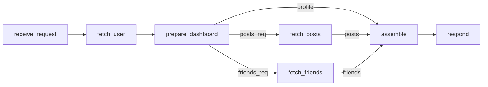
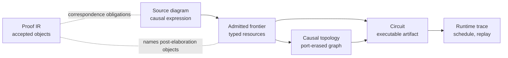

# Executable Causal Diagrams with Typed Linear Frontiers

Wire makes a source program elaborate to the causal diagram scheduled, replayed, and explained by
the runtime. The admitted diagram records which events depend on prior observations, which events
are incomparable, and which typed values cross between them. Wire turns Lamport's partial-order view
of distributed execution [\[1\]](#ref-1) into an authoring discipline for executable artifacts.

Conventional source forms tend to hide that structure. Imperative programs are ordered vectors of
effects: a later read is meaningful only because the program counter supplies an ordered prefix.
Pure functional `let` expressions move closer to named records of dependencies, but effectful
programs usually regain a linear spine unless the author adds a separate parallel or applicative
structure. Wire makes the next step explicit. A graph expression is read as a typed frontier
transformer: `<>` unions incomparable boundary fragments, and `=>` matches compatible output-input
endpoints while carrying unmatched endpoints forward. A written pipeline is therefore not a sequence
of barriers; it is a compact description of a partial order.

A dashboard request illustrates the gap:

```python
async def dashboard(uid):
    user = await fetch_user(uid)
    posts, friends = await asyncio.gather(
        fetch_posts(user.id),
        fetch_friends(user.id),
    )
    return assemble(user, posts, friends)
```

A human reads this as a causal diamond: fetch the user, fetch posts and friends independently, then
assemble. `asyncio.gather` exposes part of that structure, but the source language's primary object
is still the executing coroutine rather than an admitted typed topology. Distributed tracing
reconstructs a DAG from spans after the fact. Durable workflow runtimes can journal and replay
`await` points, but they recover topology from runtime behavior because the host language did not
expose the causal object directly.

In Wire, the diamond is authored directly rather than inferred from spans, continuations, or runtime
heuristics. Durable replay and provenance refer to the admitted diagram: recovery resumes from a
recorded causal prefix, and audit trails can point to named nodes and typed edges instead of
reconstructed traces outside the language.

## The Dashboard Diamond in Wire

The same request can be authored as a typed causal diagram. Contracts are nominal boundary
interfaces, not first-class CorePure values. Wire's pure expression sublanguage, CorePure, computes
JSON-shaped payloads; contracts classify the ports through which those payloads enter and leave the
diagram. The `@` form is Wire's effect boundary: network calls, storage, model calls, tools, and
other host effects stay behind registered executors, while deterministic payload shaping can stay in
Wire. Pulse, Cortex's durable runtime, journals outcomes for those executor nodes over the admitted
topology; CorePure expressions remain deterministic boundary equations rather than hidden host
effects.

```wire
# Registered facts that may cross node boundaries.
contract UserId;
contract UserProfile;
contract ProfileSummary;
contract PostsRequest;
contract FriendsRequest;
contract PostsFeed;
contract FriendGraph;
contract Dashboard;

# Executable events and their typed input/output frontiers.
node receive_request
  -> uid: UserId = @http.receive_dashboard_request ({});

node fetch_user
  <- uid: UserId;
  -> user: UserProfile = @http.fetch_user (uid);

node prepare_dashboard
  <- user: UserProfile;
  -> profile: ProfileSummary = {
    id = user.id;
    name = user.name;
  };
  -> posts_req: PostsRequest = {
    user_id = user.id;
    limit = 20;
  };
  -> friends_req: FriendsRequest = {
    user_id = user.id;
    include_mutual = true;
  };

node fetch_posts
  <- posts_req: PostsRequest;
  -> posts: PostsFeed = @http.fetch_posts (posts_req);

node fetch_friends
  <- friends_req: FriendsRequest;
  -> friends: FriendGraph = @http.fetch_friends (friends_req);

node assemble
  <- profile: ProfileSummary;
  <- posts: PostsFeed;
  <- friends: FriendGraph;
  -> dashboard: Dashboard = @dashboard.assemble ({
    inherit profile posts friends;
  });

node respond
  <- dashboard: Dashboard;
  = @http.respond_dashboard (dashboard);

# The file's graph expression: the returned executable topology.
receive_request
  => fetch_user
  => prepare_dashboard
  => fetch_posts <> fetch_friends
  => assemble
  => respond
```

Wire deliberately binds `<>` tighter than `=>`. The final expression therefore parses as a pipeline
whose middle stage is `fetch_posts <> fetch_friends`, an incomparable frontier. This differs from
the `Algebra.Graph` Haskell library convention to make the dashboard diamond readable without
parentheses.

The key node is `prepare_dashboard`. It has no `@` executor: its three output equations are CorePure
expressions evaluated when `user` is available. The node consumes the fetched `UserProfile` once and
produces three distinct typed facts: a profile summary for the join, a posts request for one branch,
and a friends request for the other. CorePure is deterministic and effect-free; output wrapping then
records the nominal contracts `ProfileSummary`, `PostsRequest`, and `FriendsRequest` at the ports.
The parallelism is graph structure: `fetch_posts` and `fetch_friends` are incomparable after
`prepare_dashboard`, while `assemble` is the join where their histories become comparable again.

The carried `profile` endpoint is where the frontier view does real work. The branch overlay exposes
only the inputs its operands need; it does not absorb outputs that are irrelevant to the branch. In
`prepare_dashboard => fetch_posts <> fetch_friends`, connect consumes `posts_req` and `friends_req`,
while `profile` remains a typed resource on the composed frontier. The later `=> assemble` consumes
that carried endpoint together with `posts` and `friends`. At runtime this is a direct
`prepare_dashboard -> assemble` dependency plus the two branch dependencies.



_Figure 1: Dashboard topology after admission. `profile` is carried directly from
`prepare_dashboard` to `assemble`; branch-local requests are consumed by `fetch_posts` and
`fetch_friends`._

The direct `profile` edge does not make `assemble` ready early, because readiness is still
conjunctive over all predecessors. It records that `profile` has no causal reason to flow through
either branch.

If the dashboard tried to wire `fetch_user` directly into two branches that both declared
`<- user: UserProfile`, admission would reject the graph: one produced endpoint would have two
consumers. This is a semantic rejection. A silent copy of `user` would remove the event that
explains why two downstream observations are legitimate. The fix is to name the causal event that
derives branch facts from one prior observation.

## Linear Frontiers and Algebraic Graphs

Linearity supplies the accounting discipline behind the causal reading. It is the bridge from
Lamport's partial-order view to source authoring: fan-out without a named event destroys the causal
explanation for why two downstream observations share a prior source. Wire refines Mokhov's algebra
of graphs [\[2\]](#ref-2): the source skeleton still has empty diagrams, vertices, overlay, and
connect, but vertices carry named input and output ports, and each port endpoint is a resource. The
same boundary admits graph expressions, determines executable topology, and exposes proof
obligations.

At the node boundary, the intended invariant is small enough to state directly:

$$
\forall e \in \operatorname{OwnedPorts}(n),\quad
\operatorname{internal}(e) + \operatorname{frontier}(e) = 1
$$

An owned endpoint is either used by exactly one internal edge or remains exposed on the frontier.
The closed-circuit check is the final admission step requiring a top-level circuit to have no
exposed endpoints. Overlay forms disjoint incomparable frontier union; connect matches and consumes
compatible output-input endpoint pairs; unmatched endpoints remain open obligations on the composed
boundary. Operationally, a carried endpoint plays the role of an identity wire for an open frontier:
it crosses a composition unchanged until a later compatible input consumes it. The frontier is
treated as a multiset of labelled ports, so exchange holds definitionally while source order is
retained for diagnostics. Weakening is not an operation that discards resources. Contraction is not
ambient either: reusing information requires a node that consumes one endpoint and produces fresh
endpoints with their own labels and contracts.

Finite-product adapters support the same law. The artifact supports a `*` operator that elaborates
to a generated phantom adapter for named records and bounded indexed products such as `[T; 4]`. The
adapter crosses one product constructor, creates distinct leaf endpoints, and then ordinary connect
consumes each leaf once. Static scatter/gather uses this mechanism, but it adds no copying rule and
does not drive the paper's argument. The structural-rule vocabulary is inherited from linear logic
and proof-net work [\[5\]](#ref-5), [\[6\]](#ref-6), while the interface shape places Wire near
cospan, open-graph, and string-diagram accounts of composition [\[3\]](#ref-3), [\[4\]](#ref-4),
[\[7\]](#ref-7).

## One Object, Five Views

The implementation separates five views of the admitted diagram. Source is the authored causal
expression. The admitted frontier records typed endpoint resources and remaining obligations. The
port-erased graph relation exposes topology for graph algorithms. The circuit is the executable
artifact consumed by Pulse. The runtime trace records schedule, replay, and provenance events over
that circuit. Source elaboration expands compile-time includes, bounded generation, static family
projections, and product adapters before the effectful runtime boundary.



_Figure 2: Wire's executable causal-diagram layers and the proof-facing IR's relation to the
admitted frontier._

The split mirrors the distinction between source, admission, topology, executable artifact, and
trace. Concrete node instances are invoked, completed, recovered, or observed under the partial
order implied by the topology. That separation gives Wire both roles: diagram language and
executable artifact boundary.

The proof-facing layer is narrower than a verified compiler, but it already has a live mechanized
proof surface. The public
[proof-status dashboard](https://digimuoto.github.io/cortex/Reference/proof-status/) is the source
of truth for current Lean mechanization and Haskell correspondence: it separates Lean-proven or
integrated claims from witness-backed, hooked, tested, proof-only, and still-open executable
correspondence. The generated [Lean docs](https://digimuoto.github.io/cortex/Theory/) expose the
declarations themselves. For this paper's slice, the Lean elaboration IR names accepted declarations
inside an admitted module shell after source inclusion and local admission.
`GraphExpr.AcceptedRefsClosed` states that every accepted graph expression references only accepted
nodes, kinds, and graph bindings in the surrounding admitted shell. Accepted node and kind
declarations carry label-unique frontiers whose contracts reference the accepted contract
declarations modeled in the current IR; the projection
`RawNodeDecl.toAccepted_toLinearPortObject_portLinear` records the corresponding `PortLinear`
obligation for accepted node declarations. Here `PortLinear` requires each owned output endpoint to
be either exposed or consumed by exactly one internal edge, and each owned input endpoint to be
either exposed or produced by exactly one internal edge.

Generated node provenance is explicit through `NodeOrigin`. Generated-form theorems
(`Make.accept_portLinear`, `MakeEach.accept_portLinear`, and `Star.accept_portLinear`) state
source-linearity preservation for certified bounded generation and product adapters. The
source-to-actualized bridge proves port-domain exactness for aligned witnesses. Edge-side exactness,
runtime-witness production, and correspondence to compiled Haskell artifacts remain open obligations
in the verification story.

The submitted artifact exposes this boundary through a build-backed dashboard example, parser and
compiler path, source includes, bounded graph generation, indexed family projection, finite-product
phantom adapters, topology-first formatter, Tree-sitter editor grammar, generated Lean docs, and
proof-status dashboard. The current verification boundary is staged rather than end-to-end: the
compiler and executor are not fully verified, while the proof surfaces keep authored topology
inspectable and tie diagram syntax, linear boundary checking, runtime topology, and proof-facing
closure conditions to the admitted object.

## References

1. <a id="ref-1"></a>Leslie Lamport. _Time, Clocks, and the Ordering of Events in a Distributed
   System_. Communications of the ACM 21(7), 1978: 558–565. <https://doi.org/10.1145/359545.359563>
2. <a id="ref-2"></a>Andrey Mokhov. _Algebraic Graphs with Class (Functional Pearl)_. Haskell 2017:
   2–13. <https://doi.org/10.1145/3122955.3122956>
3. <a id="ref-3"></a>Brendan Fong. _Decorated Cospans_. Theory and Applications of Categories,
   30(33), 2015. <https://arxiv.org/abs/1502.00872>
4. <a id="ref-4"></a>Peter Selinger. _A Survey of Graphical Languages for Monoidal Categories_.
   Lecture Notes in Physics 813, 2011. <https://arxiv.org/abs/0908.3347>
5. <a id="ref-5"></a>Jean-Yves Girard. _Linear Logic_. Theoretical Computer Science 50(1), 1987.
   <https://doi.org/10.1016/0304-3975(87)90045-4>
6. <a id="ref-6"></a>Vincent Danos and Laurent Regnier. _The Structure of Multiplicatives_. Archive
   for Mathematical Logic 28(3), 1989. <https://doi.org/10.1007/BF01622878>
7. <a id="ref-7"></a>Lucas Dixon, Ross Duncan, and Aleks Kissinger. _Open Graphs and Computational
   Reasoning_. EPTCS 26, 2010. <https://doi.org/10.4204/EPTCS.26.16>
