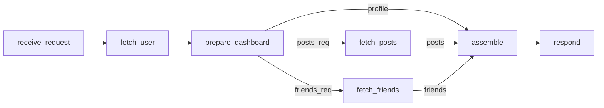
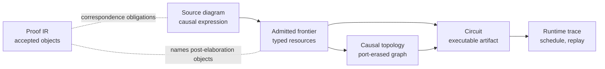

# Executable Causal Diagrams with Typed Linear Frontiers

Wire is a source language whose programs elaborate to directed graphs of typed events, and whose
runtime schedules, replays, and explains exactly the graph that elaboration produced. The paper
turns Lamport's partial-order view of distributed execution [\[1\]](#ref-1) into an authoring
discipline: the diagram is the program, not a visualization of it.

We make three claims. First, a **language claim**: graph expressions read as typed frontier
transformers — composition either unions independent boundary fragments or matches compatible
output-input ports — elaborate to port-linear diagrams in which every typed endpoint is used exactly
once. Second, a **mechanization claim**: the linearity invariant and its preservation through
elaboration (including bounded node generation and product adapters) are stated and proved in Lean 4
over an accepted-object intermediate representation. Third, an **execution claim**: a durable
runtime journals, replays, and reports provenance against the same admitted diagram, so recovery
resumes from a recorded causal prefix and audit trails point at named nodes and typed edges rather
than reconstructed traces.

## Definitions

The five terms the paper relies on are defined here, before use.

A **port instance** is one occurrence of a typed, direction-tagged endpoint — a node name, a port
name, a nominal payload contract, and an optional label — owned by the node that declares it. For a
node $n$, $\operatorname{OwnedPorts}(n)$ is the finite set of port instances $n$ declares.

The **frontier** of a graph expression is the multiset of port instances exposed on its boundary:
the ports not yet consumed by composition. Composition operators are read as frontier transformers.
**Overlay** (`<>`) unions fragments with disjoint node sets; the result's frontier is the union of
the operands' frontiers. **Connect** (`=>`) is port-key-matched: an edge forms between a left output
and a right input exactly when their (contract, label) match keys agree uniquely — direction is
enforced by matching outputs against inputs; both matched ports leave the frontier, and every
unmatched port is **carried** — it remains on the composed frontier, acting as an identity wire for
an open boundary.

A diagram is **admitted** when it passes elaboration and boundary admission; admitted diagrams are
the objects the runtime executes and the theorems quantify over.

For an admitted graph expression $g$ and a port instance $e \in \operatorname{OwnedPorts}(n)$ of a
node $n$ in $g$, define two indicator functions
$\operatorname{internal}_g, \operatorname{frontier}_g : \operatorname{OwnedPorts}(n) \to \{0,1\}$:
$\operatorname{internal}_g(e) = 1$ iff $e$ is the endpoint of exactly one edge internal to $g$, and
$\operatorname{frontier}_g(e) = 1$ iff $e$ occurs on the frontier of $g$.

**Definition 1 (port linearity, node-boundary form).** An admitted diagram $g$ is port-linear when

$$
\forall n \in g,\ \forall e \in \operatorname{OwnedPorts}(n),\quad
\operatorname{internal}_g(e) + \operatorname{frontier}_g(e) = 1 .
$$

Every owned endpoint is consumed by exactly one internal edge or exposed on the boundary — never
both, never neither, never twice. This is the statement mechanized as `PortLinear` in the Lean
development. Closedness (an empty frontier) is a property, not an admission requirement: admitted
diagrams compile whether open or closed, with open inputs becoming entry ports and open outputs exit
ports of the executable circuit. There is no ambient copying or discarding: weakening is not an
operation, and contraction requires an explicit node that consumes one endpoint and produces fresh
ones.

## A Three-Node Example

The smallest composition that shows both matching and carrying:

```wire
contract A;
contract B;
contract C;

node source
  -> left: A;
  -> right: B;
  = @demo.source ({});

node use_left
  <- left: A;
  -> out: C = @demo.use_left (left);

source => use_left
```

The frontiers are $\{\mathit{left}^{+}{:}A,\ \mathit{right}^{+}{:}B\}$ for `source` and
$\{\mathit{left}^{-}{:}A,\ \mathit{out}^{+}{:}C\}$ for `use_left` (superscripts mark direction).
Connect matches the unique compatible pair $\mathit{left}^{+}/\mathit{left}^{-}$ on key
$(A, \mathit{left})$ and forms one edge; `right` and `out` are carried. The composed frontier is
$\{\mathit{right}^{+}{:}B,\ \mathit{out}^{+}{:}C\}$, and Definition 1 checks per port: `source.left`
and `use_left.left` are internal (indicator $1+0$), the other two are frontier ($0+1$). If a second
node also declared `<- left: A`, the composition would be rejected — one produced endpoint with two
compatible consumers has no linear reading, and the admission error says so at the source level.
That rejection, scaled up, is the paper's running discipline.

## A Realistic Diagram: the Dashboard Diamond

A dashboard request shows what the discipline buys at realistic scale. Conventional source forms
hide the causal structure: imperative programs are ordered vectors of effects, and effectful
functional programs regain a linear spine unless the author adds separate parallel structure.

```python
async def dashboard(uid):
    user = await fetch_user(uid)
    posts, friends = await asyncio.gather(
        fetch_posts(user.id),
        fetch_friends(user.id),
    )
    return assemble(user, posts, friends)
```

A human reads this as a causal diamond: fetch the user, fetch posts and friends independently, then
assemble. `asyncio.gather` exposes part of that structure, but the source language's primary object
is still the executing coroutine rather than an admitted typed topology. Distributed tracing
reconstructs a DAG from spans after the fact. Durable workflow runtimes can journal and replay
`await` points, but they recover topology from runtime behavior because the host language did not
expose the causal object directly.

In Wire, the diamond is authored directly rather than inferred from spans, continuations, or runtime
heuristics. Contracts are nominal boundary interfaces. CorePure, the pure expression sublanguage,
computes JSON-shaped payloads; contracts classify the ports through which those payloads enter and
leave the diagram. The `@` form is the effect boundary: network calls, storage, model calls, and
other host effects stay behind registered executors. Pulse, the durable runtime, journals outcomes
for executor nodes over the admitted topology; CorePure expressions remain deterministic boundary
equations rather than hidden host effects.

```wire
# Registered facts that may cross node boundaries.
contract UserId;
contract UserProfile;
contract ProfileSummary;
contract PostsRequest;
contract FriendsRequest;
contract PostsFeed;
contract FriendGraph;
contract Dashboard;

# Executable events and their typed input/output frontiers.
node receive_request
  -> uid: UserId = @http.receive_dashboard_request ({});

node fetch_user
  <- uid: UserId;
  -> user: UserProfile = @http.fetch_user (uid);

node prepare_dashboard
  <- user: UserProfile;
  -> profile: ProfileSummary = {
    id = user.id;
    name = user.name;
  };
  -> posts_req: PostsRequest = {
    user_id = user.id;
    limit = 20;
  };
  -> friends_req: FriendsRequest = {
    user_id = user.id;
    include_mutual = true;
  };

node fetch_posts
  <- posts_req: PostsRequest;
  -> posts: PostsFeed = @http.fetch_posts (posts_req);

node fetch_friends
  <- friends_req: FriendsRequest;
  -> friends: FriendGraph = @http.fetch_friends (friends_req);

node assemble
  <- profile: ProfileSummary;
  <- posts: PostsFeed;
  <- friends: FriendGraph;
  -> dashboard: Dashboard = @dashboard.assemble ({
    inherit profile posts friends;
  });

node respond
  <- dashboard: Dashboard;
  = @http.respond_dashboard (dashboard);

# The file's graph expression: the returned executable topology.
receive_request
  => fetch_user
  => prepare_dashboard
  => fetch_posts <> fetch_friends
  => assemble
  => respond
```

Wire deliberately binds `<>` tighter than `=>`. The final expression therefore parses as a pipeline
whose middle stage is `fetch_posts <> fetch_friends`, an incomparable frontier. This differs from
the `Algebra.Graph` Haskell library convention to make the dashboard diamond readable without
parentheses.

The key node is `prepare_dashboard`. It has no `@` executor: its three output equations are CorePure
expressions evaluated when `user` is available. The node consumes the fetched `UserProfile` once and
produces three distinct typed facts: a profile summary for the join, a posts request for one branch,
and a friends request for the other. CorePure is deterministic and effect-free; output wrapping then
records the nominal contracts `ProfileSummary`, `PostsRequest`, and `FriendsRequest` at the ports.
The parallelism is graph structure: `fetch_posts` and `fetch_friends` are incomparable after
`prepare_dashboard`, while `assemble` is the join where their histories become comparable again.

The carried `profile` endpoint is where the frontier view does real work. The branch overlay exposes
only the inputs its operands need; it does not absorb outputs that are irrelevant to the branch. In
`prepare_dashboard => fetch_posts <> fetch_friends`, connect consumes `posts_req` and `friends_req`,
while `profile` remains a typed resource on the composed frontier. The later `=> assemble` consumes
that carried endpoint together with `posts` and `friends`. At runtime this is a direct
`prepare_dashboard -> assemble` dependency plus the two branch dependencies.



_Figure 1: Dashboard topology after admission. `profile` is carried directly from
`prepare_dashboard` to `assemble`; branch-local requests are consumed by `fetch_posts` and
`fetch_friends`._

The direct `profile` edge does not make `assemble` ready early, because readiness is still
conjunctive over all predecessors. It records that `profile` has no causal reason to flow through
either branch.

If the dashboard tried to wire `fetch_user` directly into two branches that both declared
`<- user: UserProfile`, admission would reject the graph — the three-node rejection from above at
scale: one produced endpoint would have two consumers. This is a semantic rejection. A silent copy
of `user` would remove the event that explains why two downstream observations are legitimate. The
fix is `prepare_dashboard`: name the causal event that derives branch facts from one prior
observation.

## Relation to Algebraic Graphs, Open Graphs, and Linear Logic

Linearity (Definition 1) supplies the accounting discipline behind the causal reading. It is the
bridge from Lamport's partial-order view to source authoring: fan-out without a named event destroys
the causal explanation for why two downstream observations share a prior source.

**Against Mokhov's algebra of graphs** [\[2\]](#ref-2), the delta is precise. Wire keeps the
four-constructor skeleton — empty, vertex, overlay, connect — but vertices carry named, typed ports,
and connect changes meaning: Mokhov's connect adds the full cross-product of edges between operands,
while Wire's `=>` adds an edge only per uniquely matched port key and carries the rest. Two
algebraic consequences follow. Multiple compatible counterparts for one port are a static error
rather than a fan-out, and source-level distributivity of connect over overlay deliberately
**fails**: distributing a source expression across an overlay can duplicate an operand and with it a
port resource, so `(down => some) <> (down => things)` is rejected where `down => some <> things` is
admitted. Mokhov's laws are recovered after admission by a forgetful lowering that erases port
identity into a plain edge relation; the laws hold of the lowered object, not of source expressions.

**Against cospan, open-graph, and string-diagram accounts of composition** [\[3\]](#ref-3),
[\[4\]](#ref-4), [\[7\]](#ref-7), Wire's boundary is the same shape — a typed interface through
which composition glues — but the interface is a multiset of contract-and-label-keyed ports with
admission obligations attached, and the composite is not only a categorical object: it is the
executable artifact a durable runtime schedules and replays, with the linearity obligation
discharged by a mechanized check rather than by construction in a chosen category. We do not claim a
functorial semantics into a cospan category here; stating one is future work, and the
port-key-matched composition (partial, key-directed, carrying) is exactly where such a statement
would have to differ from the standard symmetric monoidal setting.

**Against linear logic and proof nets** [\[5\]](#ref-5), [\[6\]](#ref-6), Wire inherits the
structural-rule vocabulary but uses a restricted fragment: exchange holds definitionally (the
frontier is a multiset; source order is kept only for diagnostics), weakening is absent (no
operation discards a resource), and contraction is never ambient — reusing information requires an
explicit node consuming one endpoint and producing fresh ones, which is what makes every fan-out a
named causal event. There is no exponential modality and no cut elimination claim; the linear
discipline governs diagram admission, not proof reduction.

Finite-product adapters stay inside the same law. The `*` operator elaborates to a generated
**phantom adapter** for named records and bounded indexed products such as `[T; 4]`: the adapter
crosses one product constructor, creates distinct leaf endpoints, and ordinary connect consumes each
leaf once. Static scatter/gather uses this mechanism; it adds no copying rule.

## One Object, Five Views

The implementation separates five views of the admitted diagram. Source is the authored causal
expression. The admitted frontier records typed endpoint resources and remaining obligations. The
port-erased graph relation exposes topology for graph algorithms. The circuit is the executable
artifact consumed by Pulse. The runtime trace records schedule, replay, and provenance events over
that circuit. Source elaboration expands compile-time includes, bounded generation, static family
projections, and product adapters before the effectful runtime boundary.



_Figure 2: Wire's executable causal-diagram layers and the proof-facing IR's relation to the
admitted frontier._

The split mirrors the distinction between source, admission, topology, executable artifact, and
trace. Concrete node instances are invoked, completed, recovered, or observed under the partial
order implied by the topology. That separation gives Wire both roles: diagram language and
executable artifact boundary.

The proof-facing layer is narrower than a verified compiler, but it already has a live mechanized
proof surface. The public
[proof-status dashboard](https://digimuoto.github.io/cortex/Reference/proof-status/) is the source
of truth for current Lean mechanization and Haskell correspondence: it separates Lean-proven or
integrated claims from witness-backed, hooked, tested, proof-only, and still-open executable
correspondence. The generated [Lean docs](https://digimuoto.github.io/cortex/Theory/) expose the
declarations themselves. For this paper's slice, the Lean elaboration IR names accepted declarations
inside an admitted module shell after source inclusion and local admission.
`GraphExpr.AcceptedRefsClosed` states that every accepted graph expression references only accepted
nodes, kinds, and graph bindings in the surrounding admitted shell. Accepted node and kind
declarations carry label-unique frontiers whose contracts reference the accepted contract
declarations modeled in the current IR; the projection
`RawNodeDecl.toAccepted_toLinearPortObject_portLinear` records the corresponding `PortLinear`
obligation for accepted node declarations. Here `PortLinear` requires each owned output endpoint to
be either exposed or consumed by exactly one internal edge, and each owned input endpoint to be
either exposed or produced by exactly one internal edge.

Generated node provenance is explicit through `NodeOrigin`. Generated-form theorems
(`Make.accept_portLinear`, `MakeEach.accept_portLinear`, and `Star.accept_portLinear`) state
source-linearity preservation for certified bounded generation and product adapters. The
source-to-actualized bridge proves port-domain exactness for aligned witnesses. Edge-side exactness,
runtime-witness production, and correspondence to compiled Haskell artifacts remain open obligations
in the verification story.

The same discipline reaches an unplanned domain. Wire's examples include quantum circuit
descriptions — among them a delayed-choice quantum eraser executed on IBM hardware — authored in the
same language with no quantum-specific rules: qubit-carrying ports are linear resources, so the
calculus's fan-out rejection coincides with the no-cloning constraint a qubit port requires, and
gates are nodes whose typed frontiers enforce application order. One port-linear language spans
durable workflows and quantum circuit description because both are causal diagrams over unforgeable
resources.

The submitted artifact exposes this boundary through a build-backed dashboard example, parser and
compiler path, source includes, bounded graph generation, indexed family projection, finite-product
phantom adapters, topology-first formatter, Tree-sitter editor grammar, generated Lean docs, and
proof-status dashboard. The current verification boundary is staged rather than end-to-end: the
compiler and executor are not fully verified, while the proof surfaces keep authored topology
inspectable and tie diagram syntax, linear boundary checking, runtime topology, and proof-facing
closure conditions to the admitted object.

## References

1. <a id="ref-1"></a>Leslie Lamport. _Time, Clocks, and the Ordering of Events in a Distributed
   System_. Communications of the ACM 21(7), 1978: 558–565. <https://doi.org/10.1145/359545.359563>
2. <a id="ref-2"></a>Andrey Mokhov. _Algebraic Graphs with Class (Functional Pearl)_. Haskell 2017:
   2–13. <https://doi.org/10.1145/3122955.3122956>
3. <a id="ref-3"></a>Brendan Fong. _Decorated Cospans_. Theory and Applications of Categories,
   30(33), 2015. <https://arxiv.org/abs/1502.00872>
4. <a id="ref-4"></a>Peter Selinger. _A Survey of Graphical Languages for Monoidal Categories_.
   Lecture Notes in Physics 813, 2011. <https://arxiv.org/abs/0908.3347>
5. <a id="ref-5"></a>Jean-Yves Girard. _Linear Logic_. Theoretical Computer Science 50(1), 1987.
   <https://doi.org/10.1016/0304-3975(87)90045-4>
6. <a id="ref-6"></a>Vincent Danos and Laurent Regnier. _The Structure of Multiplicatives_. Archive
   for Mathematical Logic 28(3), 1989. <https://doi.org/10.1007/BF01622878>
7. <a id="ref-7"></a>Lucas Dixon, Ross Duncan, and Aleks Kissinger. _Open Graphs and Computational
   Reasoning_. EPTCS 26, 2010. <https://doi.org/10.4204/EPTCS.26.16>
