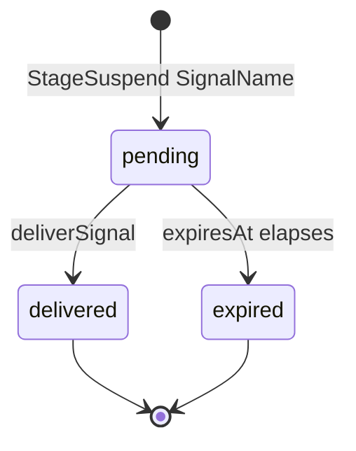

# Pulse Signals Reference

Signals are Pulse's durable external-event primitive. A stage that cannot proceed until an
out-of-band event arrives emits `StageSuspend SignalName`; the runtime parks the stage's node and
persists the wait. When the corresponding signal is delivered through the service API, the wait
atomically transitions to delivered and the run wakes at that node.

This page states the contract. Architectural framing is in
[chapter 06](../../Architecture/06-pulse-runtime.md); the service endpoint is
[`service-api.md`](./service-api.md#1-endpoints).

## 1. Identity and scope

```haskell
newtype SignalName = SignalName { unSignalName :: Text }
```

A signal name is an opaque text tag. Signals are scoped to a run: the same name in two different
runs is two different signals. Within a run, at most one wait per signal name may be `pending` at a
time — a partial unique index on `(run_id, signal_name) WHERE status = 'pending'` enforces this. A
name may be reused for a second wait once the prior wait has been delivered or expired.

The `node_id` on a signal row is informational — it records which node registered the wait — and
does not participate in uniqueness. It is nullable for cases where a wait is not attributable to a
single node.

## 2. State machine



- **pending** — a stage has emitted `StageSuspend SignalName`, the wait row is persisted, and the
  run is in `waiting`.
- **delivered** — a caller has delivered the signal; the wait row carries the delivery payload and
  timestamp.
- **expired** — an optional `expiresAt` has elapsed without delivery; the wait cannot be satisfied
  and the run must be cancelled or retried.

Only Pulse mutates these states. External callers observe them through the service API.

## 3. Producer protocol — `StageSuspend`

A stage action signals a wait by returning `StageSuspend SignalName`. The executor:

1. Persists a pending signal row.
2. Transitions the stage's node to `NodeWaiting`.
3. Writes a checkpoint reflecting the suspension.
4. Yields the run back to the scheduler. When no node is runnable, the run transitions to the
   `waiting` run-status and the executor emits a `run.suspended` event
   ([`events.md`](./events.md#3-catalog)).

The stage action does not return a value on suspension. When the signal is delivered and the stage
re-enters, the delivery payload is available to the stage through its memory handle.

## 4. Consumer protocol — signal delivery

Signals are delivered through the Pulse service API:

```
POST /Pulse/v1/runs/:run_id/signal
Content-Type: application/json

{
  "signal_name": "<name>",
  "payload":     <optional JSON>
}
```

Delivery is atomic: the runtime transitions the wait row from `pending` to `delivered`, records the
payload and delivery timestamp, and wakes the waiting node in a single transaction. Duplicate
deliveries to a signal that is already `delivered` are no-ops and return the original delivery.

Attempting to deliver a signal that was never waited on (no matching `pending` row) fails with a
structured error. Attempting to deliver an `expired` signal fails with a structured error; the run
must be retried to produce a fresh wait.

## 4.1 Run-terminal signals

The runtime is itself a signal producer for one reserved name family: `run-terminal:<run-uuid>`
(constructed with `runTerminalSignalName`, recognized with `parseRunTerminalSignal`). When a run
reaches a terminal status — completed, failed, or cancelled — the runtime delivers its run-terminal
signal to **every** pending wait on that name, across runs, in the same transaction as the status
flip, waking each waiter. The payload carries
`{"runId": ..., "outcome": "completed" | "failed" | "cancelled"}`.

This is the primitive for awaiting another run without polling: a parent that spawns a child run
suspends on the child's run-terminal signal and holds no worker slot while waiting. Two race windows
are closed by construction:

- a wait registered on a run that is **already terminal** resolves at registration time
  (`registerSignalWaitOrResolve` writes the row as `delivered` and the suspending stage completes
  with the terminal payload instead of parking);
- a run that terminates **after** the wait is pending finds the pending row in the cross-run
  delivery, because the delivery and the terminal status commit together.

Timer-style waits and further runtime-produced signals follow the same pattern (see the durable
timers issue); operator-delivered signals through the service API are unaffected.

## 5. Records

```haskell
data SignalWait = SignalWait
  { swRunId       :: UUID
  , swNodeId      :: Text
  , swSignalName  :: SignalName
  , swCreatedAt   :: UTCTime
  , swExpiresAt   :: Maybe UTCTime
  }

data SignalDelivery = SignalDelivery
  { sdRunId        :: UUID
  , sdSignalName   :: SignalName
  , sdPayload      :: Aeson.Value
  , sdDeliveredAt  :: UTCTime
  }

data SignalStatus
  = SignalPending
  | SignalDelivered
  | SignalExpired
```

`SignalWait` is the persisted wait row; `SignalDelivery` is the delivery record that is appended on
a successful delivery. Both are surfaced through the run-detail API.

## 6. Storage and ordering

Signal storage is the durable backing for the protocol; the normative contract is above.
Schema-level detail is in [`schema.md §9`](./schema.md#9-signals).

- Pending-uniqueness is scoped to `(run_id, signal_name)` via a partial unique index; `node_id` is
  informational.
- Delivery is at-most-once per wait row; there is no implicit queue.
- Ordering of multiple waits on disjoint signal names is not meaningful — the first one to be
  delivered wakes its node independently.

## Related

- [./schema.md](./schema.md) — signal table.
- [./service-api.md](./service-api.md) — the delivery endpoint.
- [./types.md](./types.md) — `StageResult` and `StageSuspend`.
- [../../Architecture/06-pulse-runtime.md](../../Architecture/06-pulse-runtime.md) — runtime
  framing.

---

_End of Pulse Signals Reference._
