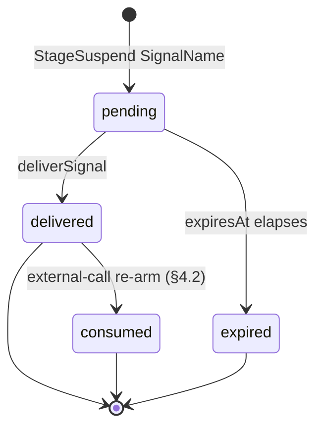

# Pulse Signals Reference

Signals are Pulse's durable external-event primitive. A stage that cannot proceed until an
out-of-band event arrives emits `StageSuspend SignalName`; the runtime parks the stage's node and
persists the wait. When the corresponding signal is delivered through the service API, the wait
atomically transitions to delivered and the run wakes at that node.

This page states the contract. Architectural framing is in
[chapter 06](../../Architecture/06-pulse-runtime.md); the service endpoint is
[`service-api.md`](./service-api.md#1-endpoints).

## 1. Identity and scope

```haskell
newtype SignalName = SignalName { unSignalName :: Text }
```

A signal name is an opaque text tag. Signals are scoped to a run: the same name in two different
runs is two different signals. Within a run, at most one wait per signal name may be `pending` at a
time — a partial unique index on `(run_id, signal_name) WHERE status = 'pending'` enforces this. A
name may be reused for a second wait once the prior wait has been delivered or expired.

The `node_id` on a signal row records which node registered the wait, but it does not participate in
uniqueness. Settlement still treats it as the pending row's owner: a same-node re-settlement is
idempotent, while a second waiting node in the same run cannot reuse the same pending signal name
and is rejected before the run parks. It is nullable for cases where a wait is not attributable to a
single node.

## 2. State machine



- **pending** — a stage has emitted `StageSuspend SignalName`, the wait row is persisted, and the
  run is in `waiting`.
- **delivered** — a caller has delivered the signal; the wait row carries the delivery payload and
  timestamp.
- **consumed** — a delivered reserved `external-call:` wake (§4.2) that suspend settlement has used
  to re-arm the node; consuming it keeps settlement from re-observing the delivered row and
  re-arming in a loop. Only the `external-call:` family reaches this state.
- **expired** — an optional `expiresAt` has elapsed without delivery; the wait cannot be satisfied
  and the run must be cancelled or retried.

Only Pulse mutates these states. External callers observe them through the service API.

The **graph-state effect** of delivery depends on the signal family. For an ordinary value signal,
the delivered payload satisfies the waiting node and becomes available to it on re-entry (§3). The
reserved runtime families have their own trusted resolution rule: `run-terminal:` (§4.1) completes
the waiter with its terminal payload, while `external-call:` (§4.2) is a wake token that **re-arms**
the waiter rather than becoming its value. Reserved-family delivery does not follow the generic
payload-as-value behavior.

## 3. Producer protocol — `StageSuspend`

A stage action signals a wait by returning `StageSuspend SignalName`. The executor:

1. Transitions the stage's node to `NodeWaiting` in graph state.
2. Settles the suspend in one database transaction: write the graph state, persist the signal wait
   row, and transition the run to `waiting` if no waiting node was already satisfied.
3. Yields the run back to the scheduler. If the run parks, the executor emits a `run.suspended`
   event ([`events.md`](./events.md#3-catalog)).

The stage action does not return a value on suspension. When an **ordinary** signal is delivered and
the stage re-enters, the delivery payload is available to the stage through its memory handle. The
reserved runtime families resolve differently — `run-terminal:` completes the waiter (§4.1) and
`external-call:` re-arms it (§4.2) — so their payloads are not consumed as the node value.

## 4. Consumer protocol — signal delivery

Signals are delivered through the Pulse service API:

```
POST /Pulse/v1/runs/:run_id/signal
Content-Type: application/json

{
  "signal_name": "<name>",
  "payload":     <optional JSON>
}
```

Delivery is atomic: the runtime transitions the wait row from `pending` to `delivered`, records the
payload and delivery timestamp, and wakes the waiting node in a single transaction. Duplicate
deliveries to a signal that is already `delivered` are no-ops and return the original delivery.

Attempting to deliver a signal that was never waited on (no matching `pending` row) fails with a
structured error. Attempting to deliver an `expired` signal fails with a structured error; the run
must be retried to produce a fresh wait.

## 4.1 Run-terminal signals

The runtime is itself a signal producer for one reserved name family: `run-terminal:<run-uuid>`
(constructed with `runTerminalSignalName`, recognized with `parseRunTerminalSignal`). When a run
reaches a terminal status — completed, failed, cancelled, or timeout (a retry, if any, is a fresh
run under a new run id) — the runtime delivers its run-terminal signal to **every** pending wait on
that name, across runs, waking each waiter. The payload carries
`{"runId": ..., "outcome": "completed" | "failed" | "cancelled" | "timeout"}`.

Delivery is centralized inside the terminal status writers themselves (`updateRunCompleted`,
`updateRunFailed`, `updateRunCancelled`, `updateRunTimedOut`, and expired-lease recovery), so the
terminal status and its waiters' wake-ups commit in the same transaction regardless of which code
path wrote the status — executor settlement, failure persistence, scheduler discard, timeout, and
recovery all funnel through them.

This is the primitive for awaiting another run without polling: a parent that spawns a child run
suspends on the child's run-terminal signal and holds no worker slot while waiting. The protocol
closes these race windows:

- run-terminal settlement and terminal status delivery both enter the same transaction-scoped
  protocol lock before touching `pulse.runs` rows, so mutual awaits cannot form cross-run row-lock
  cycles while one side parks and the other terminalizes;
- a wait on a run that is **already terminal** resolves during suspend settlement; the wait is
  recorded as `delivered`, the waiting node completes with the terminal payload, and the parent does
  not park;
- settlement **serializes against a concurrent termination** by share-locking the awaited run's row
  before it writes graph state, signal rows, and any `waiting` run-status; a terminal writer blocks
  until the pending wait row is committed and then finds it, or commits first and is visible to the
  locked status read;
- the wait row and the run's `waiting` status are committed by the same settlement transaction, so
  there is no durable interval where a terminal delivery can mark a wait `delivered` while the
  waiter later parks. If settlement sees an already-delivered row for a waiting node, it completes
  that node instead of parking.

A run-terminal wait whose target run does not exist is rejected during settlement and fails the
parent run with `run_terminal_target_missing`; it never registers a pending signal row. Only the
target run's terminal status writer can deliver this namespace, so a missing target would otherwise
be an undeliverable wait.

A run-terminal wait targeting the current run is also rejected during settlement and fails the run
with `run_terminal_self_wait`; once parked, the run would have no worker left to drive itself to a
terminal status and deliver the signal.

Timer-style waits and further runtime-produced signals follow the same pattern (see the durable
timers issue); operator-delivered signals through the service API are unaffected.

The `run-terminal:` name family is **reserved for the runtime**. External/host delivery
(`deliverSignal`) refuses any name in this family, so a caller cannot forge `run-terminal:<child>`
to wake or complete a waiter while the awaited run is still live — run-terminal delivery flows only
through the terminal status writers.

## 4.2 External-call wake signals

The runtime owns a second reserved name family: `external-call:<attempt-key>`. It is the durable
completion wake for a `submit_park_resume` external-call stage (ADR 0059) — a hardware quantum
submission, a long-running OpenAPI/MCP/WASM call, or a slow `ModelExecutor`. Its name derives from
the durable [external-call attempt key](./schema.md#10-external-call-attempts) (run id, node id,
runtime binding id, frontier id), so one wake resolves exactly one parked stage attempt.

Like `run-terminal:`, the family is **reserved**: external/host `deliverSignal` refuses any name in
it, so a completion wake cannot be forged. Only the trusted external-call delivery path — used by
provider-completion watchers, not the public signal endpoint — may mark it delivered.

A delivered `external-call:` signal is a **wake token, not node output**. Its payload may carry
completion status and an optional provider result locator, but it never becomes the node value.
Delivery — or an already-delivered wake observed at suspend settlement (ADR 0058) — **re-arms** the
waiting node: graph state returns to `NodePending`, not `NodeCompleted`. The bound `StageAction`
re-runs, reads the durable attempt record, fetches and validates the provider result, and only then
commits canonical output envelopes or a typed failure closure. The resumed fetch is idempotent and
not-ready-tolerant: a premature or duplicate wake observing a non-terminal provider job re-suspends
or returns a typed retry/no-progress outcome rather than closing the stage as a provider failure.

## 5. Records

```haskell
data SignalWait = SignalWait
  { swRunId       :: UUID
  , swNodeId      :: Text
  , swSignalName  :: SignalName
  , swCreatedAt   :: UTCTime
  , swExpiresAt   :: Maybe UTCTime
  }

data SignalDelivery = SignalDelivery
  { sdRunId        :: UUID
  , sdSignalName   :: SignalName
  , sdPayload      :: Aeson.Value
  , sdDeliveredAt  :: UTCTime
  }

data SignalStatus
  = SignalPending
  | SignalDelivered
  | SignalExpired
```

`SignalWait` is the persisted wait row; `SignalDelivery` is the delivery record that is appended on
a successful delivery. Both are surfaced through the run-detail API.

## 6. Storage and ordering

Signal storage is the durable backing for the protocol; the normative contract is above.
Schema-level detail is in [`schema.md §9`](./schema.md#9-signals).

- Pending-uniqueness is scoped to `(run_id, signal_name)` via a partial unique index; `node_id` is
  informational.
- Delivery is at-most-once per wait row; there is no implicit queue.
- Ordering of multiple waits on disjoint signal names is not meaningful — the first one to be
  delivered wakes its node independently.

## Related

- [./schema.md](./schema.md) — signal table.
- [./service-api.md](./service-api.md) — the delivery endpoint.
- [./types.md](./types.md) — `StageResult` and `StageSuspend`.
- [../../Architecture/06-pulse-runtime.md](../../Architecture/06-pulse-runtime.md) — runtime
  framing.

---

_End of Pulse Signals Reference._
