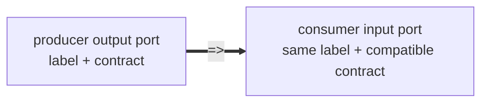

# Wire Reference — Contracts, Ports, and Matching

Contracts are named typed interfaces. Ports are labeled node-boundary slots typed by contracts. `=>`
connects output ports to input ports when their contract and label match exactly.

## Nodes, Ports, And Edges

A `node` declaration supplies both graph identity and a typed boundary:

```wire
node classify
  <- evidence: EvidenceSet;
  -> accepted: AcceptedSet;
  -> rejected: RejectedSet;
  = @review.classify (evidence);
```

The identifier `classify` names the node. The `<-` clauses declare input ports. The `->` clauses
declare output ports. The body after `=` is the implementation behind that boundary.

The graph edge operator connects already-declared ports:

```wire
source
  => classify
classify
  => reviewer
```

An edge never evaluates an expression and never changes payload shape. Boundary adaptation belongs
to the producer node's egress adapter, the consumer node's ingress adapter, or an explicit pure node
between them.



## Port Syntax

```wire
<- label: Contract;
-> label: Contract;
-> ok: Value | error: ExecutorError;
```

Authored ports require labels. Labels are routing identity. A labeled port never matches an
unlabeled port, and there is no wildcard label.

## Port Keys

A port key is:

```text
(direction, contract, label)
```

`=>` matches the contract and label, with direction reversed: output to input. Each endpoint port
may participate in at most one edge created by a connect expression.

Boundary adaptation belongs to node ingress/egress adapters or to explicit pure nodes, not to the
edge. `=>` only checks that an already-produced output port resource satisfies a consumer input
obligation.

## Cardinality

All authored ports are cardinality-one at the graph boundary. During open composition, unmatched
inputs and outputs remain exposed as boundary obligations. If `=>` would add two edges out of the
same output or two edges into the same input, the composition is rejected. Implicit fan-out and
implicit fan-in are never valid Wire topology.

In a closed actualized graph, every actualized input port instance must have exactly one producer
edge. Every actualized output port instance must be consumed exactly once: by one edge to a
downstream input, or by an explicit terminal egress, sink, or exported boundary discharge.

`=>` does not duplicate output resources. If one output must feed several consumers, author a fresh
generated node family or an explicit fan-out, sharing, persistence, broadcast, projection, or
record↔ports adapter node that consumes the source once and produces fresh output port instances:

```wire
node fan_out_score
  <- score: Score;
  -> for_audit: Score = pure (score);
  -> for_decision: Score = pure (score);
```

Wire no longer has `<- [Contract]` implicit list aggregation. To gather many values, author an
explicit transformation node:

```wire
node merge
  <- mechanism: AnalysisFragment;
  <- timing: AnalysisFragment;
  <- beneficiaries: AnalysisFragment;
  -> merged: AnalysisFragment;
  = @review.report_merge ({
    fragments = [mechanism, timing, beneficiaries];
  });
```

## Sum Groups

Sum groups are output-only:

```wire
-> value: AnalysisFragment | error: ExecutorError;
```

Exactly one variant fires per evaluation. Each variant has its own label and contract and matches
downstream ports independently.

## Empty Boundary Sides

Executor nodes may have empty input or output port sets when their registered executor projection
admits that shape:

```wire
node log_event
  <- event: Event;
  = @artifact.log (event);
```

Wire does not assign special source/sink semantics in syntax. Empty boundary sides are ordinary
typed interface facts. Terminal behavior comes from the registered executor or the explicit
execution boundary that consumes or discharges the adjacent port instances.
