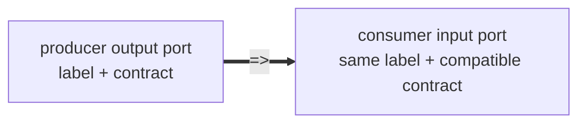

# Wire Reference — Contracts, Ports, and Matching

Contracts are named typed interfaces. Ports are labeled node-boundary slots typed by contracts. `=>`
connects output ports to input ports when their contract and label match exactly.

## Nodes, Ports, And Edges

A `node` declaration supplies both graph identity and a typed boundary:

```wire
node classify
  <- evidence: EvidenceSet;
  -> accepted: AcceptedSet;
  -> rejected: RejectedSet;
  = @review.classify (evidence);
```

The identifier `classify` names the node. The `<-` clauses declare input ports. The `->` clauses
declare output ports. The body after `=` is the implementation behind that boundary.

The graph edge operator connects already-declared ports:

```wire
source
  => classify
  => reviewer
```

An edge never evaluates an expression and never changes payload shape. Boundary adaptation belongs
to the producer node's egress adapter, the consumer node's ingress adapter, or an explicit pure node
between them.



## Port Syntax

```text
<- label: Contract;
-> label: Contract;
-> ok: Value | error: ExecutorError;
```

Authored ports require labels. Labels are routing identity. A labeled port never matches an
unlabeled port, and there is no wildcard label.

## Port Keys

A port key is:

```text
(direction, contract, label)
```

`=>` matches the contract and label, with direction reversed: output to input. Each endpoint port
may participate in at most one edge created by a connect expression.

Boundary adaptation belongs to node ingress/egress adapters or to explicit pure nodes, not to the
edge. `=>` only checks that an already-produced output port resource satisfies a consumer input
obligation.

## Cardinality

All authored ports are cardinality-one at the graph boundary. During open composition, unmatched
inputs and outputs remain exposed as boundary obligations. If `=>` would add two edges out of the
same output or two edges into the same input, the composition is rejected. Implicit fan-out and
implicit fan-in are never valid Wire topology.

In a closed actualized graph, every actualized input port instance must have exactly one producer
edge. Every actualized output port instance must be consumed exactly once: by one edge to a
downstream input, or by an explicit terminal egress, sink, or exported boundary discharge.

`=>` does not duplicate output resources. If one output must feed several consumers, author a fresh
generated node family or an explicit fan-out, sharing, persistence, broadcast, projection, or
record↔ports adapter node that consumes the source once and produces fresh output port instances:

```wire
node fan_out_score
  <- score: Score;
  -> for_audit: Score = score;
  -> for_decision: Score = score;
```

Wire no longer has `<- [Contract]` implicit list aggregation. To gather many values, author an
explicit transformation node:

```wire
node merge
  <- mechanism: AnalysisFragment;
  <- timing: AnalysisFragment;
  <- beneficiaries: AnalysisFragment;
  -> merged: AnalysisFragment;
  = @review.report_merge ({
    fragments = [mechanism, timing, beneficiaries];
  });
```

## Sum Groups

Sum groups are output-only:

```text
-> value: AnalysisFragment | error: ExecutorError;
```

Exactly one variant fires per evaluation. Each variant has its own label and contract and matches
downstream ports independently.

## Empty Boundary Sides

Executor nodes may have empty input or output port sets when their registered executor projection
admits that shape:

```wire
node log_event
  <- event: Event;
  = @artifact.log (event);
```

Wire does not assign special source/sink semantics in syntax. Empty boundary sides are ordinary
typed interface facts. Terminal behavior comes from the registered executor or the explicit
execution boundary that consumes or discharges the adjacent port instances.

## Contract Schemas (ADR 0085)

A registered contract may declare a `schema` (a JSON value, authored in the package manifest's
`[[contract]]` stanza or supplied programmatically). Schema content never participates in contract
identity or port matching — contracts remain equal iff their names are equal — but where a schema is
declared, `json` and `artifact_ref` payloads are **decoded and validated against it** at the runtime
node boundary, alongside the payload-kind shape check. A contract without a schema keeps the shallow
check only. For `artifact_ref` contracts the validated payload is the reference object, not the
resolved durable artifact content.

### The pinned dialect (version 1)

The supported dialect is the deliberately narrow subset upstreamed from Logos ADR 0015 as
`Cortex.Wire.ContractValidation`. It is not a full JSON Schema implementation; unknown keywords are
ignored.

| Keyword                   | Semantics                                                                                                                                                                                                                                              |
| ------------------------- | ------------------------------------------------------------------------------------------------------------------------------------------------------------------------------------------------------------------------------------------------------ |
| `type`                    | A string or array of strings over `object`/`array`/`string`/`number`/`integer`/`boolean`/`null`. An absent or empty list admits everything; an unknown name admits nothing. `integer` admits whole-valued numbers (`2.0` is an integer, `2.5` is not). |
| `enum`                    | An array; structural membership with no type coercion (`"1"` never matches `1`).                                                                                                                                                                       |
| `required`                | An array of keys that must be present on object payloads; independent of `properties`.                                                                                                                                                                 |
| `properties`              | Sub-schemas applied to the payload keys that are present; absence is enforced only via `required`.                                                                                                                                                     |
| `additionalProperties`    | **Boolean form only** (a schema-valued form is an invalid schema); `false` rejects payload keys not declared in `properties`.                                                                                                                          |
| `items`                   | One sub-schema applied to every array element.                                                                                                                                                                                                         |
| `minLength` / `maxLength` | Inclusive string length bounds, counted in Unicode code points.                                                                                                                                                                                        |
| `minimum` / `maximum`     | Inclusive numeric bounds.                                                                                                                                                                                                                              |

Validation is fail-fast with a fixed per-node check order (enum, type, string bounds, number bounds,
object checks, array checks); errors carry the contract id and a JSON path (`$`, `$.prop`, `$[i]`).
One recorded divergence from the Logos incubator: the payload-kind gate accepts `artifact_ref`
alongside `json`.

The dialect is versioned (`wireContractDialectVersion`, mirrored by the Lean constant
`Cortex.Wire.ContractValidation.dialectVersion`) and mechanized: the Lean checker is proven sound
and complete against the dialect semantics (`theory/Cortex/Wire/ContractValidationCheck.lean`), and
generated fixtures pin Haskell and Lean against drift (see [proof-status](../proof-status.md)).
