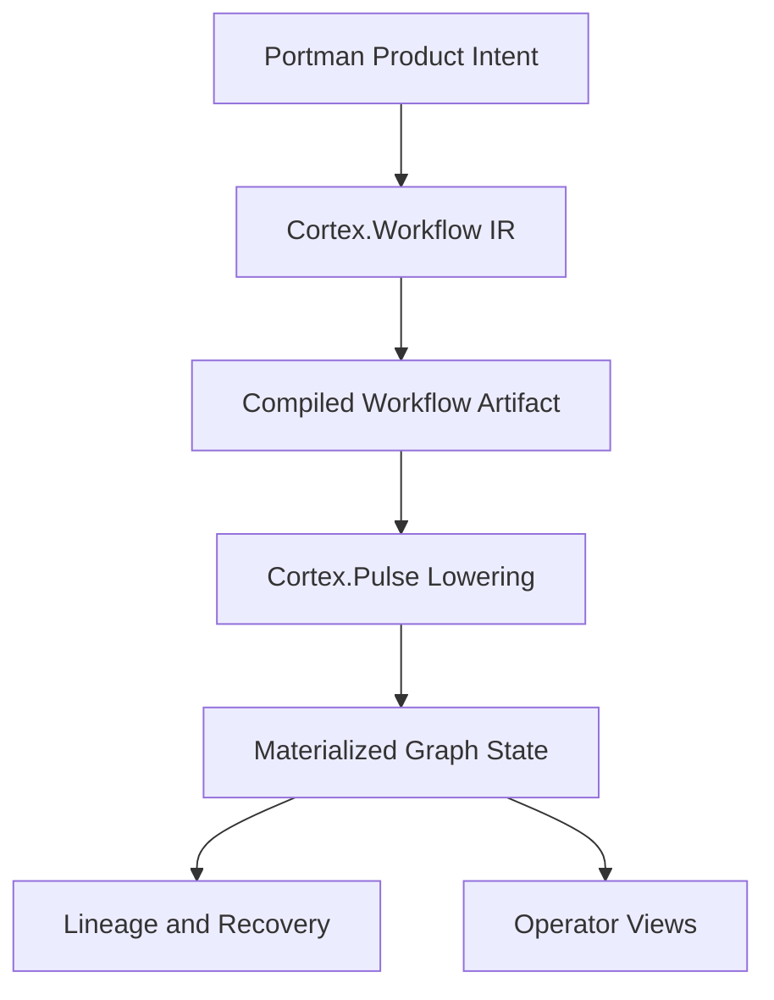
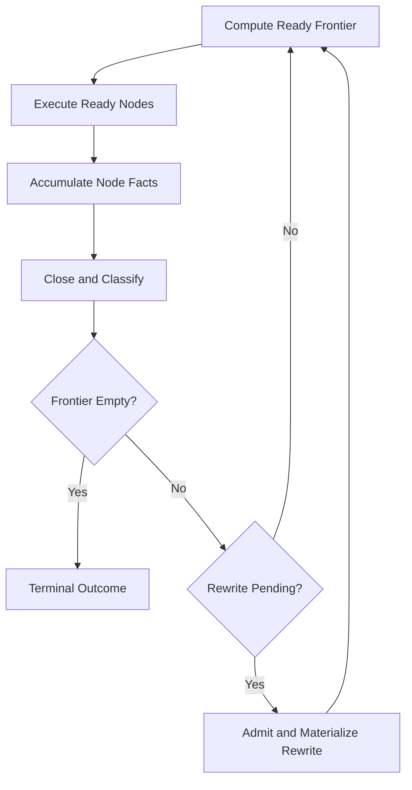

# Research Memo: Cortex Durable Workflow Architecture Overview

**Date:** 2026-04-10  
**Scope:** `dig-466-conditional-substitution` branch state of `Cortex.Workflow`, `Cortex.Pulse`, the workflow papers, the graph-runtime architecture docs, and the active foundation issues around execution semantics  
**Artifacts examined:** implementation, tests, architecture docs, papers, and Linear issues `DIG-417`, `DIG-419`, `DIG-442`, `DIG-443`, `DIG-450`, `DIG-457`, `DIG-466`  
**Method:** implementation-first cross-reference synthesis with architecture and paper alignment  
**Confidence profile:** high on what the runtime and lowering paths actually do today; medium on the sequencing recommendations for the next foundation slices

---

## Executive Summary

This branch contains a real durable runtime core plus the first honest execution semantics for built-in workflow conditionals. `Cortex.Pulse` can execute static DAGs durably, suspend and resume runs, persist graph state, replay admitted rewrites through a materialization watermark, and expose operator-visible graph state. On top of that, `DIG-466` now lowers built-in conditionals as latent branch fragments attached to a condition node, with runtime branch selection materializing only the chosen path.

What is still not complete is the full Cortex stack beyond that step. `Cortex.Workflow` now has executable semantics for the previously missing conditional case, but Cortex as a whole is still not a complete generic durable workflow VM because runtime unification, fault-injection hardening, and stronger provenance/integrity remain open.

So the correct statement is:

- `Cortex.Pulse` is already a durable execution VM
- `DIG-466` closes the clearest workflow-semantics gap by making built-in conditionals executable through latent branches plus rewrite materialization
- `Cortex` as a whole is still not yet a complete generic durable workflow VM
- the remaining center is not “more graph algebra” but runtime unification, failure hardening, and stronger provenance around the existing workflow/runtime stack

---

## Current Layered Architecture



The important distinction on this branch is:

- the **compiled workflow artifact** describes what obligations may arise
- the **materialized graph state** describes what this run has actually installed and reached
- **lineage** bridges the two by recording admitted topology changes

That separation is now explicit in the papers and roughly reflected in the code, even if not every workflow construct is executable yet.

### Module Map on Current `main`

| Layer | Current role | Main modules |
| --- | --- | --- |
| Product semantics | Portman-specific workflow intent, templates, report policies, section plans | `src/Portman/Clerk/Workflow/Compiler.hs`, `src/Portman/Clerk/Runtime/*` |
| Workflow substrate | Generic workflow IR, compiled workflow artifact, lowering boundary | `src/Cortex/Workflow/IR.hs`, `src/Cortex/Workflow/Compiled.hs`, `src/Cortex/Workflow/Compiler.hs`, `src/Cortex/Workflow/Lowering.hs` |
| Durable runtime | Graph scheduling, waits, rewrites, materialization, replay, graph-state persistence | `src/Cortex/Pulse/GraphRuntime.hs`, `src/Cortex/Pulse/Rewrite.hs`, `src/Cortex/Pulse/Materialization.hs`, `src/Cortex/Pulse/Executor/*` |
| Operator surface | Admin graph snapshots, blocked/waiting diagnostics, signal delivery, run inspection | `src/Portman/Server/Admin/*`, `src/Cortex/Pulse/Query.hs` |

### Pulse Control Loop



This loop is not a cycle in the workflow DAG. It is the runtime control loop over the current materialized graph.

---

## What Cortex Already Solves

### 1. Durable execution over graph topology

Pulse already executes graph-shaped workflows as graphs, not as linear stage counters. `readyNodes` in `Cortex.Pulse.GraphRuntime` computes execution from predecessor satisfaction over the current relation, and graph state tracks per-node status and outputs durably.

What this buys Portman:

- a run can stop mid-frontier, restart, and recover a valid ready set
- long waits such as human approval or external signal delivery are first-class runtime states
- execution shape is inspectable as graph state rather than buried in task-local control flow

### 2. Bounded runtime topology evolution

`DIG-417` is already real on `main`: the runtime supports structured graph rewrites with validation, budgeting, namespaced node identities, and materialization through a persistent watermark.

That means Cortex already solves this class of problem:

> a running node discovers that the future work must be elaborated, and the runtime must durably install that future work without losing replay or auditability

This is already stronger than an ordinary durable task runner.

### 3. A real workflow compilation boundary

`DIG-457` and `DIG-450` are valuable even before every workflow construct is executable. They solve a structural problem the codebase had:

- product workflow intent no longer has to live only in ad hoc Portman task code
- a workflow can now be compiled into a first-class artifact
- that artifact can be surfaced in APIs, UI, and assistant/report flows
- Portman-side policy such as required evidence, section fanout, and render policy now has an honest place to live above Pulse

This is already useful for:

- workflow selection
- workflow visualization
- API contracts
- architecture clarity
- future dogfooding on the subset that is executable

---

## Illustrative Examples

### Example A: Already well supported today

```text
workflow ReportSections {
  planner;
  gatherer;
  analyst;
  parallel {
    section:summary,
    section:risks,
    section:actions
  };
  reviewer;
  artifact report
}
```

This is the kind of workflow Cortex already models honestly:

- stable DAG shape
- explicit fan-out and join
- durable execution frontier
- restart/replay over graph state

This is enough to power a meaningful subset of Portman report workflows.

### Example B: Also already aligned with the current runtime

```text
planner
  -> gatherer
  -> analyst
  -> reviewer
```

At runtime, `reviewer` may discover missing evidence and append a repair branch:

```text
planner
  -> gatherer
  -> analyst
  -> reviewer
  -> repair_evidence
  -> reviewer_followup
```

This is the sweet spot of current Pulse rewriting:

- bounded structural change
- explicit lineage
- durable materialization
- operator-inspectable evolution

### Example C: The previous semantic gap that this branch closes

```text
workflow DeepReport {
  planner;
  gatherer;
  choose required_evidence_missing {
    repair_evidence
  };
  analyst;
  reviewer;
  artifact report
}
```

Before `DIG-466`, this is where the stack stopped being complete.

If the runtime were to lower the conditional as plain DAG fan-out, both branches would become runnable under current readiness semantics. That was the rejected design. This branch replaces it with latent branch fragments plus runtime branch selection.

### Example D: The current conditional execution model on this branch

The intended model is not ordinary fan-out. It is branch selection as endogenous substitution.

Initial compiled artifact:

```text
planner -> gatherer -> [condition: required_evidence_missing] -> analyst -> reviewer
```

Latent branch table attached to the condition node:

- `missing = false` -> empty continuation
- `missing = true` -> `required_evidence_repair`

Materialized graph after the condition evaluates `true`:

```text
planner -> gatherer -> [condition: required_evidence_missing] -> required_evidence_repair -> analyst -> reviewer
```

Materialized graph after the condition evaluates `false`:

```text
planner -> gatherer -> [condition: required_evidence_missing] -> analyst -> reviewer
```

The branch implementation currently uses retained-anchor elaboration rather than full anchor replacement: when the condition selects a non-empty branch, Pulse appends the chosen fragment after the condition node and marks that condition anchor as rewritten. The unchosen branch is never materialized.

This is why conditionals belong to workflow semantics rather than plain graph shape. The chosen branch changes which future obligations exist at all, while the condition anchor itself remains available for lineage and provenance.

---

## Key Findings

### [P1] Pulse is already a durable execution VM, but Cortex is not yet a complete durable workflow VM
**Category:** Terminology Gap  
**Status:** Inferred  
**Confidence:** High  
**Primary evidence:** `src/Cortex/Pulse/GraphRuntime.hs`, `src/Cortex/Pulse/Rewrite.hs`, `src/Cortex/Pulse/Materialization.hs`, `DIG-417`, `DIG-457`  
**Cross-reference:** `docs/Roadmap/Epics/graph-execution-engine-v2.md`, `docs/Roadmap/Plans/rewrite-materialization-and-recovery.md`

Current `main` already supports durable graph execution, signal waits, watermark-based materialization, and bounded rewrites. That is enough to call Pulse a durable execution VM. What Cortex still lacks is a fully closed workflow-semantics layer that can compile all generic workflow constructs into that runtime.

**Why it matters:**  
This keeps the evaluation honest. The runtime core is already valuable and should not be undersold, but the broader Cortex VM story should not be overstated until workflow semantics are complete.

**Next step:**  
Talk about Pulse and Cortex separately in architecture docs and roadmap updates.

### [P1] Built-in conditionals now validate the workflow/compiler seam rather than exposing a runtime algebra hole
**Category:** Capability Landed  
**Status:** Observed  
**Confidence:** High  
**Primary evidence:** `src/Cortex/Workflow/IR.hs`, `src/Cortex/Workflow/Compiler.hs`, `src/Cortex/Workflow/Lowering.hs`, `test/Cortex/Workflow/CompilerSpec.hs`, `DIG-466`  
**Cross-reference:** `docs/Publications/Paper-3-graph-substitution-semantics/manuscript.md`

The source language can express `WorkflowConditional`, and this branch now lowers it honestly: the compiled artifact carries a real condition node plus latent branch fragments, and Pulse materializes only the chosen branch at runtime. That proves the missing work was in compiled-artifact representation and lowering, not in reopening the structured rewrite substrate from `DIG-417`.

The important point is that the solution did not require a new runtime mechanism. Existing rewrite/materialization machinery was already enough; the real work was representing latent alternatives and making branch choice a first-class executable lowering concept.

**Why it matters:**  
This validates the current layering. `Cortex.Workflow` owns branch semantics and compiled-artifact shape; `Cortex.Pulse` owns durable materialization and replay.

**Next step:**  
Dogfood real bounded-adaptation workflows through this model and decide whether retained-anchor `AppendAfter` should remain the long-term conditional materialization law.

### [P1] The compiled workflow artifact is already useful even when not fully executable
**Category:** Missed Abstraction  
**Status:** Observed  
**Confidence:** High  
**Primary evidence:** `src/Portman/Clerk/Workflow/Compiler.hs`, `test/Portman/Clerk/WorkflowSpec.hs`, `DIG-450`  
**Cross-reference:** `docs/Publications/Paper-3-graph-substitution-semantics/manuscript.md`

Portman can already compile workflow intent into generic Cortex workflow graphs for descriptive/API purposes. That artifact is not dead weight. It is the right place to carry:

- workflow identity
- topology shape
- model/tool policy context
- section fanout
- future compatibility witness evolution

Even before all constructs are executable, this is materially better than using `workflowStageGraph` or hand-assembled stage plans as the product-facing workflow surface.

**Why it matters:**  
It justifies dogfooding on the descriptive and partially executable subset now, instead of waiting for a perfect end-to-end VM.

**Next step:**  
Continue using the compiled artifact in APIs/UI while being explicit about which constructs are executable today.

### [P2] The biggest remaining non-conditional foundation gap is still the split durable model
**Category:** Design Tension  
**Status:** Observed  
**Confidence:** High  
**Primary evidence:** `DIG-443`, `docs/Consumers/Portman/response-eval-run.md`, prior synthesis memos  
**Cross-reference:** `docs/Research-notes/Foundation/2026-04-09-current-main-graph-runtime-synthesis.md`

Even if conditional semantics were solved tomorrow, the codebase would still carry more than one durable execution model because legacy checkpoint artifacts remain around `ResponseEvalRun`.

**Why it matters:**  
This weakens the “Cortex is one durable runtime” story and complicates correctness claims, proofs, and future workflow compilation.

**Next step:**  
Keep `DIG-443` in the minimum foundation set before declaring the substrate mostly complete.

### [P2] Foundation hardening is still lightest exactly where dogfooding gets dangerous
**Category:** Evidence Gap  
**Status:** Observed  
**Confidence:** High  
**Primary evidence:** `DIG-442`, `DIG-419`, `test/Cortex/Pulse/*`, `docs/Roadmap/Plans/rewrite-materialization-and-recovery.md`
**Cross-reference:** `docs/Roadmap/Epics/graph-execution-engine-v2.md`

The runtime is already strong enough to run meaningful work, but the weakest evidence still clusters around:

- persist-failure fault injection
- crash/resume convergence under injected failure
- operator-grade integrity/provenance

Those are exactly the properties that become painful once more product logic is routed through the system.

**Why it matters:**  
Dogfooding on a substrate without these checks risks teaching the wrong lessons about the runtime rather than the product flow.

**Next step:**  
Treat `DIG-442` and `DIG-419` as close follow-ups, not optional late polish.

### [P2] Conditional business value is real because it gives agents bounded adaptive control
**Category:** Novel Idea  
**Status:** Inferred  
**Confidence:** Medium  
**Primary evidence:** `src/Portman/Clerk/Workflow/Compiler.hs`, `DIG-466`, `docs/Roadmap/Epics/graph-execution-engine-v2.md`, `docs/Publications/Paper-3-graph-substitution-semantics/manuscript.md`
**Cross-reference:** Portman template use of `required_evidence_missing`

Conditionals are not just a convenience syntax. In a durable agentic runtime, they are the bounded form of adaptation:

- choose deterministic vs enriched path
- choose repair vs proceed
- choose escalate vs auto-finalize

This is the governance-friendly middle ground between static workflows and unconstrained planner-over-graph execution.

**Why it matters:**  
It explains why `DIG-466` is not just theoretical cleanup. It is the feature that lets Cortex represent adaptive agent behavior without immediately jumping to open-ended planner rewrites.

**Next step:**  
Frame conditionals in docs and issues as “bounded adaptive control,” not merely “if/else support.”

---

## Missed Abstractions

| Abstraction | Current state | Needed next |
| --- | --- | --- |
| Durable VM | Real in `Cortex.Pulse` but not across full Cortex stack | Separate runtime-complete claims from workflow-semantics-complete claims |
| Conditional execution | Executable through latent branches plus retained-anchor materialization | Dogfood real conditional workflows and decide long-term anchor/provenance semantics |
| Compiled artifact role | Useful but still easy to underrate as “descriptive only” | Treat as the canonical workflow boundary even before full execution coverage |
| Durable execution model | Mostly graph-native, but legacy checkpoint path still exists | One runtime model across task types |

## Evidence Gaps

| Claim | Source | Current Evidence | Missing Evidence | Recommended Validation |
| --- | --- | --- | --- | --- |
| Cortex is ready for most Portman workflows | `DIG-450`, `DIG-466`, current compiled artifact path | good support for static/fan-out workflows and built-in conditional selection | broader execution experience across real product flows | reroute a real conditional workflow and compare authoring/runtime ergonomics |
| Graph runtime survives injected persist failures cleanly | `DIG-442` | designed behavior exists | explicit failure-injection tests | add fault injection and convergence tests |
| Operator graph views are fully trustworthy | `DIG-419` | watermark reconstruction exists | stronger integrity witness and provenance | add integrity checks and richer history surfaces |

## Design Tensions

- **Dogfood now vs foundation first:** the compiled workflow boundary is already useful enough to dogfood on simple workflows, but the missing semantic features are central enough that aggressive dogfooding could blur substrate problems with product problems.
- **Conditionals as sugar vs conditionals as runtime law:** flattening branches was tempting because it looked like “just graph structure,” but real branch selection changes materialized obligations and therefore belongs in runtime semantics.
- **Retained anchor vs pure replacement:** the current implementation keeps the condition node as a rewritten control anchor while materializing only the chosen branch. That is a clean fit for today’s runtime, but the papers should stay aligned about whether this is the long-term law or an implementation-biased choice.

## Novel Ideas & Hypotheses

- **Speculative, Medium confidence:** conditional nodes should be treated as a governance primitive for agentic workflows: bounded branch choice over predeclared alternatives, not as a weak form of planner rewrite.  
  Validation path: compare authoring ergonomics of the landed `DIG-466` model against ad hoc stage-local condition logic on a real Portman workflow.
- **Speculative, Medium confidence:** once `DIG-466` lands, the next useful abstraction may be a “latent obligation graph” inside the compiled artifact, separating potential topology from materialized topology more explicitly than today’s flattened graph.  
  Validation path: use the current latent-fragment compiled artifact on nested conditionals and see whether the same shape helps child workflows later.

## Dead Ends / Rejected Directions

- Treating flattened conditional fan-out as good enough executable semantics. `DIG-466` replaces that rejected design with latent branch fragments plus runtime branch selection.
- Waiting for every future feature before using the compiled workflow artifact anywhere. The artifact is already valuable for UI/API/compiler boundary purposes even before the full VM is complete.

---

## Recommended Actions

### Act Now
- [ ] Keep using compiled workflow artifacts as the canonical Portman workflow surface
- [ ] Start dogfooding one real conditional Portman workflow through the landed `DIG-466` path
- [ ] Treat `DIG-466` as part of the minimum foundation set that is now available for product use

### Design Next
- [ ] Decide whether retained-anchor `AppendAfter` should remain the long-term conditional materialization law
- [ ] Finish `DIG-443` so Cortex has one durable execution model
- [ ] Add `DIG-442` failure-injection coverage against graph-state persistence

### Write Up
- [ ] Update architecture notes to say explicitly: Pulse is already a durable execution VM; Cortex as a complete workflow VM is still under construction
- [ ] Keep the rewrite materialization plan and Paper 3 aligned with the “compiled artifact vs materialized state” distinction

### Parked
- `DIG-422` planner-over-graph integration — still the wrong next move until conditionals, provenance, and runtime-unification are stronger

---

## Issue Map

| Issue | Role in the stack | Why it matters now |
| --- | --- | --- |
| `DIG-417` `Pulse graph v2: structured rewrite algebra and validation` | Runtime rewrite/materialization core | Already provides the bounded topology-evolution substrate |
| `DIG-457` `Cortex.Workflow: define generic workflow IR above Cortex.Graph and below Portman` | Generic workflow layer | Establishes the workflow-semantic boundary above Pulse |
| `DIG-450` `Portman/Clerk: compile workflow semantics into generic Cortex workflow graphs` | First product consumer | Turns Portman workflow intent into a first-class compiled artifact |
| `DIG-466` `Cortex.Workflow / Pulse: built-in conditional branch semantics via endogenous substitution` | Conditional execution model | Closes the clearest gap between workflow IR and executable lowering |
| `DIG-443` `Migrate remaining legacy checkpoint artifacts to graph-state model` | Runtime unification | Removes the remaining split durable execution model |
| `DIG-442` `Test: fault-injection coverage for graph-state persistence failures` | Runtime hardening | Raises confidence in persist-failure and crash/resume behavior |
| `DIG-419` `Pulse graph v2: rewrite provenance, graph diffs, and integrity guards` | Trust/explanation layer | Makes operator views and recovery claims more trustworthy |

---

## Known Unknowns

- It is still undecided whether retained-anchor `AppendAfter` should remain the long-term conditional law or whether a more explicit replace-style or condition-selection runtime event would serve provenance better.
- The operator/admin surface does not yet distinguish potential conditional topology from the currently materialized branch history.
- The current memo does not cover child-workflow semantics in detail; that remains adjacent but separate.
