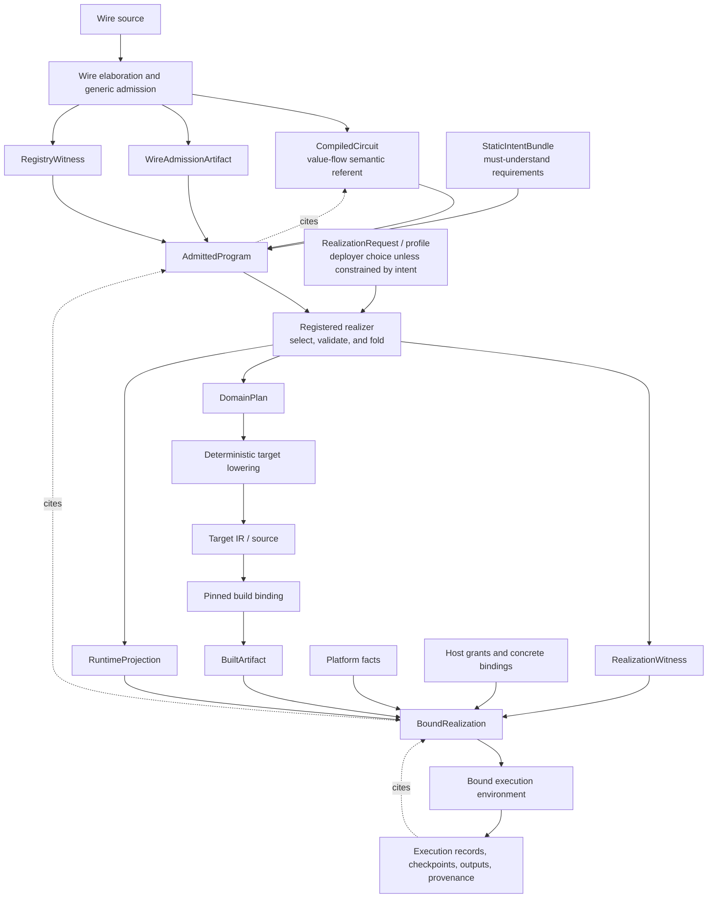
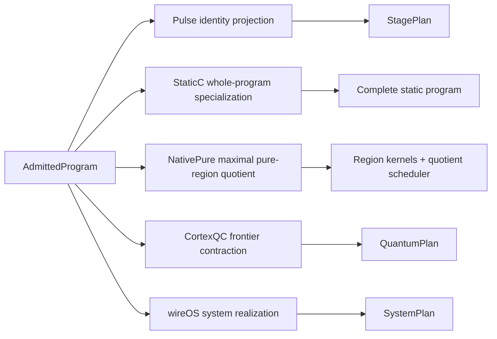

# Research Memo: Circuit, Realization, and Bound Execution

**Method:** repository-grounded architecture synthesis, checked against the current Circuit,
Pulse-lowering, NativePure, static-intent, and downstream-consumer surfaces. **Confidence profile:**
high for the semantic boundaries and current Cortex implementation; medium for the proposed generic
realization protocol; speculative where wireOS and CortexQC must define downstream-owned plan and
binding schemas.

## Conclusion

Wire is the authoring and certifying front end for executable causal programs. It is not merely a
notation translated into an unrelated graph format. Elaboration performs mandatory static CorePure
evaluation, resolves registered executor and contract identities, checks typed port boundaries,
fixes topology, and produces one canonical `CompiledCircuit` plus admission evidence. That Circuit
remains the authoritative referent for value-flow semantics.

Execution is obtained by a later **realization** step. A realizer selects some or all of an admitted
program, validates the selection for one realization family, folds it into a target-neutral domain
plan, and constructs a runtime projection whose units remain traceable to the source Circuit. A
realization may preserve nodes, fuse pure regions, contract a quantum frontier, generate a complete
native program, or construct a deployment plan. None of those representations replaces the Circuit
as the semantic source of truth.

The complete principle is:

> **Wire defines and admits meaning. Realizers choose an executable representation. Binders
> authorize a concrete implementation. Bound environments execute it. Every artifact and action
> remains witnessed back to the admitted program.**

This refines the earlier realization pipeline:

```text
residualize -> select -> fold -> lower -> build -> bind -> execute -> re-enter
```

The refinement is chiefly about identity and authority. Circuit meaning, admitted requirements,
runtime topology, built artifacts, concrete bindings, and execution records are related objects, not
one progressively mutated program.

## The three permanent referents

The desired model has three long-lived identities:

| Referent           | Governs                                                        |
| ------------------ | -------------------------------------------------------------- |
| `CompiledCircuit`  | Value-flow meaning, typed ports, executor identities, topology |
| `AdmittedProgram`  | The Circuit's admitted interpretation and realization needs    |
| `BoundRealization` | A concrete implementation plus explicitly granted authority    |

They compose as follows:

```text
CompiledCircuit
+ WireAdmissionArtifact
+ RegistryWitness
+ StaticIntentBundle
= AdmittedProgram
```

The `CompiledCircuit` must stay independently addressable. Two admitted programs may cite the same
Circuit while carrying different realization requirements. Likewise, two bound realizations may
implement the same admitted program for different hosts without changing what the program means.

### `CompiledCircuit`: meaning

The Circuit fixes the causal value-flow graph after Wire elaboration. It records nodes, typed input
and output boundaries, executor references, pure residue, conditions, and topology. Backends may
interpret or contract that graph, but they do not silently redefine it.

### `AdmittedProgram`: acceptable realization

The admission artifact proves generic graph facts. The registry witness pins the exact contract,
executor, validator, and projection data used to interpret the Circuit. The static-intent bundle
adds must-understand requirements which constrain realizations without adding edges or granting
authority.

Static intent belongs here, before realizer selection. A realizer must consume or explicitly reject
every applicable intent attachment; it must not reinterpret the same Circuit against ambient,
possibly changed registry state. The remaining registry-witness seam is tracked by
[issue #402](https://github.com/Digimuoto/cortex/issues/402).

### `BoundRealization`: implementation and authority

A bound realization cites the admitted program, a witnessed runtime projection, built artifacts,
platform facts, concrete implementation choices, and host grants. It is the first object which can
authorize execution. Source text, Circuit metadata, static intent, domain plans, and build artifacts
do not grant device, filesystem, network, provider, credential, or tool access by themselves.

## Realization has three logically distinct results

A generic realizer should have a conceptual signature like:

```text
realize :
  AdmittedProgram
  x RealizationRequest
  -> RealizationWitness
   x DomainPlan
   x RuntimeProjection
```

The outputs may share one serialized envelope, but they answer different questions:

- `RealizationWitness` explains how source nodes and typed source boundaries map to runtime units.
- `DomainPlan` records target-neutral semantics such as `NativePurePlan`, `QuantumPlan`, or
  `SystemPlan`.
- `RuntimeProjection` is the identity graph or witnessed quotient which a scheduler executes.

The witness must be total over the selected source members, exact at crossing ports, and explicit
about preserved, fused, contracted, or skipped units. The projection must preserve enough provenance
to explain every runtime effect, output, checkpoint, and failure in terms of the admitted program.

The existing NativePure `RealizationArtifact` is the first executable instance of this concept. It
already records the Circuit referent, normalized input digest, source-to-runtime mapping, runtime
units, quotient edges, and artifact digest. Its runtime kinds and normalized input are still
NativePure-specific, so it should not yet be described as the final cross-domain protocol.

A future domain-neutral witness will likely need to carry or cite:

- the admitted-program, admission-artifact, and registry-witness identities;
- the realizer family and version;
- exact port-level external boundary mappings;
- the domain-plan and runtime-projection identities;
- the applicable refinement, preservation, or contraction claim; and
- the fusion, optimization, or selection policy identity.

The quotient and provenance vocabulary should eventually move to a neutral `Cortex.Wire.Realization`
layer. NativePure, CortexQC, wireOS, and other downstreams should retain ownership of their domain
plans.

## The desired stack



This is one abstract stack, not one mandated physical service. Pulse, a generated native engine, a
quantum provider adapter, and a wireOS supervisor may implement the bound-execution role through
different protocols.

## Keep realization, lowering, build, binding, and execution separate

These stages have different purity and authority boundaries:

| Phase            | Input                                      | Output                                     | Authority |
| ---------------- | ------------------------------------------ | ------------------------------------------ | --------- |
| Wire elaboration | Wire source                                | Circuit and admission evidence             | none      |
| Realization      | admitted program and realization request   | witness, domain plan, runtime projection   | none      |
| Target lowering  | domain plan                                | typed target IR or source                  | none      |
| Build            | target source and pinned toolchain         | built artifact                             | build     |
| Binding          | artifact, projection, platform, and grants | bound realization                          | host      |
| Execution        | bound realization and runtime inputs       | outputs, checkpoints, failures, provenance | bounded   |

Invoking Clang, GHC, Nix, a QASM compiler, filesystem tooling, or a deployment generator may require
supply-chain trust and build authority. Running the result may require an entirely different device,
network, credential, MMIO, provider-account, or external-tool grant. A compiler being allowed to
produce an artifact does not authorize that artifact to act.

`RealizationRequest` also differs from static intent. Choosing Pulse, StaticC, NativePure, quantum,
or a system target is ordinarily deployer policy. It becomes program intent only when the program
requires a representation property, such as freestanding execution, bounded memory, same-authority
quantum execution, or prohibition of a process boundary. Selection therefore searches for a realizer
satisfying all of:

```text
admitted static intent
and requested profile
and available platform facts
```

The platform can narrow what is possible. It cannot weaken a must-understand program requirement.

## Realization modes

The unified abstraction permits several different graph morphisms. It does not require them to
produce the same plan type or runtime protocol.



### Pulse: conceptual identity realization

Conceptually, Pulse is the identity projection: each Circuit node remains a runtime unit and the
source-to-runtime witness is trivial. This makes Pulse compatible with the generic model without
claiming it transforms topology.

The current implementation is more direct. `Cortex.Wire.Circuit.Lowering` lowers a `CompiledCircuit`
to a Pulse `StagePlan` with a host-supplied binder; it does not yet pass through a generic
realization artifact. The ownership seam is therefore shared:

- Cortex owns the Wire-to-Circuit projection logic;
- Pulse owns the durable `StagePlan` execution semantics; and
- the host owns concrete executor binding.

Pulse may continue to execute lowered JSON StagePlans as a runtime representation. The architectural
correction is that a StagePlan is a realized projection of an admitted Circuit, not an alternative
source of Wire semantics. Pulse observes and supervises the bound plan; it should not re-elaborate
authored Wire or silently choose new contracts.

### StaticC: whole-program realization

StaticC specializes an eligible whole Circuit into one topology-specific program while preserving
the v1 runtime and artifact contracts. Its scheduler and executor calls remain derived from the
Circuit. The result is not "Wire becoming C"; it is one built realization of the admitted program.

### NativePure: partial fusion plus preserved effects

NativePure selects maximal eligible pure components, fuses them into authority-free region
functions, and preserves the surrounding effect graph as a witnessed quotient. Its executable result
has two inseparable parts:

1. native region functions; and
2. a specialized quotient scheduler implementing checkpoint, selection, restoration, and effect
   ordering rules.

The complete target program is therefore not merely a C function emitted for each region.
`NativePurePlan` and its realization witness drive both the kernels and the scheduler.

### CortexQC: domain contraction, then provider binding

A quantum realization selects a typed symbolic frontier and folds it into a backend-neutral
`QuantumPlan`. Provider-neutral lowering and credentialed invocation must remain distinct:

```text
QuantumPlan
  -> OpenQASM or provider-neutral payload
  -> provider binding
  -> bound quantum request
  -> credentialed provider task
```

This keeps device, region, queue policy, credentials, and spending authority out of the admitted
program. Returned task and device identities become runtime provenance citing the bound request.

### wireOS: system plan before concrete deployment

wireOS needs a target-independent system realization before platform-specific assignment:

```text
AdmittedProgram + SystemIntent
  -> SystemPlan

SystemPlan + platform description + deployer grant + artifact inventory
  -> witnessed SystemGraph
  -> systemd, Microkit, or other deployment artifacts
  -> deployment and supervision
```

Concrete addresses, devices, protection domains, effect bindings, and artifact assignments depend on
platform facts and grants. They belong in the bound realization and its derived `SystemGraph`, not
in Circuit meaning or a late arrow added after deployment artifacts already exist.

### Logos: requirements before model and tool binding

Logos profiles can contribute static requirements for model class, tool vocabulary, memory class,
grounding, approval, and budget ceilings. They do not select credentials or grant tool use.
Realization and binding resolve those requirements to concrete model, memory, and tool
implementations under the host's grant. Runtime prompt, tool results, and model outputs remain
ingress and execution data.

## What Wire and Circuit do not do

The unified model depends on several negative boundaries:

- Wire does not embed a target compiler or provider invocation into source semantics.
- Circuit does not contain host credentials, concrete provider selection, or deployment authority.
- CorePure syntax does not imply compile-time evaluation; the enclosing obligation determines the
  stage.
- Static intent constrains realizations but does not add value-flow topology or grant authority.
- A realizer may change runtime representation, not Circuit meaning.
- A target artifact is not executable authority.
- A runtime plan is not allowed to become a second, unwitnessed semantic referent.

These boundaries also explain why `let ... in` remains stage-polymorphic and why executor admission
fields belong to the executor's one authoritative input schema. Binding time determines when values
become available; realization determines how admitted computation is represented; binding determines
which implementation and authority may execute it.

## Required invariants

The desired stack should make the following properties mechanically checkable.

### Identity continuity

Every artifact cites its immediate semantic input and the complete chain reaches the
`CompiledCircuit`. Re-running a later stage against different registry projections, static intent,
target policy, toolchain, platform facts, or grants produces a different derived identity.

### Typed quotient totality

For topology-changing realization, every selected source node maps to exactly one runtime unit or
one explicitly represented latent/skipped state. Every external source port maps to an exact typed
runtime boundary. No selected source member disappears merely because it was optimized.

### Semantic preservation or refinement

Each realizer declares the claim it can establish: identity preservation, structural contraction,
typed pure-region refinement, domain-plan interpretation, or another registered relation. The claim
is attached to the witness rather than inferred from a target filename.

### Closed authority

The admitted program can request capabilities but cannot mint them. A bound realization's authority
is no greater than both the admitted requirements and the host grant. Runtime execution cannot
acquire authority through an unwitnessed target artifact or ambient registry lookup.

### Replay and provenance

Execution records, checkpoints, outputs, failures, provider task identities, and deployment
observations cite the bound realization. That record cites the admitted program and its Circuit.
Observability may be aggregated at runtime-unit level while preserving source-member provenance.

## Current implementation versus desired unification

| Surface    | Current implementation                                                                | Desired relation                                                |
| ---------- | ------------------------------------------------------------------------------------- | --------------------------------------------------------------- |
| Wire       | Elaborates and admits one canonical `CompiledCircuit`                                 | Remains the sole authoring/certifying front end                 |
| Pulse      | Direct `CompiledCircuit -> StagePlan` lowering with a host binder                     | Explicit identity realization and bound-plan provenance         |
| StaticC    | Whole-program generated static backend                                                | Whole-Circuit realization through shared witness terminology    |
| NativePure | Concrete normalized artifact, maximal fusion, typed plan, C kernels, quotient engine  | First generic-witness implementation, then neutral extraction   |
| CortexQC   | Circuit frontier selection and fold to `QuantumPlan`, followed by backend integration | Separate witness, domain plan, target payload, provider binding |
| wireOS     | Downstream intent and system-graph construction                                       | `SystemPlan` before platform-bound witnessed `SystemGraph`      |
| Logos      | Downstream profiles and executor bindings                                             | Intent requirements resolved by explicit grants and bindings    |

This table is deliberately asymmetric. A canonical architecture should normalize identities and
proof obligations without forcing every downstream into NativePure's data types or Pulse's runtime
protocol.

## Recommended next decisions

1. Define a domain-neutral `Cortex.Wire.Realization` vocabulary for referent identities,
   source-to-runtime port mappings, runtime projections, and preservation/refinement claims.
2. Keep `NativePurePlan`, `QuantumPlan`, and `SystemPlan` under their domain owners.
3. Decide whether `AdmittedProgram` is one serialized envelope or a small typed product of cited
   artifacts; in either case, make the identity chain canonical.
4. Close [issue #402](https://github.com/Digimuoto/cortex/issues/402) before treating realization as
   stable: admission and downstream realization must cite the exact consulted registry witness
   rather than ambient registry state.
5. Model Pulse as the first identity realization without changing its durable semantics, then use
   that path to validate the generic protocol before more complex contractions adopt it.
6. Define `BoundRealization` and separate build grants from execution grants.
7. Require downstream plans to expose exact typed ingress/egress boundaries and provenance while
   retaining their own semantic schemas.

[PR #370](https://github.com/Digimuoto/cortex/pull/370) remains valuable research provenance for
typed graph staging, staging roles, fragment selection, quotient lowering, and the original
pipeline. The NativePure epic demonstrates an automatic maximal-fusion instance. The next
architectural step is not to revive a special `@realize` syntax everywhere; it is to extract the
common witnessed-realization protocol while allowing explicit boundaries, automatic fusion, identity
projection, and whole-program specialization to be different policies over the same admitted
Circuit.

## Refined invariant

> **The `CompiledCircuit` remains authoritative for value-flow semantics. The `AdmittedProgram`
> remains authoritative for realization requirements. Every topology-changing realization carries a
> total typed quotient or refinement witness to that admitted program. Every concrete execution
> cites a binding record whose authority is no greater than both the admitted requirements and the
> host grant.**
