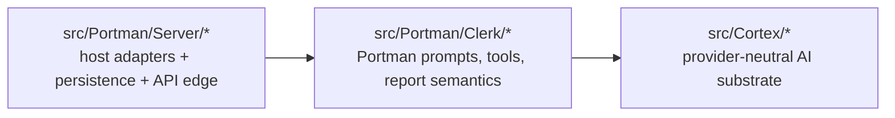

# Cortex Boundary Cleanup

Status: **Implemented in DIG-314**

Last updated: **March 21, 2026** — DIG-314.

This page captures the Architecture/design target that DIG-314 implements for
finishing the post-DIG-313 Cortex boundary cleanup.

It exists so the follow-up work has a stable target before more code moves.

## Current Status

DIG-314 lands these canonical owners:

- `Cortex.Capability.Model.Message` owns provider-neutral model message
  construction
- `Cortex.Capability.Model.Output` owns grounded output/source-footer rendering
- `Cortex.Json.Text` owns generic JSON/text helpers such as `jsonValueText` and
  `decodeLazyUtf8`
- `Cortex.Provider.OpenRouter.Client` owns OpenRouter request construction from
  `CortexChoiceRequest`, so Portman no longer rebuilds provider payloads
- temporary shim modules are removed once in-repo imports converge

## Why This Exists

DIG-313 landed the structural split that the assistant runtime needed:

- `Assistant.hs` stopped being the monolith
- provider HTTP/wire logic moved into `src/Cortex/*`
- tool ownership moved into the right handler contexts
- Clerk began consuming provider-neutral Cortex types

That refactor was intentionally large and stopped short of the final boundary.
DIG-314 closes that gap for the provider-neutral Cortex/Portman seam.

## Cleanup Outcomes

The main cleanup outcomes are:

| Prior seam | Why it was wrong | DIG-314 outcome |
| --- | --- | --- |
| `Cortex.Provider.OpenRouter.Client` exposed assistant-shaped naming | A generic Cortex provider client should not speak in assistant-era terms | Public surface renamed to model/provider-oriented terminology |
| Portman runtime imported OpenRouter-shaped helpers | Clerk/runtime code should consume provider-neutral Cortex helpers | Message/output shaping moved under `Cortex.Capability.Model.*` |
| `Portman.Server.Handler.Assistant.ModelUsage` rebuilt provider payloads for observability | The host adapter knew too much about provider request assembly | Host adapter now reuses the Cortex payload-build path |
| temporary compatibility shims existed during migration | They preserved momentum, but were not durable public boundaries | `Cortex.Agent.Types`, `Cortex.Provider.Types`, and `Cortex.Types` were removed |
| Generic helpers such as `jsonValueText` existed in multiple places | Shared utility ownership was ambiguous | `Cortex.Json.Text` is the canonical owner for shared JSON/text helpers |

## Canonical End State

The target boundary is:

The resulting responsibilities are:

### Cortex

Cortex owns:

- provider-neutral model capability types and clients
- provider-specific HTTP/wire adapters
- generic message/payload shaping for model execution
- generic tool-call record and preview helpers
- generic run/agent metadata and runtime substrate

### Portman.Clerk

Clerk owns:

- Portman prompts and product-facing runtime policy
- model selection policy that is product-specific
- grounding policy that is product-specific
- report and artifact semantics such as `ReportIR`
- domain-specific tool composition

### Portman.Server

Server owns:

- HTTP/auth/SSE/polling
- DB persistence and API conversion
- usage persistence
- observability emission at the host edge
- error translation into API/handler failures

## Concrete Design Decisions

DIG-314 implements these decisions explicitly:

1. Generic model message/payload shaping belongs in Cortex, not in Clerk or the
   assistant host adapter.
2. Provider-specific wire and HTTP concerns stay in `Cortex.Provider.*`.
3. Portman runtime code should not expose `OpenRouter`-named helper APIs as
   part of its normal public surface.
4. Generic Cortex APIs must not use assistant-era naming.
5. Compatibility shims are temporary migration aids, not durable module
   boundaries.

## Landed Cleanup Slices

### 1. Provider-neutral model message layer

Provider-neutral message/payload helper modules now live under
`Cortex.Capability.Model.*`, and Clerk runtime code consumes them.

Expected result:

- `Portman.Clerk.Message`
- `Portman.Clerk.Prompts`
- `Portman.Clerk.Runtime`

consume Cortex-owned provider-neutral helpers instead of provider-shaped ones.

### 2. Rename assistant-era public APIs in Cortex

The public surface of these modules was cleaned up:

- `Cortex.Provider.OpenRouter.Client`
- any remaining `CortexChoiceRequest` fields that are still assistant-oriented

Expected result:

- the generic provider client speaks in model/provider terms
- no `assistant*` naming remains in generic Cortex public APIs

### 3. Thin the Portman host adapter

`Portman.Server.Handler.Assistant.ModelUsage` is reduced to a true host
adapter.

It should own:

- usage persistence
- observability emission
- handler/error translation

It should not own:

- duplicate provider payload construction
- generic message assembly

### 4. Remove transitional shims

The migration shims were removed:

- `Cortex.Agent.Types`
- `Cortex.Provider.Types`
- `Cortex.Types`

In-repo imports now point at the canonical module homes.

### 5. Deduplicate generic helpers

Duplicated helpers were moved to one owner and the copies removed.

This especially applies to JSON/text preview helpers that are not specific to
Portman product logic.

## Non-Goals

DIG-314 does **not** need to:

- implement the full durable workflow/control-plane runtime
- redesign Portman's report semantics
- expand the DIG-313 refactor retroactively

The goal is to finish the boundary cleanup so future Cortex/runtime work builds
on a clean substrate.

## Acceptance Criteria

DIG-314 is complete when:

- `Cortex.Provider.OpenRouter.Client` has no assistant-shaped public naming
- Portman runtime modules no longer expose or depend on OpenRouter-shaped
  helpers outside the explicit provider/host adapter layer
- `Portman.Server.Handler.Assistant.ModelUsage` no longer duplicates provider
  payload construction
- `Cortex.Agent.Types`, `Cortex.Provider.Types`, and `Cortex.Types` are gone
- generic shared helpers have a single canonical owner
- the resulting Cortex/Portman boundary is understandable from the docs and
  enforceable in code review

## What DIG-314 Does Not Decide

DIG-314 intentionally does not decide the next runtime architecture.

It leaves open:

- whether long-lived Cortex runs stay Haskell-first or eventually move onto an
  external durable runtime
- whether agents are authored directly as manifests or compiled from a richer
  closure/DSL layer
- how far Cortex should go toward workflow/actor/runtime semantics beyond the
  current provider-neutral substrate

Those are follow-on architecture questions to solve on top of the cleaned
boundary, not inside the DIG-313/DIG-314 refactor sequence.
