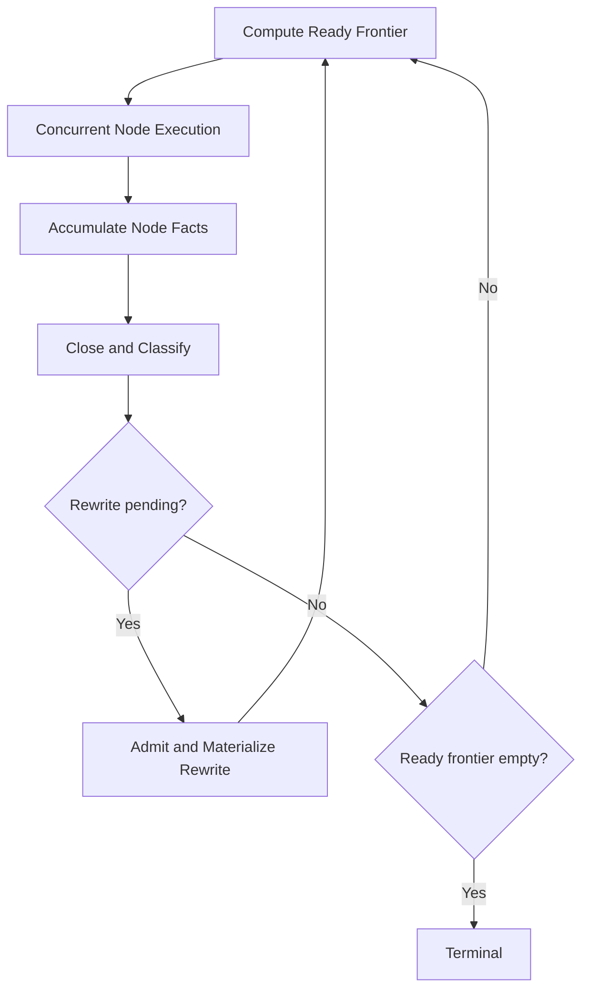

# Rewrite Materialization and Recovery Research Plan

**Status:** proposed
**Scope:** runtime-grounded rewrite admission, materialization, and recovery
semantics beyond the fixed-topology core

## Summary

This plan is the runtime-grounded companion to Paper 3's substitution theory.
It studies topology-changing durable execution in which a running stage may
propose a structured rewrite of the future execution graph. Papers 1 and 2
cover the fixed-topology kernel; they do not cover the case where accumulation,
closure, and recovery are computed over a graph that may change mid-run.

The plan therefore centers on a stronger execution machine with an explicit
materialization boundary and iterative control loop over materialized graph
state. The focus is recovery semantics, not just rewrite syntax.

## Why This Is Separate

Topology-changing execution is not a minor extension of the fixed-topology
theorem.

Once a rewrite is admitted:

- the topology changes
- the valid-state predicate changes
- downstream readiness changes
- recovery must distinguish persisted lineage from durably materialized topology

The theory also needs to distinguish:

- the planned or compiled graph artifact describing what obligations may arise
- the materialized execution state describing what this run has actually reached

This is why the runtime rewrite story belongs in a plan of its own rather than
as a subsection of the fixed-topology papers.

## Rewrite-Capable Machine

The normative machine is an iterative control loop:

Key rule:

- an admitted rewrite must be materialized before the runtime may conclude completion, suspension, or stuckness from the old topology

The back-edge above is a runtime control loop, not a graph cycle. Each
materialized topology epoch is still a DAG.

## Durable Identity Model

The rewrite-capable runtime needs distinct identities for:

- `NodeId` — durable execution identity
- `StageTemplateId` — durable serialized template identity
- `StageActionId` — executable identity used for hydration and retry validation
- `stageId` — semantic stage label only

The plan should explain why these identities must stay distinct and what fails
when `stageId` is overloaded as both semantic and executable identity.

## Persistence and Materialization

The persistence model has three key pieces:

- **lineage** — append-only rewrite history
- **materialization watermark** — monotone marker such as `applied_rewrite_id`
- **remaining budget** — durable rewrite-budget state consumed at materialization

Recovery should:

1. rebuild the graph only through the watermark
2. deterministically finish any admitted but not yet materialized rewrites
3. only then resume scheduling

This is closer to projection-checkpoint recovery than to raw log replay.

## Rewrite Admission Contract

Admitted rewrites must satisfy explicit structural conditions:

- inserted nodes and stage definitions match exactly
- entry and exit nodes are subsets of the inserted graph
- required entry and exit sets are non-empty for the relevant constructors
- resulting topology remains acyclic
- anchor nodes exist in the current materialized plan
- output-preserving rewrite modes keep the rewriting node's output available for downstream dataflow

The current shipped rejection policy is intentionally narrow:

- invalid or over-budget rewrites fail fast with a structured diagnostic

Configurable fallback or planner-visible rejection handling is future work, not
part of the current contract.

## Proof Obligations

The plan centers on the new proof burdens:

1. materialized-state validity for rewritten graphs
2. crash safety across lineage and materialization gaps
3. hydration safety from persisted template identity back to executable semantics
4. dataflow preservation for output-preserving rewrite modes
5. admitted-rewrite-before-termination correctness

The fixed-topology theorem can be reused only inside a single materialized
topology epoch.

## Boundary to Process Migration

Local graph substitution and non-local workflow migration should remain distinct:

- local rewrites substitute a bounded node region and continue
- migration reinterprets already executed structure, history, or state mapping

That boundary matters because future planner- or operator-driven graph surgery
may stop being "just another rewrite constructor" and become a process-migration
problem instead.

## Relationship to the Paper Set

- **Paper 1** — fixed-topology experience report
- **Lean mechanization plan** — machine-checked support for the fixed-topology core
- **Paper 2** — algebraic theory of the fixed-topology core and extension boundary
- **This plan** — rewrite-capable execution, materialization, and recovery semantics
- **Paper 3** — graph substitution semantics, compiled artifacts, and the implementation-independent layering above this runtime track

This split keeps the fixed-topology theorem honest while giving rewriting
enough room to be treated seriously.

## Deferred Work

The following are explicitly outside the current shipped and theory contract:

- true concurrent rewrite admission within one frontier wave
- configurable rewrite rejection fallback instead of fail-fast only
- richer operator-facing graph visualization and rewrite provenance
- hierarchical child workflows with explicit sub-budget assignment
- integrity witnesses stronger than the current watermark model, such as materialized-graph checksums

## Related

- [../../Publications/Paper-2-algebraic-foundations/](../../Publications/Paper-2-algebraic-foundations/) — fixed-topology algebra and extension boundary.
- [../../Publications/Paper-3-graph-substitution-semantics/](../../Publications/Paper-3-graph-substitution-semantics/) — implementation-independent substitution theory.
- [../../Architecture/07-rewrites-and-materialization.md](../../Architecture/07-rewrites-and-materialization.md) — canonical runtime architecture chapter.
