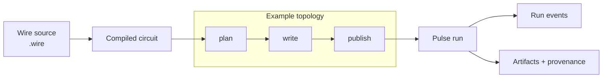

# Cortex Documentation

Cortex is a standalone Haskell substrate for graph-shaped AI systems. It gives
you a small language for authoring workflows, a typed graph layer for validating
their topology, a durable runtime for executing them, and artifact/provenance
surfaces for explaining what happened.

The boundary is deliberate: Cortex owns reusable mechanics; downstream products
own domain semantics, policy, tools, operators, transport, and persistence.

## What Cortex Does

| Capability | What it gives you |
|---|---|
| **Wire authoring** | A real `.wire` language for composing registered executors into typed dataflow graphs. |
| **Graph and Circuit semantics** | Pure graph structure plus validated executable topology before a run starts. |
| **Pulse execution** | Durable graph execution with checkpoints, signals, run events, cancellation, retry, and inspection. |
| **Controlled rewrites** | Runtime topology changes are proposals admitted through explicit rewrite rules and budgets. |
| **Topological memory** | Nodes can query settled upstream graph state without turning memory into hidden mutable state. |
| **Artifacts and provenance** | Structured outputs carry stable artifact-local provenance instead of relying on generated prose. |
| **Cortex.Nous** | A structured reasoning library above the substrate with canonical epistemological archetypes and templates. |
| **Host-action boundary** | Product-specific side effects stay behind authenticated, idempotent host APIs. |

## System Layers

| Layer | Responsibility | Primary artifact |
|---|---|---|
| **Graph** | Pure topology: vertices, edges, overlay, connect, DAG validation. | Graph topology |
| **Circuit** | Validated executable topology: nodes plus compatible wires. | Circuit |
| **Wire** | Source language and rewrite notation that authors circuit topology. | `.wire` source |
| **Pulse** | Durable execution of compiled circuits. | Run state and events |

The core rule: **Wire composes registered authority; implementations own what
that authority means.** Wire references registered executors, contracts, tools,
prompts, memory strategies, and wiring. It does not invent host authority.

## Wire Is The Front Door

Wire is not pseudocode. It is the source language Cortex uses to describe
workflow topology over a closed executor alphabet.

```wire
contract Topic;
contract Outline;
contract Draft;
contract ReportArtifactRef;

node plan : <- Topic -> Outline = @llm.planner {
  prompt = ''Build a concise research outline.'';
};

node write : <- Outline -> Draft = @llm.writer {
  memory = topological { preset = "writer"; };
};

node publish : <- Draft -> ReportArtifactRef = @artifact.report {};

plan => write => publish
```

The same source is compiled into a graph-shaped executable artifact. Pulse then
executes the materialized graph and records run state, events, and artifacts.



## Architectural Ideas

- **Graphs are the semantic object.** Cortex treats topology as execution
  structure, not as a visualization over a hidden linear plan.
- **Authority is closed.** Wire composes registered executors and contracts; it
  cannot invent host tools, side effects, or domain semantics.
- **Adaptation is admitted, not arbitrary.** Rewrites change topology only after
  runtime validation, budgeting, and materialization.
- **Runtime and host stay separate.** Pulse owns durable execution; hosts own
  domain mutation and product policy through host actions.
- **Artifacts explain themselves.** Provenance is attached to structured
  artifact nodes before rendering, so explanation does not depend on brittle
  text spans.

## Read First

1. **[Architecture overview](Architecture/01-overview.md)** - system frame and
   ownership boundary.
2. **[Ownership and boundaries](Architecture/02-ownership-and-boundaries.md)** -
   what belongs in Cortex versus a downstream product.
3. **[Wire language](Architecture/05-wire-language.md)** - how source programs
   describe executable topology.
4. **[Wire grammar v1](Reference/Wire/grammar-v1.md)** - the normative language
   surface.
5. **[Pulse runtime](Architecture/06-pulse-runtime.md)** - durable execution,
   events, signals, retries, and host actions.
6. **[Rewrites and materialization](Architecture/07-rewrites-and-materialization.md)** -
   controlled topology evolution.
7. **[Artifacts and provenance](Architecture/08-artifacts-and-provenance.md)** -
   structured outputs and explanation.
8. **[Nous reasoning library](Architecture/09-nous-reasoning-library.md)** -
   epistemological archetypes above the substrate.

## Explore The Canon

- **[Architecture/](Architecture/)** - conceptual chapters for the substrate.
- **[Reference/](Reference/)** - normative specifications for Wire, Pulse,
  rewrites, terminology, and contributor workflow.
- **[ADRs/](ADRs/)** - numbered architecture decisions.
- **[Publications/](Publications/)** - formal paper drafts, figures, and
  publication roadmap.
- **[Consumers/](Consumers/)** - downstream binding examples after the core
  model is clear.

## Working Artifacts

- **[Roadmap/](Roadmap/)** - active research and implementation plans.
- **[Research-notes/](Research-notes/)** - dated synthesis notes that are still
  useful as design archaeology.
- **[Experiments/](Experiments/)** - dated smoke tests and dogfood runs.
- **[Handoffs/](Handoffs/)** - contributor or work-phase handoffs when one is
  current enough to keep in the tree.
- **[Templates/](Templates/)** - frontmatter and section shapes for new docs.

## Consumer Examples

Consumer docs show how a downstream system can bind Cortex to product-specific
policy, tools, artifacts, and operator surfaces. They are examples, not
prerequisites for understanding Cortex. Generic rules belong in architecture,
reference, or ADR docs.

## Source Of Truth

When docs and implementation disagree, the implementation is authoritative until
the docs are reconciled. Canonical docs should still avoid repo-layout details
unless a page is specifically about migration or implementation planning.
