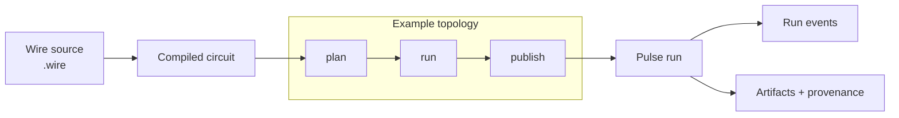

# Cortex Documentation

Cortex is a standalone Haskell substrate for graph-shaped durable workflows. It gives you a small
language for authoring workflows, a durable runtime for executing them, and value-provenance
surfaces for explaining what happened.

The boundary is deliberate: Cortex owns reusable mechanics; downstream products own domain
semantics, policy, tools, operators, transport, and persistence.

## What Cortex Does

| Capability                     | What it gives you                                                                                   |
| ------------------------------ | --------------------------------------------------------------------------------------------------- |
| **Wire authoring**             | A real `.wire` language for composing registered executors into typed dataflow graphs.              |
| **Algebra and Wire semantics** | Pure graph algebra plus validated executable topology before a run starts.                          |
| **Pulse execution**            | Durable graph execution with checkpoints, signals, run events, cancellation, retry, and inspection. |
| **Controlled rewrites**        | Runtime topology changes are proposals admitted through explicit rewrite rules and budgets.         |
| **Value provenance**           | Runtime values carry stable contract and provenance metadata instead of relying on generated prose. |
| **Host-action boundary**       | Product-specific side effects stay behind authenticated, idempotent host APIs.                      |

## System Layers

| Layer          | Responsibility                                                            | Primary artifact                    |
| -------------- | ------------------------------------------------------------------------- | ----------------------------------- |
| **Algebra**    | Pure topology laws: vertices, edges, overlay, connect, DAG validation.    | Graph/relation algebra              |
| **Wire**       | Source language, contracts, compiled circuit form, and runtime envelopes. | `.wire` source and compiled circuit |
| **Pulse**      | Durable execution of compiled circuits.                                   | Run state and events                |
| **Capability** | Executor registration and native pure-executor capability surfaces.       | Registered authority                |

The core rule: **Wire composes registered authority; implementations own what that authority
means.** Wire references registered executors, contracts, tools, config constructors, and wiring. It
does not invent host authority.

## Wire Is The Front Door

Wire is not pseudocode. It is the source language Cortex uses to describe workflow topology over a
closed executor alphabet.

```wire
contract Topic;
contract Outline;
contract Result;
contract ArtifactRef;

node plan
  <- topic: Topic;
  -> outline: Outline = @workflow.plan {
    mode = "concise";
  } (topic);

node run
  <- outline: Outline;
  -> result: Result = @workflow.execute {
    retry = { max_attempts = 2; };
  } (outline);

node publish
  <- result: Result;
  -> artifact: ArtifactRef = @host.artifact_store (result);

plan
  => run
  => publish
```

The same source is compiled into a graph-shaped executable artifact. Pulse then executes the
materialized graph and records run state, events, and artifacts.



## If You Just Want To Use It

Start with [Usage/](Usage/). It is the practical guide: build Cortex, inspect the Pulse runtime,
write a first Wire workflow, deploy a consumer-bound Pulse binary, and find the right
troubleshooting surface.

The architecture chapters explain why Cortex is designed this way. The reference pages state exact
rules. Usage should be the first stop when the question is "what do I do next?"

## Architectural Ideas

- **Algebraic topology is the semantic object.** Cortex treats graph structure as execution
  structure, not as a visualization over a hidden linear plan.
- **Authority is closed.** Wire composes registered executors and contracts; it cannot invent host
  tools, side effects, or domain semantics.
- **Adaptation is admitted, not arbitrary.** Rewrites change topology only after runtime validation,
  budgeting, and materialization.
- **Runtime and host stay separate.** Pulse owns durable execution; hosts own domain mutation and
  product policy through host actions.
- **Values explain themselves.** Provenance is attached to runtime values before downstream artifact
  rendering, so explanation does not depend on brittle text spans.

## Read First

1. **[Usage guide](Usage/)** - practical path for building, authoring, running, and deploying.
2. **[Architecture overview](Architecture/01-overview.md)** - system frame and ownership boundary.
3. **[Ownership and boundaries](Architecture/02-ownership-and-boundaries.md)** - what belongs in
   Cortex versus a downstream product.
4. **[Wire language](Architecture/05-wire-language.md)** - how source programs describe executable
   topology.
5. **[Wire grammar](Reference/Wire/grammar.md)** - the normative language surface.
6. **[Pulse runtime](Architecture/06-pulse-runtime.md)** - durable execution, events, signals,
   retries, and host actions.
7. **[Rewrites and materialization](Architecture/07-rewrites-and-materialization.md)** - controlled
   topology evolution.
8. **[Artifacts and provenance](Architecture/08-artifacts-and-provenance.md)** - structured outputs
   and explanation.
9. **[Proof status](Reference/proof-status.md)** - current Lean proof and Haskell correspondence
   matrix.

## Explore The Canon

- **[Usage/](Usage/)** - practical guide for using Cortex.
- **[Architecture/](Architecture/)** - conceptual chapters for the substrate.
- **[Reference/](Reference/)** - normative specifications for Wire, Pulse, rewrites, terminology,
  and contributor workflow.
- **[ADRs/](ADRs/)** - numbered architecture decisions.
- **[Consumers/](Consumers/)** - downstream binding examples after the core model is clear.
- **[Publications/](Publications/)** - formal paper drafts, figures, and publication roadmap.

## Working Artifacts

- **[Roadmap/](Roadmap/)** - active research and implementation plans.
- **[Research-notes/](Research-notes/)** - dated synthesis notes that are still useful as design
  archaeology.
- **[Experiments/](Experiments/)** - controlled experiment records that start from active epics or
  plans.
- **[Templates/](Templates/)** - frontmatter and section shapes for new docs.

## Consumer Examples

Consumer docs show how a downstream library or product can bind Cortex to reasoning workflows,
product-specific policy, tools, artifacts, and operator surfaces. They are examples, not
prerequisites for understanding Cortex. Generic rules belong in architecture, reference, or ADR
docs.

## Source Of Truth

When docs and implementation disagree, the implementation is authoritative until the docs are
reconciled. Canonical docs should still avoid repo-layout details unless a page is specifically
about migration or implementation planning.
