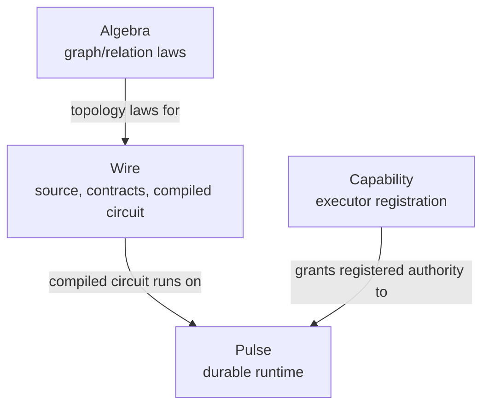

# Cortex Taxonomy

Glossary ([glossary.md](glossary.md)) defines terms one at a time. This page shows how they cluster.

## Layers

Cortex separates four canonical substrate roots. Arrows here show operational relationships, not
import or dependency direction:

Algebra is the pure substrate Wire authors over. Mechanized theory names the safety contracts that
runtime implementation must enforce. Wire owns the compiled circuit form. Pulse executes compiled
circuits durably. Capability exposes executor authority. Value provenance and artifact references
are runtime/contract concepts, not a current public Haskell root.

## Roles a value can play

A single Wire value often wears multiple hats. The roles are:

| Role                          | What it is                                                                                 | Examples                                                                        |
| ----------------------------- | ------------------------------------------------------------------------------------------ | ------------------------------------------------------------------------------- |
| **Executor**                  | Registered recipe. Turns config + typed inputs into typed outputs. Referenced via `@name`. | `@review.analyst`, `@artifact.log`, `@cortex.report_run`                        |
| **Configured executor value** | Executor plus inert config, reusable in node bodies. Not a graph vertex.                   | `@review.gatherer { memory = topological { preset = "causal"; }; }`             |
| **Node**                      | Explicit graph vertex with typed input/output ports and an implementation body.            | `node analyst <- evidence: EvidenceBundle -> analysis: AnalysisFragment = ...;` |
| **Composed wire**             | Result of applying a graph operator. Has a derived boundary.                               | `planner => gatherer => analyst`                                                |
| **Runtime wrapper**           | A node whose role is to host a whole wire and provide runtime services.                    | `@cortex.report_run { title = ...; }`                                           |

The leading `@` marks the executor-authority boundary. It stages a registered executor with pure
config data; it does not run the executor. Wire-authored CorePure output equations are written
directly without `@`; they lower to the native pure evaluator inside the admitted Wire semantics.
See [Reference/Wire/executors-and-alphabet.md](Reference/Wire/executors-and-alphabet.md).

## Artifacts a contract can carry

Every contract declares a **payload kind** that selects validation and rendering:

| Payload kind   | Shape                         | Examples                                 |
| -------------- | ----------------------------- | ---------------------------------------- |
| `json`         | Structured domain object      | `AssetRef`, `AssetSet`, `ReportFragment` |
| `markdown`     | Lintable markdown text        | `FinalReport`, `MarkdownSection`         |
| `text`         | Minimal-structure text        | `SearchQuery`, `OperatorNote`            |
| `table`        | Row/column typed data         | `PriceSeries`, `CorrelationMatrix`       |
| `artifact_ref` | Reference to a persisted blob | `WorkbookRef`, `ReportArtifactRef`       |

## Namespaces

Cortex has a small closed set of globally-ambient namespaces:

| Namespace               | Registered where                                    | Referenced in Wire how                        |
| ----------------------- | --------------------------------------------------- | --------------------------------------------- |
| **Executor alphabet**   | External registry (`Cortex.Capability` + consumers) | `@qualified.name`                             |
| **Contract namespace**  | Contract registry + `contract X;` assertions        | bare `Name` in port signatures                |
| **Tool registry**       | External registry                                   | bare `name` inside config `tools = [...]`     |
| **Config constructors** | Executor config schemas                             | `qualified.name { ... }` inside config values |

Beyond these four, every name is local: introduced by `let`, `node`, or `import`. The executor
alphabet is authority-bearing; ordinary config constructors are not. The syntax distinction is the
leading `@`.

## Downstream Logos library

`Logos` is a downstream reasoning library built on Cortex. It adds reusable LLM-shaped catalogs
above the substrate. `Logos.Archetypes` classifies modes of cognition, `Logos.Thought` names one
bounded model-mediated node evaluation, `Logos.Memory` owns cognitive context construction, and
`Logos.Patterns` names reusable reasoning programs. None of these grants executor authority or
creates new runtime registries.

| Archetype                   | Role                                            |
| --------------------------- | ----------------------------------------------- |
| `Logos.Archetypes.Logos`    | Discursive reason, argument, symbolic reasoning |
| `Logos.Archetypes.Sophia`   | Wisdom, judgment, synthesis                     |
| `Logos.Archetypes.Techne`   | Craft, engineering, implementation              |
| `Logos.Archetypes.Episteme` | Knowledge, evidence, research                   |
| `Logos.Archetypes.Kritikos` | Criticism, adversarial review                   |
| `Logos.Archetypes.Themis`   | Audit, law, correctness, constraints            |
| `Logos.Archetypes.Poiesis`  | Creative generation, composition                |

Each archetype may have an operational activation bundle at
`Logos.Archetypes.<Archetype>.Activation`. The archetype is the semantic definition; the activation
bundle is the concrete set of prompt discipline, retrieval corpus, embedding spaces, tool surface,
memory policy, evaluation criteria, and runtime contract. Thought frames compose one or more
archetype activations.

`Logos.Patterns.DeepReport` is the planned extraction target for reusable deep-report reasoning
contracts, ports, templates, prompts, memory presets, and evaluation policy.

## Doc-kind taxonomy

This taxonomy, the canonical-vs-dated boundary, and the per-kind frontmatter and format contract are
governed by
[ADR 0001 — Canonical Documentation Contract](ADRs/0001-canonical-documentation-contract.md).

Docs are classified on two axes:

| Classification      | Stable canon                                                     | Dated artifacts           |
| ------------------- | ---------------------------------------------------------------- | ------------------------- |
| Canonical authority | `Usage/`, `Architecture/`, `Reference/`, `Style.md`, `ADRs/`     | none                      |
| Project working     | `Roadmap/Epics/`, `Roadmap/Plans/`                               | `Research-notes/{scope}/` |
| Historical          | `Roadmap/Completed/`, `Roadmap/Archive/`                         | `Experiments/{scope}/`    |
| Cross-cutting canon | `Templates/`, `index.md`, `map.md`, `glossary.md`, `taxonomy.md` | none                      |
| Consumer-specific   | `Consumers/{consumer}.md`, `Consumers/Logos/`                    | none                      |
| Publication working | `Publications/Paper-N-*/`, `Publications/Notes/`                 | none                      |

Every home in [map.md](map.md#by-kind) must appear above as a backticked taxonomy path. Missing
coverage is a documentation-canon bug caught by `scripts/docs-lint`.

Per-kind authoring shape is tracked in [Templates/index.md](Templates/index.md#template-coverage).
That page accounts for every kind listed in [map.md](map.md#by-kind), including kinds that
intentionally reuse a generic template or have no dedicated template.

## Related

- [ADRs/0001-canonical-documentation-contract.md](ADRs/0001-canonical-documentation-contract.md) —
  the governing decision for this taxonomy.
- [map.md](map.md) — where to put a new doc.
- [glossary.md](glossary.md) — term definitions.
- [Architecture/01-overview.md](Architecture/01-overview.md) — architectural starting point.
- [Reference/terminology.md](Reference/terminology.md) — normative terminology.
