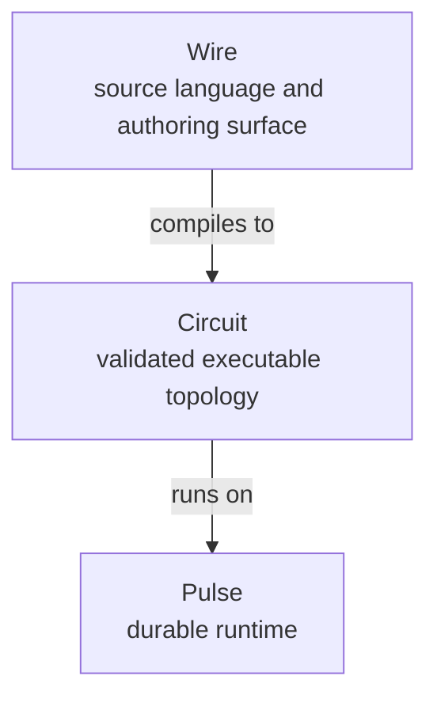

# Cortex Taxonomy

Glossary ([glossary.md](glossary.md)) defines terms one at a time. This page shows how they cluster.

## Layers

Cortex separates three orthogonal concerns:

Graph is the pure algebraic substrate that Wire authors over and Circuit validates.

## Roles a value can play

A single Wire value often wears multiple hats. The roles are:

| Role | What it is | Examples |
|---|---|---|
| **Executor** | Registered recipe. Turns config + inputs into outputs. Referenced via `@name`. | `@llm.analyst`, `@artifact.log`, `@cortex.report_run`, `@pure` |
| **Partial node** | Executor applied to config, no ports pinned. `let`-bindable, `//`-mergeable. | `@llm.gatherer { memory = topological { preset = "analyst" }; }` |
| **Node** | Partial node with ports pinned. Has boundary. Has identity. | `node analyst : <- EvidenceBundle -> AnalysisFragment | ExecutorError = @llm.analyst { prompt = "..."; };` |
| **Composed wire** | Result of applying a graph operator. Has a derived boundary. | `planner => gatherer => analyst` |
| **Runtime wrapper** | A node whose role is to host a whole wire and provide runtime services. | `@cortex.report_run { title = ...; }` |

## Artifacts a contract can carry

Every contract declares a **payload kind** that selects validation and rendering:

| Payload kind | Shape | Examples |
|---|---|---|
| `json` | Structured domain object | `AssetRef`, `AssetSet`, `ReportFragment` |
| `markdown` | Lintable markdown text | `FinalReport`, `MarkdownSection` |
| `text` | Minimal-structure text | `SearchQuery`, `PromptNote` |
| `table` | Row/column typed data | `PriceSeries`, `CorrelationMatrix` |
| `artifact_ref` | Reference to a persisted blob | `WorkbookRef`, `ReportArtifactRef` |

## Namespaces

Cortex has a small closed set of globally-ambient namespaces:

| Namespace | Registered where | Referenced in Wire how |
|---|---|---|
| **Executor alphabet** | External registry (`Cortex.Capability.*` + consumers) | `@qualified.name` |
| **Contract namespace** | Contract registry + `contract X;` assertions | bare `Name` in port signatures |
| **Tool registry** | External registry | bare `name` inside config `tools = [...]` |
| **Config constructors** | Executor config schemas | `qualified.name { ... }` inside config values |

Beyond these four, every name is local: introduced by `let`, `node`, or `import`.

## Doc-kind taxonomy

Docs are classified on two axes:

| | Stable canon | Dated artifacts |
|---|---|---|
| **Canonical authority** | `Architecture/`, `Reference/`, `ADRs/` | none |
| **Project working** | `Roadmap/Epics/`, `Roadmap/Plans/` | `Research-notes/` |
| **Historical** | `Roadmap/Completed/`, `Roadmap/Archive/` | `Experiments/`, `Handoffs/` |

Cross-cutting canon: `Templates/`, `index.md`, `map.md`, `glossary.md`, `taxonomy.md`
Consumer-specific: `Consumers/{consumer}.md`, or `Consumers/{consumer}/` for a
larger public binding
Papers: `Publications/paper-N-*/`

## Related

- [map.md](map.md) — where to put a new doc.
- [glossary.md](glossary.md) — term definitions.
- [Architecture/01-overview.md](Architecture/01-overview.md) — architectural starting point.
- [Reference/terminology.md](Reference/terminology.md) — normative terminology.
