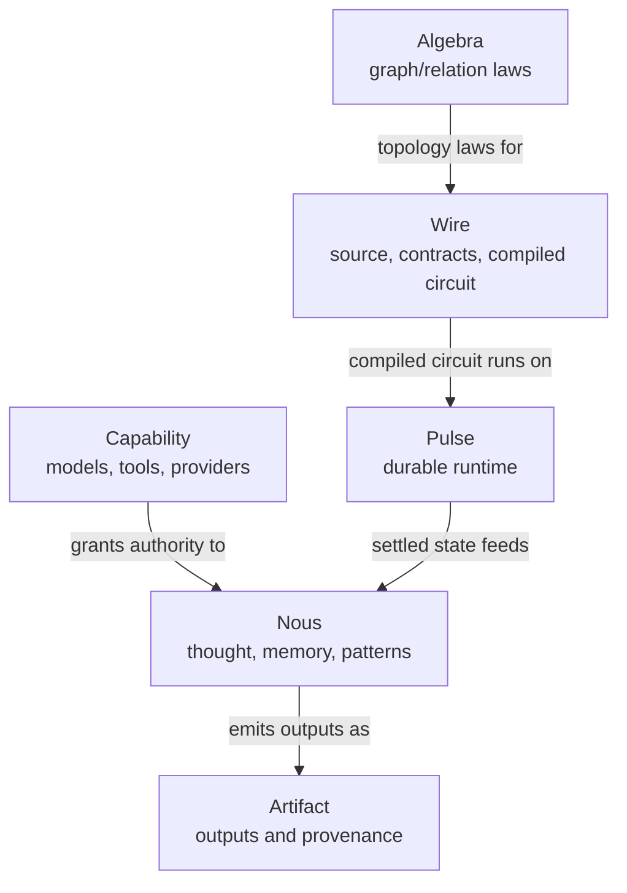

# Cortex Taxonomy

Glossary ([glossary.md](glossary.md)) defines terms one at a time. This page shows how they cluster.

## Layers

Cortex separates six canonical roots. Arrows here show operational relationships, not import or
dependency direction:

Algebra is the pure substrate Wire authors over. Mechanized theory names the safety contracts that
runtime implementation must enforce. Wire owns the compiled circuit form. Pulse executes compiled
circuits durably. Capability exposes external authority. Artifact owns durable outputs and
provenance. Nous owns model-mediated cognition.

## Roles a value can play

A single Wire value often wears multiple hats. The roles are:

| Role                | What it is                                                                     | Examples                                                                                                    |
| ------------------- | ------------------------------------------------------------------------------ | ----------------------------------------------------------------------------------------------------------- |
| **Executor**        | Registered recipe. Turns config + inputs into outputs. Referenced via `@name`. | `@llm.analyst`, `@artifact.log`, `@cortex.report_run`, `@pure`                                              |
| **Partial node**    | Executor applied to config, no ports pinned. `let`-bindable, `//`-mergeable.   | `@llm.gatherer { memory = topological { preset = "analyst" }; }`                                            |
| **Node**            | Partial node with ports pinned. Has boundary. Has identity.                    | `node analyst : <- EvidenceBundle -> AnalysisFragment \| ExecutorError = @llm.analyst { prompt = "..."; };` |
| **Composed wire**   | Result of applying a graph operator. Has a derived boundary.                   | `planner => gatherer => analyst`                                                                            |
| **Runtime wrapper** | A node whose role is to host a whole wire and provide runtime services.        | `@cortex.report_run { title = ...; }`                                                                       |

The leading `@` marks the executor-authority boundary. It stages a registered executor with pure
config data; it does not run the executor. See
[Reference/Wire/executors-and-alphabet.md](Reference/Wire/executors-and-alphabet.md).

## Artifacts a contract can carry

Every contract declares a **payload kind** that selects validation and rendering:

| Payload kind   | Shape                         | Examples                                 |
| -------------- | ----------------------------- | ---------------------------------------- |
| `json`         | Structured domain object      | `AssetRef`, `AssetSet`, `ReportFragment` |
| `markdown`     | Lintable markdown text        | `FinalReport`, `MarkdownSection`         |
| `text`         | Minimal-structure text        | `SearchQuery`, `PromptNote`              |
| `table`        | Row/column typed data         | `PriceSeries`, `CorrelationMatrix`       |
| `artifact_ref` | Reference to a persisted blob | `WorkbookRef`, `ReportArtifactRef`       |

## Namespaces

Cortex has a small closed set of globally-ambient namespaces:

| Namespace               | Registered where                                      | Referenced in Wire how                        |
| ----------------------- | ----------------------------------------------------- | --------------------------------------------- |
| **Executor alphabet**   | External registry (`Cortex.Capability.*` + consumers) | `@qualified.name`                             |
| **Contract namespace**  | Contract registry + `contract X;` assertions          | bare `Name` in port signatures                |
| **Tool registry**       | External registry                                     | bare `name` inside config `tools = [...]`     |
| **Config constructors** | Executor config schemas                               | `qualified.name { ... }` inside config values |

Beyond these four, every name is local: introduced by `let`, `node`, or `import`. The executor
alphabet is authority-bearing; ordinary config constructors are not. The syntax distinction is the
leading `@`.

## Nous archetypes and patterns

`Cortex.Nous` adds reusable LLM-shaped catalogs above the substrate. `Cortex.Nous.Archetypes`
classifies modes of cognition, `Cortex.Nous.Thought` names one bounded model-mediated node
evaluation, `Cortex.Nous.Memory` owns cognitive context construction, and `Cortex.Nous.Patterns`
names reusable reasoning programs. None of these grants executor authority or creates new runtime
registries.

| Archetype                         | Role                                            |
| --------------------------------- | ----------------------------------------------- |
| `Cortex.Nous.Archetypes.Logos`    | Discursive reason, argument, symbolic reasoning |
| `Cortex.Nous.Archetypes.Sophia`   | Wisdom, judgment, synthesis                     |
| `Cortex.Nous.Archetypes.Techne`   | Craft, engineering, implementation              |
| `Cortex.Nous.Archetypes.Episteme` | Knowledge, evidence, research                   |
| `Cortex.Nous.Archetypes.Kritikos` | Criticism, adversarial review                   |
| `Cortex.Nous.Archetypes.Themis`   | Audit, law, correctness, constraints            |
| `Cortex.Nous.Archetypes.Poiesis`  | Creative generation, composition                |

Each archetype may have an operational activation bundle at
`Cortex.Nous.Archetypes.<Archetype>.Activation`. The archetype is the semantic definition; the
activation bundle is the concrete set of prompt discipline, retrieval corpus, embedding spaces, tool
surface, memory policy, evaluation criteria, and runtime contract. Thought frames compose one or
more archetype activations.

`Cortex.Nous.Patterns.DeepReport` is the planned extraction target for reusable deep-report
reasoning contracts, ports, templates, prompts, memory presets, and evaluation policy.

## Doc-kind taxonomy

Docs are classified on two axes:

|                         | Stable canon                             | Dated artifacts             |
| ----------------------- | ---------------------------------------- | --------------------------- |
| **Canonical authority** | `Architecture/`, `Reference/`, `ADRs/`   | none                        |
| **Project working**     | `Roadmap/Epics/`, `Roadmap/Plans/`       | `Research-notes/`           |
| **Historical**          | `Roadmap/Completed/`, `Roadmap/Archive/` | `Experiments/`, `Handoffs/` |

Cross-cutting canon: `Templates/`, `index.md`, `map.md`, `glossary.md`, `taxonomy.md`
Consumer-specific: `Consumers/{consumer}.md`, or `Consumers/{consumer}/` for a larger public binding
Papers: `Publications/paper-N-*/`

## Related

- [map.md](map.md) — where to put a new doc.
- [glossary.md](glossary.md) — term definitions.
- [Architecture/01-overview.md](Architecture/01-overview.md) — architectural starting point.
- [Reference/terminology.md](Reference/terminology.md) — normative terminology.
